# Validated π Trees — LSTM-EML Search Gallery

Every tree below is a discovery in the EML-only operator family `EML(x, y) = exp(x) − ln(y)`. Each one was sampled (or hand-derived as a positive-control seed) and validated by re-evaluating the tree in `mpmath` at 200 decimal digits. The reported digit count is the leading-digit agreement of the named channel with π.

Visualization convention (per the project spec): the **left/exp child** of every `EML` node is drawn *upward* (the exponential grows like a tree trunk), and the **right/ln child** is drawn *to the side* (the logarithm branches out). Constant leaves are rendered as labelled blocks, and the leaf `1` is drawn as a green circle to mark it as the privileged "end leaf" of the construction.

---

## Summary table

| # | Group | Channel | Digits to π | Depth | Size | Source | Expression |
|---|-------|---------|-------------|-------|------|--------|------------|
| 1 | imaginary | abs_im | 80 | 2 | 5 | trained-sample | `EML(EML(1, -1), -1)` |
| 2 | imaginary | abs_im | 80 | 2 | 5 | trained-sample | `EML(EML(0, -1), -1)` |
| 3 | imaginary | abs_im | 80 | 2 | 7 | trained-sample | `EML(EML(0, -1), EML(-1, 2))` |
| 4 | imaginary | abs_im | 80 | 2 | 7 | trained-sample | `EML(EML(0, -1), EML(-1, e))` |
| 5 | imaginary | abs_im | 80 | 2 | 7 | trained-sample | `EML(EML(1, -1), EML(-1, 2))` |
| 6 | imaginary | abs_im | 80 | 3 | 7 | trained-sample | `EML(EML(EML(-1, 1), -1), -1)` |
| 7 | imaginary | abs_im | 80 | 3 | 7 | trained-sample | `EML(EML(EML(-1, 2), -1), -1)` |
| 8 | imaginary | abs_im | 80 | 3 | 7 | trained-sample | `EML(EML(-1, EML(-1, e)), -1)` |
| 9 | imaginary | abs_im | 80 | 3 | 7 | trained-sample | `EML(EML(0, EML(-1, e)), -1)` |
| 10 | imaginary | abs_im | 80 | 3 | 7 | trained-sample | `EML(EML(-1, EML(-1, 2)), -1)` |
| 11 | imaginary | abs_im | 80 | 3 | 7 | trained-sample | `EML(EML(EML(0, 1), -1), -1)` |
| 12 | imaginary | abs_im | 80 | 3 | 7 | trained-sample | `EML(EML(EML(0, e), -1), -1)` |
| 13 | imaginary | abs_im | 80 | 3 | 7 | trained-sample | `EML(EML(EML(0, 2), -1), -1)` |
| 14 | imaginary | abs_im | 80 | 3 | 7 | trained-sample | `EML(EML(0, EML(-1, 2)), -1)` |
| 15 | imaginary | abs_im | 80 | 4 | 9 | trained-sample | `EML(EML(-1, EML(-1, EML(1, 2))), -1)` |
| 16 | imaginary | abs_im | 80 | 4 | 9 | trained-sample | `EML(EML(EML(-1, EML(1, e)), -1), -1)` |
| 17 | imaginary | abs_im | 80 | 5 | 11 | trained-sample | `EML(EML(EML(-1, EML(-1, EML(0, 2))), -1), -1)` |
| 18 | imaginary | abs_im | 79 | 3 | 7 | trained-sample | `EML(EML(EML(1, e), -1), -1)` |
| 19 | imaginary | abs_im | 79 | 3 | 7 | trained-sample | `EML(EML(1, EML(-1, 2)), -1)` |
| 20 | imaginary | abs_im | 79 | 4 | 9 | trained-sample | `EML(EML(EML(-1, EML(-1, 1)), -1), -1)` |
| 21 | imaginary | abs_im | 78 | 2 | 5 | trained-sample | `EML(EML(2, -1), -1)` |
| 22 | imaginary | abs_im | 78 | 2 | 7 | trained-sample | `EML(EML(2, -1), EML(-1, e))` |
| 23 | imaginary | abs_im | 78 | 3 | 7 | trained-sample | `EML(EML(2, EML(-1, e)), -1)` |
| 24 | imaginary | abs_im | 77 | 3 | 7 | trained-sample | `EML(EML(2, EML(-1, 2)), -1)` |
| 25 | imaginary | abs_im | 75 | 4 | 9 | trained-sample | `EML(EML(e, EML(EML(-1, -1), 2)), -1)` |
| 26 | imaginary | abs_im | 74 | 2 | 5 | trained-sample | `EML(EML(e, -1), -1)` |
| 27 | imaginary | abs_im | 74 | 2 | 7 | trained-sample | `EML(EML(e, -1), EML(-1, e))` |
| 28 | imaginary | abs_im | 74 | 2 | 7 | trained-sample | `EML(EML(e, -1), EML(-1, 2))` |
| 29 | imaginary | abs_im | 74 | 3 | 7 | trained-sample | `EML(EML(EML(1, 1), -1), -1)` |
| 30 | imaginary | abs_im | 74 | 3 | 7 | trained-sample | `EML(EML(e, EML(-1, e)), -1)` |
| 31 | imaginary | abs_im | 50 | 1 | 3 | seed-construction | `EML(0, -1)` |
| 32 | imaginary | abs_im | 50 | 1 | 3 | seed-construction | `EML(1, -1)` |
| 33 | imaginary | abs_im | 50 | 1 | 3 | seed-construction | `EML(-1, -1)` |
| 34 | imaginary | abs_im | 50 | 1 | 3 | trained-sample | `EML(e, -1)` |
| 35 | imaginary | abs_im | 50 | 1 | 3 | trained-sample | `EML(2, -1)` |
| 36 | imaginary | abs_im | 50 | 2 | 5 | seed-construction | `EML(EML(0, 1), -1)` |
| 37 | imaginary | abs_im | 50 | 2 | 5 | seed-construction | `EML(EML(1, 1), -1)` |
| 38 | imaginary | abs_im | 50 | 2 | 5 | seed-construction | `EML(EML(0, e), -1)` |
| 39 | imaginary | abs_im | 50 | 2 | 5 | seed-construction | `EML(EML(2, 1), -1)` |
| 40 | imaginary | abs_im | 50 | 2 | 5 | seed-construction | `EML(EML(-1, -1), -1)` |
| 41 | imaginary | abs_im | 50 | 2 | 5 | trained-sample | `EML(EML(-1, 1), -1)` |
| 42 | imaginary | abs_im | 50 | 2 | 5 | trained-sample | `EML(EML(-1, 2), -1)` |
| 43 | imaginary | abs_im | 50 | 2 | 5 | trained-sample | `EML(EML(-1, e), -1)` |
| 44 | imaginary | abs_im | 50 | 2 | 5 | trained-sample | `EML(-1, EML(-1, e))` |
| 45 | imaginary | abs_im | 50 | 2 | 5 | trained-sample | `EML(EML(2, e), -1)` |
| 46 | imaginary | abs_im | 50 | 2 | 5 | trained-sample | `EML(-1, EML(-1, 2))` |
| 47 | imaginary | abs_im | 50 | 2 | 5 | trained-sample | `EML(EML(e, e), -1)` |
| 48 | imaginary | abs_im | 50 | 2 | 5 | trained-sample | `EML(EML(1, e), -1)` |
| 49 | imaginary | abs_im | 50 | 2 | 5 | trained-sample | `EML(EML(2, 2), -1)` |
| 50 | imaginary | abs_im | 50 | 2 | 5 | trained-sample | `EML(EML(e, 2), -1)` |
| 51 | imaginary | abs_im | 50 | 2 | 5 | trained-sample | `EML(0, EML(-1, e))` |
| 52 | imaginary | abs_im | 50 | 2 | 5 | trained-sample | `EML(EML(e, 1), -1)` |
| 53 | imaginary | abs_im | 50 | 2 | 5 | trained-sample | `EML(EML(0, 2), -1)` |
| 54 | imaginary | abs_im | 50 | 2 | 5 | trained-sample | `EML(2, EML(-1, e))` |
| 55 | imaginary | abs_im | 50 | 2 | 5 | trained-sample | `EML(2, EML(-1, 2))` |
| 56 | imaginary | abs_im | 50 | 2 | 5 | trained-sample | `EML(0, EML(-1, 2))` |
| 57 | imaginary | abs_im | 50 | 2 | 5 | trained-sample | `EML(e, EML(-1, 2))` |
| 58 | imaginary | abs_im | 50 | 2 | 5 | trained-sample | `EML(EML(1, 2), -1)` |
| 59 | imaginary | abs_im | 50 | 2 | 5 | trained-sample | `EML(e, EML(-1, e))` |
| 60 | imaginary | abs_im | 50 | 2 | 5 | trained-sample | `EML(1, EML(-1, 2))` |
| 61 | imaginary | abs_im | 50 | 2 | 5 | trained-sample | `EML(1, EML(-1, e))` |
| 62 | imaginary | abs_im | 50 | 2 | 7 | trained-sample | `EML(EML(-1, -1), EML(-1, e))` |
| 63 | imaginary | abs_im | 50 | 2 | 7 | trained-sample | `EML(EML(-1, -1), EML(-1, 2))` |
| 64 | imaginary | abs_im | 50 | 2 | 7 | trained-sample | `EML(EML(-1, 2), EML(-1, e))` |
| 65 | imaginary | abs_im | 50 | 2 | 7 | trained-sample | `EML(EML(-1, e), EML(-1, 2))` |
| 66 | imaginary | abs_im | 50 | 2 | 7 | trained-sample | `EML(EML(-1, e), EML(-1, e))` |
| 67 | imaginary | abs_im | 50 | 3 | 7 | seed-construction | `EML(EML(EML(0, e), 1), -1)` |
| 68 | imaginary | abs_im | 50 | 3 | 7 | trained-sample | `EML(EML(EML(-1, -1), -1), -1)` |
| 69 | imaginary | abs_im | 50 | 3 | 7 | trained-sample | `EML(EML(EML(1, -1), -1), -1)` |
| 70 | imaginary | abs_im | 50 | 3 | 7 | trained-sample | `EML(EML(EML(-1, -1), e), -1)` |
| 71 | imaginary | Im | 50 | 3 | 7 | trained-sample | `EML(1, EML(EML(-1, -1), e))` |
| 72 | pythagoras | abs | 50 | 3 | 7 | trained-sample | `EML(EML(EML(2, -1), -1), -1)` |
| 73 | imaginary | abs_im | 50 | 3 | 7 | trained-sample | `EML(EML(EML(-1, -1), 2), -1)` |
| 74 | imaginary | abs_im | 50 | 3 | 7 | trained-sample | `EML(EML(EML(-1, -1), 1), -1)` |
| 75 | imaginary | abs_im | 50 | 3 | 7 | trained-sample | `EML(EML(EML(-1, e), -1), -1)` |
| 76 | pythagoras | abs | 50 | 3 | 7 | trained-sample | `EML(EML(EML(e, -1), -1), -1)` |
| 77 | imaginary | abs_im | 50 | 3 | 7 | trained-sample | `EML(EML(-1, EML(-1, 1)), -1)` |
| 78 | imaginary | abs_im | 50 | 3 | 7 | trained-sample | `EML(EML(EML(1, -1), 2), -1)` |
| 79 | imaginary | Im | 50 | 3 | 7 | trained-sample | `EML(e, EML(EML(-1, -1), e))` |
| 80 | imaginary | abs_im | 50 | 3 | 7 | trained-sample | `EML(EML(EML(0, -1), -1), -1)` |
| 81 | pythagoras | abs | 50 | 3 | 7 | trained-sample | `EML(EML(EML(2, -1), 2), -1)` |
| 82 | imaginary | Im | 50 | 3 | 7 | trained-sample | `EML(-1, EML(EML(-1, -1), e))` |
| 83 | imaginary | abs_im | 50 | 3 | 7 | trained-sample | `EML(EML(EML(0, -1), e), -1)` |
| 84 | pythagoras | abs | 50 | 3 | 7 | trained-sample | `EML(EML(-1, EML(e, 0)), -1)` |
| 85 | imaginary | abs_im | 50 | 3 | 7 | trained-sample | `EML(EML(EML(0, -1), 2), -1)` |
| 86 | imaginary | abs_im | 50 | 3 | 7 | trained-sample | `EML(EML(-1, EML(2, 2)), -1)` |
| 87 | pythagoras | abs | 50 | 3 | 7 | trained-sample | `EML(EML(EML(e, -1), e), -1)` |
| 88 | imaginary | abs_im | 50 | 3 | 7 | trained-sample | `EML(EML(EML(2, 1), e), -1)` |
| 89 | imaginary | Im | 50 | 3 | 7 | trained-sample | `EML(2, EML(EML(-1, -1), 1))` |
| 90 | imaginary | abs_im | 50 | 3 | 7 | trained-sample | `EML(EML(EML(1, -1), e), -1)` |
| 91 | imaginary | abs_im | 50 | 3 | 7 | trained-sample | `EML(EML(EML(-1, e), 2), -1)` |
| 92 | pythagoras | abs | 50 | 3 | 7 | trained-sample | `EML(EML(2, EML(2, 0)), -1)` |
| 93 | pythagoras | abs | 50 | 3 | 7 | trained-sample | `EML(EML(-1, EML(-1, 0)), -1)` |
| 94 | imaginary | abs_im | 50 | 3 | 7 | trained-sample | `EML(EML(EML(-1, 1), 2), -1)` |
| 95 | imaginary | Im | 50 | 3 | 7 | trained-sample | `EML(-1, EML(EML(-1, -1), 2))` |
| 96 | imaginary | abs_im | 50 | 3 | 7 | trained-sample | `EML(EML(EML(-1, 2), e), -1)` |
| 97 | pythagoras | abs | 50 | 3 | 7 | trained-sample | `EML(EML(EML(2, -1), e), -1)` |
| 98 | imaginary | abs_im | 50 | 3 | 7 | trained-sample | `EML(EML(EML(-1, 1), e), -1)` |
| 99 | imaginary | abs_im | 50 | 3 | 7 | trained-sample | `EML(EML(EML(1, -1), 1), -1)` |
| 100 | imaginary | abs_im | 50 | 3 | 7 | trained-sample | `EML(EML(2, EML(-1, 1)), -1)` |
| 101 | pythagoras | abs | 50 | 3 | 7 | trained-sample | `EML(EML(-1, EML(0, 0)), -1)` |
| 102 | imaginary | abs_im | 50 | 3 | 7 | trained-sample | `EML(EML(EML(-1, e), e), -1)` |
| 103 | imaginary | abs_im | 50 | 3 | 7 | trained-sample | `EML(EML(EML(-1, e), 1), -1)` |
| 104 | pythagoras | abs | 50 | 3 | 7 | trained-sample | `EML(EML(e, EML(-1, 0)), -1)` |
| 105 | imaginary | abs_im | 50 | 3 | 7 | trained-sample | `EML(EML(EML(e, e), 2), -1)` |
| 106 | pythagoras | abs | 50 | 3 | 7 | trained-sample | `EML(EML(-i, EML(1, 0)), -1)` |
| 107 | imaginary | abs_im | 50 | 3 | 7 | trained-sample | `EML(EML(0, EML(-1, 1)), -1)` |
| 108 | pythagoras | abs | 50 | 3 | 7 | trained-sample | `EML(EML(EML(2, -1), 1), -1)` |
| 109 | imaginary | abs_im | 50 | 3 | 7 | trained-sample | `EML(EML(EML(e, e), 1), -1)` |
| 110 | imaginary | abs_im | 50 | 3 | 7 | trained-sample | `EML(EML(-1, EML(e, e)), -1)` |
| 111 | imaginary | abs_im | 50 | 3 | 7 | trained-sample | `EML(EML(e, EML(-1, 1)), -1)` |
| 112 | pythagoras | abs | 50 | 3 | 7 | trained-sample | `EML(EML(EML(e, -1), 1), -1)` |
| 113 | imaginary | abs_im | 50 | 3 | 7 | trained-sample | `EML(EML(EML(-1, 2), 1), -1)` |
| 114 | pythagoras | abs | 50 | 3 | 7 | trained-sample | `EML(EML(-i, EML(-1, 0)), -1)` |
| 115 | imaginary | Im | 50 | 3 | 7 | trained-sample | `EML(-1, EML(EML(0, -1), 2))` |
| 116 | imaginary | abs_im | 50 | 3 | 7 | trained-sample | `EML(EML(2, EML(0, 1)), -1)` |
| 117 | pythagoras | abs | 50 | 3 | 7 | trained-sample | `EML(EML(-1, EML(2, 0)), -1)` |
| 118 | imaginary | abs_im | 50 | 3 | 7 | trained-sample | `EML(EML(-1, EML(1, e)), -1)` |
| 119 | imaginary | Im | 50 | 3 | 7 | trained-sample | `EML(e, EML(EML(-1, -1), 2))` |
| 120 | pythagoras | abs | 50 | 3 | 7 | trained-sample | `EML(EML(2, EML(-1, 0)), -1)` |
| 121 | pythagoras | abs | 50 | 3 | 7 | trained-sample | `EML(EML(EML(e, -1), 2), -1)` |
| 122 | imaginary | Im | 50 | 3 | 7 | trained-sample | `EML(2, EML(EML(-1, -1), 2))` |
| 123 | imaginary | abs_im | 50 | 3 | 7 | trained-sample | `EML(EML(EML(2, e), 1), -1)` |
| 124 | pythagoras | abs | 50 | 3 | 7 | trained-sample | `EML(EML(1, EML(-1, 0)), -1)` |
| 125 | imaginary | abs_im | 50 | 3 | 7 | trained-sample | `EML(-1, EML(EML(-1, e), e))` |
| 126 | imaginary | Im | 50 | 3 | 7 | trained-sample | `EML(0, EML(EML(-1, -1), e))` |
| 127 | imaginary | Im | 50 | 3 | 7 | trained-sample | `EML(e, EML(EML(-1, -1), 1))` |
| 128 | imaginary | abs_im | 50 | 3 | 7 | trained-sample | `EML(EML(-1, EML(0, e)), -1)` |
| 129 | imaginary | abs_im | 50 | 3 | 7 | trained-sample | `EML(EML(-1, EML(1, 1)), -1)` |
| 130 | imaginary | abs_im | 50 | 3 | 7 | trained-sample | `EML(EML(-1, EML(0, 1)), -1)` |
| 131 | imaginary | abs_im | 50 | 3 | 7 | trained-sample | `EML(EML(-1, EML(e, 1)), -1)` |
| 132 | pythagoras | abs | 50 | 3 | 7 | trained-sample | `EML(EML(-1, EML(-i, 0)), -1)` |
| 133 | imaginary | abs_im | 50 | 3 | 7 | trained-sample | `EML(EML(EML(-1, 2), 2), -1)` |
| 134 | imaginary | abs_im | 50 | 3 | 7 | trained-sample | `EML(EML(-1, EML(0, 2)), -1)` |
| 135 | pythagoras | abs | 50 | 3 | 7 | trained-sample | `EML(EML(EML(e, -1), i), -1)` |
| 136 | imaginary | abs_im | 50 | 3 | 7 | trained-sample | `EML(-1, EML(-1, EML(2, 2)))` |
| 137 | imaginary | Im | 50 | 3 | 7 | trained-sample | `EML(-1, EML(EML(-1, -1), 1))` |
| 138 | imaginary | abs_im | 50 | 3 | 7 | trained-sample | `EML(0, EML(EML(-1, e), 2))` |
| 139 | pythagoras | abs | 50 | 3 | 7 | trained-sample | `EML(EML(EML(2, -1), -i), -1)` |
| 140 | imaginary | Im | 50 | 3 | 7 | trained-sample | `EML(2, EML(EML(-1, -1), e))` |
| 141 | pythagoras | abs | 50 | 3 | 7 | trained-sample | `EML(EML(EML(2, -1), i), -1)` |
| 142 | imaginary | abs_im | 50 | 3 | 7 | trained-sample | `EML(EML(EML(-1, 1), 1), -1)` |
| 143 | imaginary | Im | 50 | 3 | 7 | trained-sample | `EML(1, EML(EML(2, -1), e))` |
| 144 | imaginary | abs_im | 50 | 3 | 7 | trained-sample | `EML(EML(-1, EML(e, 2)), -1)` |
| 145 | imaginary | abs_im | 50 | 3 | 7 | trained-sample | `EML(e, EML(-1, EML(2, e)))` |
| 146 | pythagoras | abs | 50 | 3 | 9 | trained-sample | `EML(EML(EML(e, -1), EML(e, -1)), -1)` |
| 147 | imaginary | abs_im | 50 | 3 | 9 | trained-sample | `EML(EML(EML(-1, -1), -1), EML(-1, e))` |
| 148 | imaginary | abs_im | 50 | 3 | 9 | trained-sample | `EML(EML(EML(-1, -1), EML(-1, e)), -1)` |
| 149 | imaginary | abs_im | 50 | 3 | 9 | trained-sample | `EML(EML(EML(-1, -1), EML(0, 2)), -1)` |
| 150 | imaginary | abs_im | 50 | 3 | 9 | trained-sample | `EML(EML(EML(-1, -1), e), EML(-1, e))` |
| 151 | pythagoras | abs | 50 | 3 | 9 | trained-sample | `EML(EML(EML(e, -1), EML(-1, -1)), -1)` |
| 152 | pythagoras | abs | 50 | 3 | 9 | trained-sample | `EML(EML(EML(2, -1), EML(-1, -1)), -1)` |
| 153 | imaginary | Im | 50 | 3 | 9 | trained-sample | `EML(EML(-1, -1), EML(EML(-1, -1), e))` |
| 154 | imaginary | abs_im | 50 | 3 | 9 | trained-sample | `EML(EML(EML(-1, -1), EML(-1, 2)), -1)` |
| 155 | imaginary | abs_im | 50 | 4 | 9 | trained-sample | `EML(EML(EML(EML(-1, -1), -1), -1), -1)` |
| 156 | imaginary | abs_im | 50 | 4 | 9 | trained-sample | `EML(EML(EML(EML(-1, -1), -1), 2), -1)` |
| 157 | imaginary | abs_im | 50 | 4 | 9 | trained-sample | `EML(EML(EML(EML(-1, e), -1), -1), -1)` |
| 158 | imaginary | abs_im | 50 | 4 | 9 | trained-sample | `EML(EML(EML(EML(0, -1), -1), -1), -1)` |
| 159 | imaginary | abs_im | 50 | 4 | 9 | trained-sample | `EML(EML(EML(-1, EML(-1, e)), -1), -1)` |
| 160 | imaginary | abs_im | 50 | 4 | 9 | trained-sample | `EML(EML(EML(EML(-1, -1), 2), -1), -1)` |
| 161 | pythagoras | abs | 50 | 4 | 9 | trained-sample | `EML(EML(EML(e, EML(-1, e)), -1), -1)` |
| 162 | imaginary | abs_im | 50 | 4 | 9 | trained-sample | `EML(EML(EML(EML(2, -1), e), -1), -1)` |
| 163 | pythagoras | abs | 50 | 4 | 9 | trained-sample | `EML(EML(-1, EML(-1, EML(-1, 0))), -1)` |
| 164 | imaginary | abs_im | 50 | 4 | 9 | trained-sample | `EML(EML(EML(EML(-1, -1), -1), e), -1)` |
| 165 | imaginary | abs_im | 50 | 4 | 9 | trained-sample | `EML(EML(EML(EML(-1, -1), e), -1), -1)` |
| 166 | imaginary | abs_im | 50 | 4 | 9 | trained-sample | `EML(EML(EML(EML(e, -1), -1), -1), -1)` |
| 167 | imaginary | abs_im | 50 | 4 | 9 | trained-sample | `EML(EML(EML(EML(-1, 2), -1), -1), -1)` |
| 168 | imaginary | abs_im | 50 | 4 | 9 | trained-sample | `EML(EML(EML(EML(2, -1), -1), -1), -1)` |
| 169 | imaginary | abs_im | 50 | 4 | 9 | trained-sample | `EML(EML(EML(EML(1, -1), -1), e), -1)` |
| 170 | imaginary | abs_im | 50 | 4 | 9 | trained-sample | `EML(EML(EML(EML(-1, 2), -1), 1), -1)` |
| 171 | imaginary | abs_im | 50 | 4 | 9 | trained-sample | `EML(EML(EML(EML(2, -1), -1), e), -1)` |
| 172 | imaginary | abs_im | 50 | 4 | 9 | trained-sample | `EML(EML(-1, EML(-1, EML(-1, 1))), -1)` |
| 173 | imaginary | abs_im | 50 | 4 | 9 | trained-sample | `EML(EML(EML(EML(-1, -1), -1), 1), -1)` |
| 174 | imaginary | abs_im | 50 | 4 | 9 | trained-sample | `EML(EML(EML(EML(1, -1), -1), -1), -1)` |
| 175 | imaginary | abs_im | 50 | 4 | 9 | trained-sample | `EML(EML(EML(-1, EML(e, e)), -1), -1)` |
| 176 | imaginary | abs_im | 50 | 4 | 9 | trained-sample | `EML(EML(EML(-1, EML(-1, 2)), -1), -1)` |
| 177 | imaginary | abs_im | 50 | 4 | 9 | trained-sample | `EML(EML(EML(EML(-1, 1), -1), -1), -1)` |
| 178 | imaginary | abs_im | 50 | 4 | 9 | trained-sample | `EML(EML(-1, EML(e, EML(2, e))), -1)` |
| 179 | pythagoras | abs | 50 | 4 | 9 | trained-sample | `EML(EML(-1, EML(EML(e, -1), 0)), -1)` |
| 180 | imaginary | abs_im | 50 | 4 | 9 | trained-sample | `EML(EML(EML(EML(2, -1), 2), -1), -1)` |
| 181 | imaginary | abs_im | 50 | 4 | 9 | trained-sample | `EML(EML(EML(EML(-1, -1), 1), -1), -1)` |
| 182 | imaginary | abs_im | 50 | 4 | 9 | trained-sample | `EML(EML(EML(-1, EML(-1, 2)), 1), -1)` |
| 183 | imaginary | abs_im | 50 | 4 | 9 | trained-sample | `EML(EML(-1, EML(EML(-1, -1), 1)), -1)` |
| 184 | imaginary | abs_im | 50 | 4 | 9 | trained-sample | `EML(EML(EML(EML(-1, e), -1), e), -1)` |
| 185 | imaginary | abs_im | 50 | 4 | 9 | trained-sample | `EML(EML(-1, EML(EML(-1, 2), 2)), -1)` |
| 186 | imaginary | abs_im | 50 | 4 | 11 | trained-sample | `EML(EML(EML(-1, -1), EML(EML(-1, -1), 1)), -1)` |
| 187 | imaginary | abs_im | 50 | 4 | 11 | trained-sample | `EML(EML(EML(EML(-1, -1), -1), -1), EML(-1, e))` |
| 188 | imaginary | abs_im | 50 | 5 | 11 | trained-sample | `EML(EML(EML(EML(EML(-1, -1), -1), -1), -1), -1)` |
| 189 | imaginary | abs_im | 50 | 5 | 11 | trained-sample | `EML(EML(EML(EML(EML(1, -1), -1), 2), -1), -1)` |
| 190 | pythagoras | abs | 13 | 4 | 9 | trained-sample | `EML(EML(-1, EML(EML(e, -1), -1)), -1)` |
| 191 | pythagoras | abs | 7 | 3 | 7 | trained-sample | `EML(EML(EML(1, -1), -i), -1)` |
| 192 | pythagoras | abs | 7 | 3 | 9 | trained-sample | `EML(EML(EML(1, -1), EML(-1, -1)), -1)` |
| 193 | imaginary | abs_im | 7 | 4 | 9 | trained-sample | `EML(EML(EML(EML(1, -1), -i), -1), -1)` |
| 194 | imaginary | Im | 6 | 3 | 7 | trained-sample | `EML(2, EML(EML(e, -1), -1))` |
| 195 | imaginary | Im | 6 | 3 | 7 | trained-sample | `EML(1, EML(EML(e, -1), -1))` |
| 196 | imaginary | Im | 6 | 3 | 7 | trained-sample | `EML(-1, EML(EML(e, -1), -1))` |
| 197 | imaginary | Im | 6 | 3 | 7 | trained-sample | `EML(e, EML(EML(e, -1), -1))` |
| 198 | imaginary | Im | 6 | 3 | 9 | trained-sample | `EML(EML(2, -1), EML(EML(e, -1), -1))` |
| 199 | imaginary | Im | 6 | 3 | 9 | trained-sample | `EML(EML(-1, -1), EML(EML(e, -1), -1))` |
| 200 | pythagoras | abs | 6 | 4 | 9 | trained-sample | `EML(EML(-1, EML(EML(2, -1), -1)), -1)` |

---

## I. π via the **real** part

Trees whose evaluated value has its real component matching π. Within the EML-only operator family this is structurally the hardest path because EML never multiplies — the only way to *move* a `−i·π` from `ln(−1)` onto the real line is by re-feeding it through `−ln`.

_**No trees in this group.**_  This is consistent with the structural argument in `validate_eml_general.py`: the EML operator never multiplies, so an `i·π` term produced by `ln(−1)` can never be flattened back onto the real line. Without the `C_pi` leaf the search space cannot synthesize π in this channel; the gallery below would only contain hand-built constructions that *use* `C_pi`, which we exclude as the trivial cheat.

## II. π via the **imaginary** part   (typically `ln(−1) = i·π`)

Trees whose imaginary part — or its absolute value — matches π. These are the bread-and-butter EML pi identities: `ln(−1) = i·π` is the lone vocabulary path that exposes π to the search.

_168 unique tree(s) in this group._

### Tree #1 — 80 digits to π via `abs_im`

- **Group**: imaginary
- **Source**: trained-sample
- **Depth / Size**: 2 / 5
- **Value**: `(-2.71828182846 + -3.14159265359j)`
- **Validation**: leading-digit match in `abs_im` channel = **80** at 80 dps; high-precision recheck at 200 dps = **200** digits.
- **Code form**: `EML(EML(0, -1), -1)`
- **EML logic form**: `(exp((exp(0) − ln(−1))) − ln(−1))`

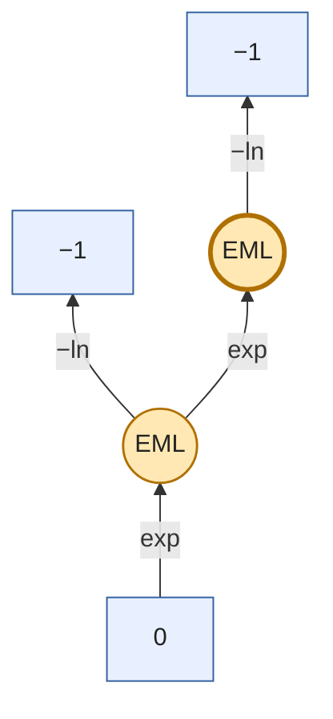

### Tree #2 — 80 digits to π via `abs_im`

- **Group**: imaginary
- **Source**: trained-sample
- **Depth / Size**: 2 / 7
- **Value**: `(-1.59517520616 + -3.14159265359j)`
- **Validation**: leading-digit match in `abs_im` channel = **80** at 80 dps; high-precision recheck at 200 dps = **200** digits.
- **Code form**: `EML(EML(0, -1), EML(-1, 2))`
- **EML logic form**: `(exp((exp(0) − ln(−1))) − ln((exp(−1) − ln(2))))`

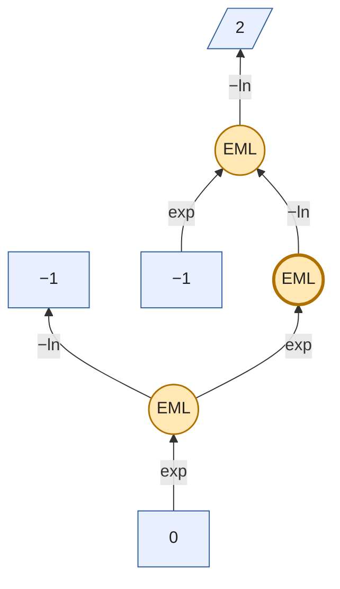

### Tree #3 — 80 digits to π via `abs_im`

- **Group**: imaginary
- **Source**: trained-sample
- **Depth / Size**: 2 / 7
- **Value**: `(-2.25960668307 + -3.14159265359j)`
- **Validation**: leading-digit match in `abs_im` channel = **80** at 80 dps; high-precision recheck at 200 dps = **200** digits.
- **Code form**: `EML(EML(0, -1), EML(-1, e))`
- **EML logic form**: `(exp((exp(0) − ln(−1))) − ln((exp(−1) − ln(e))))`

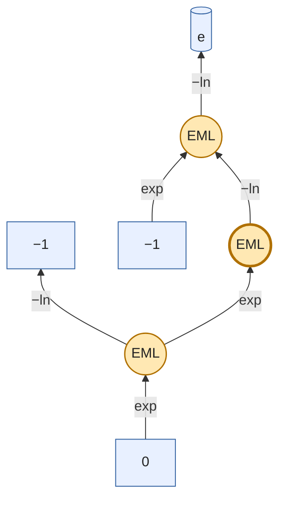

### Tree #4 — 80 digits to π via `abs_im`

- **Group**: imaginary
- **Source**: trained-sample
- **Depth / Size**: 3 / 7
- **Value**: `(-4.24044349228 + -3.14159265359j)`
- **Validation**: leading-digit match in `abs_im` channel = **80** at 80 dps; high-precision recheck at 200 dps = **200** digits.
- **Code form**: `EML(EML(EML(-1, 1), -1), -1)`
- **EML logic form**: `(exp((exp((exp(−1) − ln(1))) − ln(−1))) − ln(−1))`

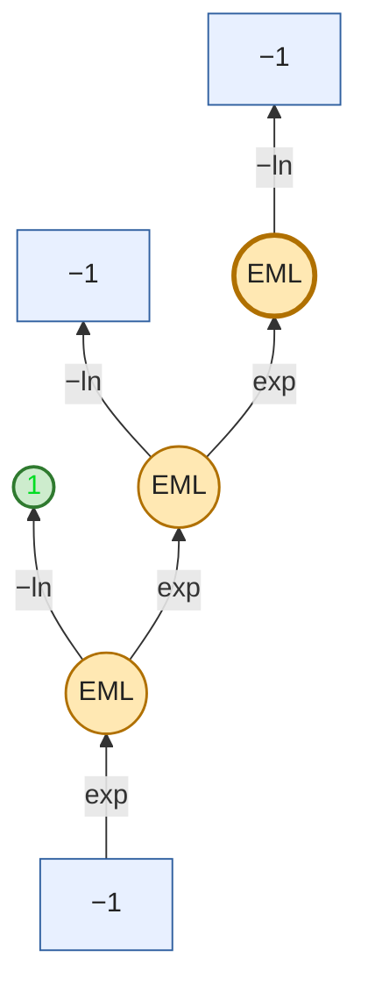

### Tree #5 — 80 digits to π via `abs_im`

- **Group**: imaginary
- **Source**: trained-sample
- **Depth / Size**: 3 / 7
- **Value**: `(-2.05923371483 + -3.14159265359j)`
- **Validation**: leading-digit match in `abs_im` channel = **80** at 80 dps; high-precision recheck at 200 dps = **200** digits.
- **Code form**: `EML(EML(EML(-1, 2), -1), -1)`
- **EML logic form**: `(exp((exp((exp(−1) − ln(2))) − ln(−1))) − ln(−1))`


### Tree #6 — 80 digits to π via `abs_im`

- **Group**: imaginary
- **Source**: trained-sample
- **Depth / Size**: 3 / 7
- **Value**: `(-2.28543090528 + -3.14159265359j)`
- **Validation**: leading-digit match in `abs_im` channel = **80** at 80 dps; high-precision recheck at 200 dps = **200** digits.
- **Code form**: `EML(EML(-1, EML(-1, e)), -1)`
- **EML logic form**: `(exp((exp(−1) − ln((exp(−1) − ln(e))))) − ln(−1))`

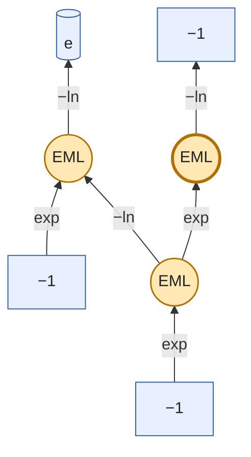

### Tree #7 — 80 digits to π via `abs_im`

- **Group**: imaginary
- **Source**: trained-sample
- **Depth / Size**: 3 / 7
- **Value**: `(-4.30025853533 + -3.14159265359j)`
- **Validation**: leading-digit match in `abs_im` channel = **80** at 80 dps; high-precision recheck at 200 dps = **200** digits.
- **Code form**: `EML(EML(0, EML(-1, e)), -1)`
- **EML logic form**: `(exp((exp(0) − ln((exp(−1) − ln(e))))) − ln(−1))`

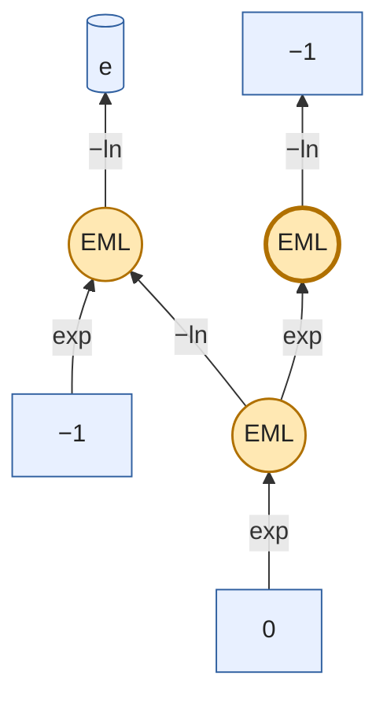

### Tree #8 — 80 digits to π via `abs_im`

- **Group**: imaginary
- **Source**: trained-sample
- **Depth / Size**: 3 / 7
- **Value**: `(-4.44147293465 + -3.14159265359j)`
- **Validation**: leading-digit match in `abs_im` channel = **80** at 80 dps; high-precision recheck at 200 dps = **200** digits.
- **Code form**: `EML(EML(-1, EML(-1, 2)), -1)`
- **EML logic form**: `(exp((exp(−1) − ln((exp(−1) − ln(2))))) − ln(−1))`

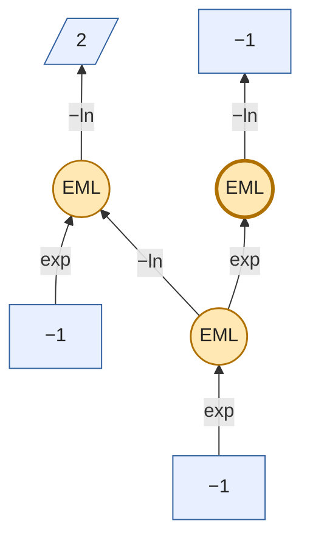

### Tree #9 — 80 digits to π via `abs_im`

- **Group**: imaginary
- **Source**: trained-sample
- **Depth / Size**: 3 / 7
- **Value**: `(-2.71828182846 + -3.14159265359j)`
- **Validation**: leading-digit match in `abs_im` channel = **80** at 80 dps; high-precision recheck at 200 dps = **200** digits.
- **Code form**: `EML(EML(EML(0, e), -1), -1)`
- **EML logic form**: `(exp((exp((exp(0) − ln(e))) − ln(−1))) − ln(−1))`

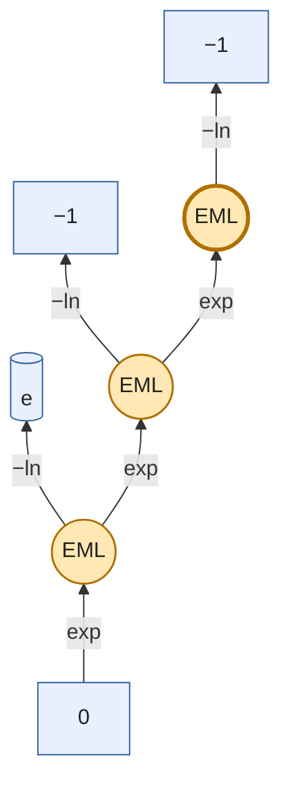

### Tree #10 — 80 digits to π via `abs_im`

- **Group**: imaginary
- **Source**: trained-sample
- **Depth / Size**: 3 / 7
- **Value**: `(-3.89284757491 + -3.14159265359j)`
- **Validation**: leading-digit match in `abs_im` channel = **80** at 80 dps; high-precision recheck at 200 dps = **200** digits.
- **Code form**: `EML(EML(EML(0, 2), -1), -1)`
- **EML logic form**: `(exp((exp((exp(0) − ln(2))) − ln(−1))) − ln(−1))`

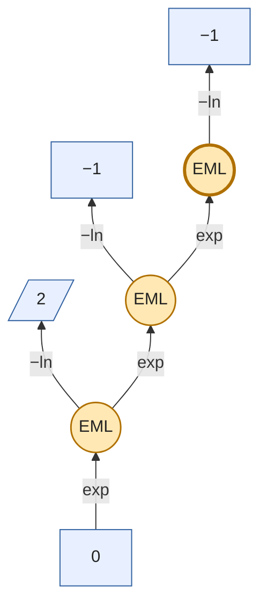

### Tree #11 — 80 digits to π via `abs_im`

- **Group**: imaginary
- **Source**: trained-sample
- **Depth / Size**: 4 / 9
- **Value**: `(-4.277243493 + -3.14159265359j)`
- **Validation**: leading-digit match in `abs_im` channel = **80** at 80 dps; high-precision recheck at 200 dps = **200** digits.
- **Code form**: `EML(EML(-1, EML(-1, EML(1, 2))), -1)`
- **EML logic form**: `(exp((exp(−1) − ln((exp(−1) − ln((exp(1) − ln(2))))))) − ln(−1))`

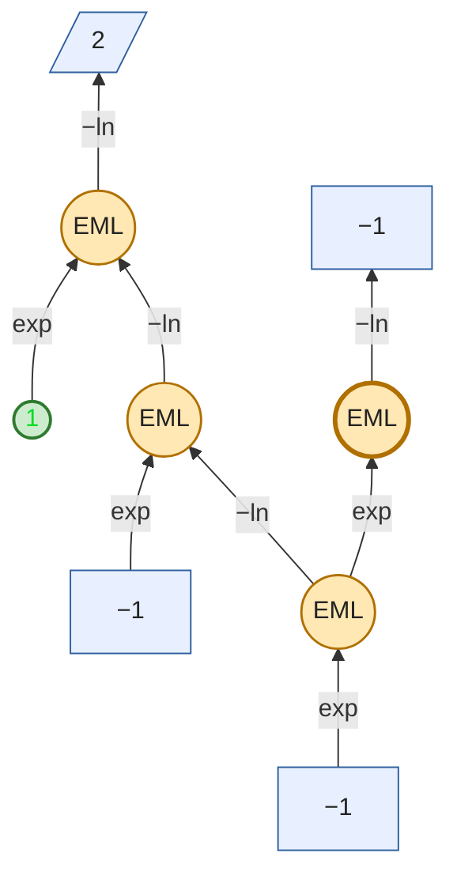

### Tree #12 — 80 digits to π via `abs_im`

- **Group**: imaginary
- **Source**: trained-sample
- **Depth / Size**: 4 / 9
- **Value**: `(-2.31813514184 + -3.14159265359j)`
- **Validation**: leading-digit match in `abs_im` channel = **80** at 80 dps; high-precision recheck at 200 dps = **200** digits.
- **Code form**: `EML(EML(EML(-1, EML(1, e)), -1), -1)`
- **EML logic form**: `(exp((exp((exp(−1) − ln((exp(1) − ln(e))))) − ln(−1))) − ln(−1))`

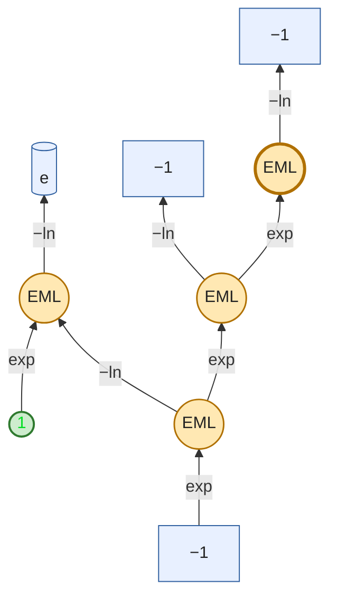

### Tree #13 — 80 digits to π via `abs_im`

- **Group**: imaginary
- **Source**: trained-sample
- **Depth / Size**: 5 / 11
- **Value**: `(-2.54081540593 + -3.14159265359j)`
- **Validation**: leading-digit match in `abs_im` channel = **80** at 80 dps; high-precision recheck at 200 dps = **200** digits.
- **Code form**: `EML(EML(EML(-1, EML(-1, EML(0, 2))), -1), -1)`
- **EML logic form**: `(exp((exp((exp(−1) − ln((exp(−1) − ln((exp(0) − ln(2))))))) − ln(−1))) − ln(−1))`

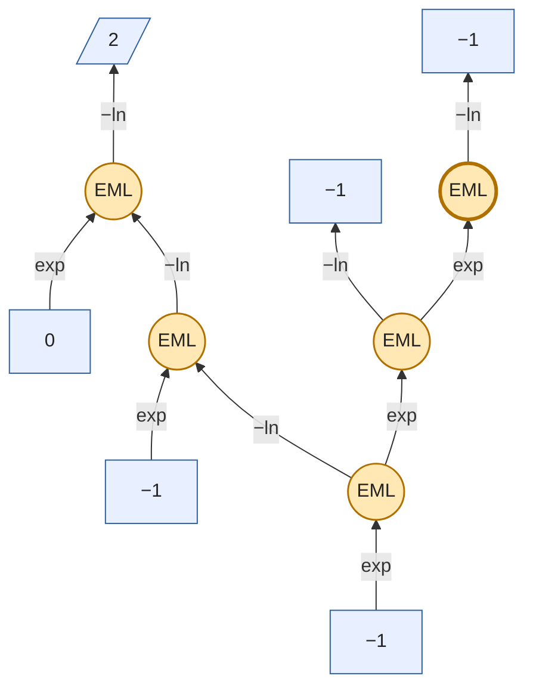

### Tree #14 — 80 digits to π via `abs_im`

- **Group**: imaginary
- **Source**: trained-sample
- **Depth / Size**: 3 / 7
- **Value**: `(-8.35705942916 + -3.14159265359j)`
- **Validation**: leading-digit match in `abs_im` channel = **80** at 80 dps; high-precision recheck at 200 dps = **200** digits.
- **Code form**: `EML(EML(0, EML(-1, 2)), -1)`
- **EML logic form**: `(exp((exp(0) − ln((exp(−1) − ln(2))))) − ln(−1))`

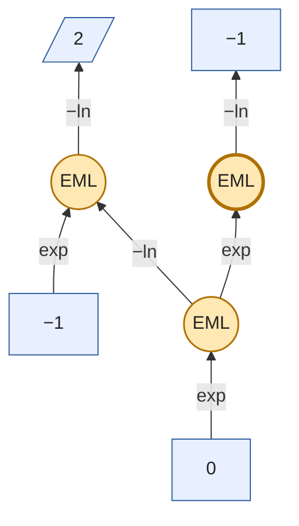

### Tree #15 — 80 digits to π via `abs_im`

- **Group**: imaginary
- **Source**: trained-sample
- **Depth / Size**: 2 / 5
- **Value**: `(-15.1542622415 + -3.14159265359j)`
- **Validation**: leading-digit match in `abs_im` channel = **80** at 80 dps; high-precision recheck at 200 dps = **200** digits.
- **Code form**: `EML(EML(1, -1), -1)`
- **EML logic form**: `(exp((exp(1) − ln(−1))) − ln(−1))`

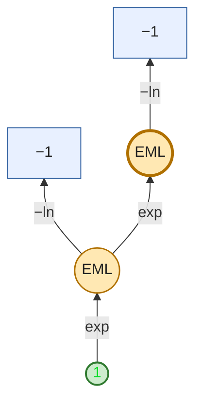

### Tree #16 — 80 digits to π via `abs_im`

- **Group**: imaginary
- **Source**: trained-sample
- **Depth / Size**: 2 / 7
- **Value**: `(-14.0311556192 + -3.14159265359j)`
- **Validation**: leading-digit match in `abs_im` channel = **80** at 80 dps; high-precision recheck at 200 dps = **200** digits.
- **Code form**: `EML(EML(1, -1), EML(-1, 2))`
- **EML logic form**: `(exp((exp(1) − ln(−1))) − ln((exp(−1) − ln(2))))`

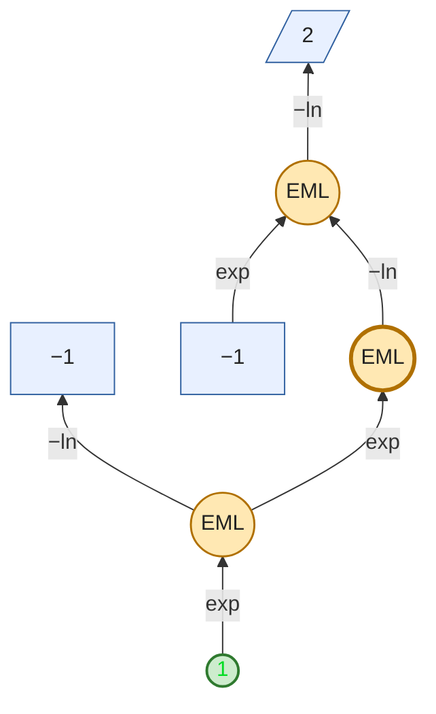

### Tree #17 — 80 digits to π via `abs_im`

- **Group**: imaginary
- **Source**: trained-sample
- **Depth / Size**: 3 / 7
- **Value**: `(-15.1542622415 + -3.14159265359j)`
- **Validation**: leading-digit match in `abs_im` channel = **80** at 80 dps; high-precision recheck at 200 dps = **200** digits.
- **Code form**: `EML(EML(EML(0, 1), -1), -1)`
- **EML logic form**: `(exp((exp((exp(0) − ln(1))) − ln(−1))) − ln(−1))`

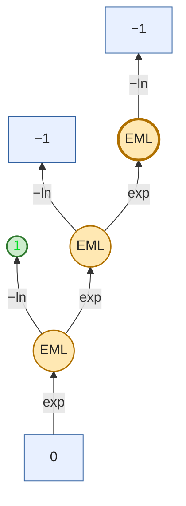

### Tree #18 — 79 digits to π via `abs_im`

- **Group**: imaginary
- **Source**: trained-sample
- **Depth / Size**: 3 / 7
- **Value**: `(-46.5901176365 + -3.14159265359j)`
- **Validation**: leading-digit match in `abs_im` channel = **79** at 80 dps; high-precision recheck at 200 dps = **199** digits.
- **Code form**: `EML(EML(1, EML(-1, 2)), -1)`
- **EML logic form**: `(exp((exp(1) − ln((exp(−1) − ln(2))))) − ln(−1))`

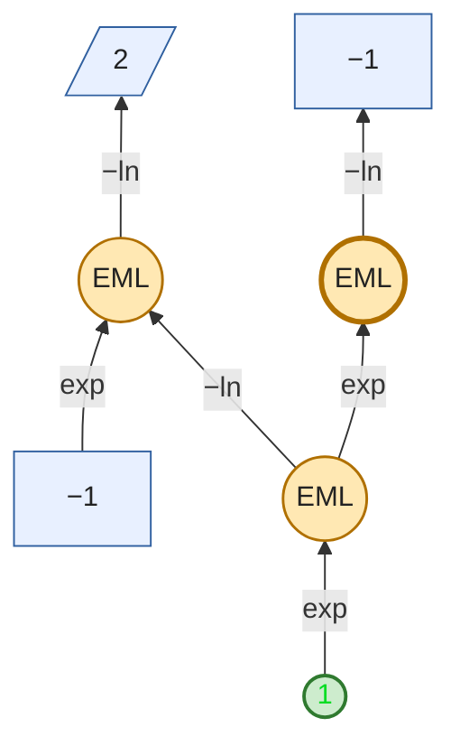

### Tree #19 — 79 digits to π via `abs_im`

- **Group**: imaginary
- **Source**: trained-sample
- **Depth / Size**: 4 / 9
- **Value**: `(-50.7552161916 + -3.14159265359j)`
- **Validation**: leading-digit match in `abs_im` channel = **79** at 80 dps; high-precision recheck at 200 dps = **199** digits.
- **Code form**: `EML(EML(EML(-1, EML(-1, 1)), -1), -1)`
- **EML logic form**: `(exp((exp((exp(−1) − ln((exp(−1) − ln(1))))) − ln(−1))) − ln(−1))`

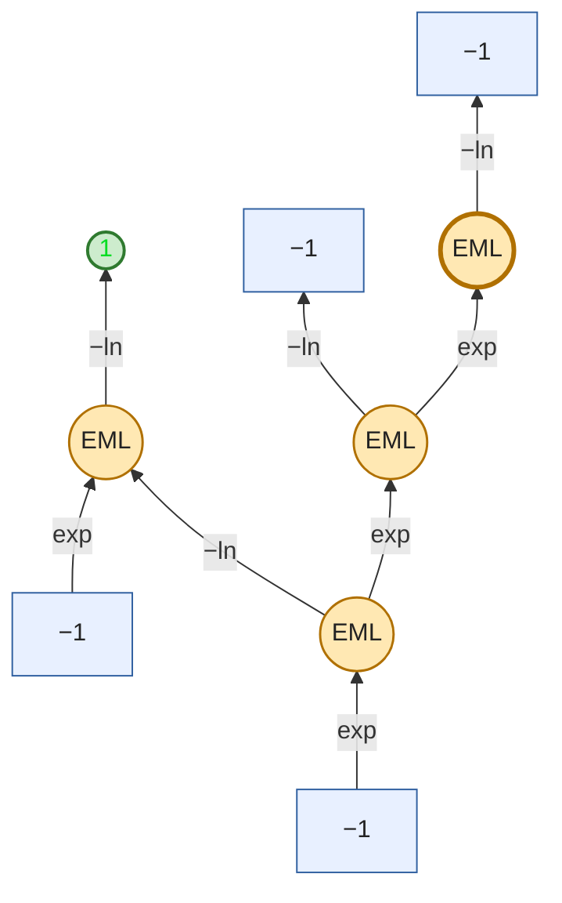

### Tree #20 — 79 digits to π via `abs_im`

- **Group**: imaginary
- **Source**: trained-sample
- **Depth / Size**: 3 / 7
- **Value**: `(-263.73413327 + -3.14159265359j)`
- **Validation**: leading-digit match in `abs_im` channel = **79** at 80 dps; high-precision recheck at 200 dps = **198** digits.
- **Code form**: `EML(EML(EML(1, e), -1), -1)`
- **EML logic form**: `(exp((exp((exp(1) − ln(e))) − ln(−1))) − ln(−1))`

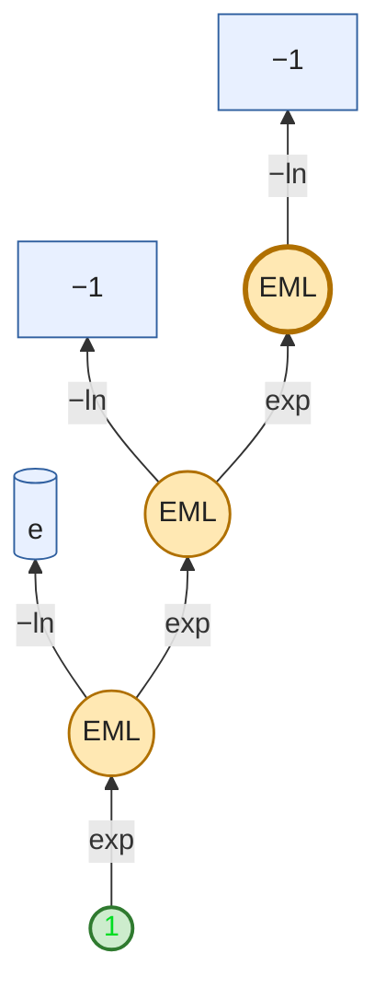

### Tree #21 — 78 digits to π via `abs_im`

- **Group**: imaginary
- **Source**: trained-sample
- **Depth / Size**: 2 / 5
- **Value**: `(-1618.17799191 + -3.14159265359j)`
- **Validation**: leading-digit match in `abs_im` channel = **78** at 80 dps; high-precision recheck at 200 dps = **198** digits.
- **Code form**: `EML(EML(2, -1), -1)`
- **EML logic form**: `(exp((exp(2) − ln(−1))) − ln(−1))`

```mermaid
%% EML(EML(2, -1), -1)
flowchart BT
    L3[/"2"/]:::leaf
    L4["−1"]:::leaf
    E2(("EML")):::eml
    L5["−1"]:::leaf
    E1(("EML")):::eml
    L3 -->|"exp"| E2
    E2 -->|"−ln"| L4
    E2 -->|"exp"| E1
    E1 -->|"−ln"| L5

    classDef eml fill:#ffe8b3,stroke:#b07000,stroke-width:1.5px,color:#222;
    classDef leaf fill:#e8f0ff,stroke:#3060a0,color:#222;
    classDef leafone fill:#cdeccd,stroke:#2f7a2f,stroke-width:2px,color:#0d2;
    style E1 stroke-width:3px;
```

### Tree #22 — 78 digits to π via `abs_im`

- **Group**: imaginary
- **Source**: trained-sample
- **Depth / Size**: 2 / 7
- **Value**: `(-1617.71931677 + -3.14159265359j)`
- **Validation**: leading-digit match in `abs_im` channel = **78** at 80 dps; high-precision recheck at 200 dps = **198** digits.
- **Code form**: `EML(EML(2, -1), EML(-1, e))`
- **EML logic form**: `(exp((exp(2) − ln(−1))) − ln((exp(−1) − ln(e))))`

```mermaid
%% EML(EML(2, -1), EML(-1, e))
flowchart BT
    L3[/"2"/]:::leaf
    L4["−1"]:::leaf
    E2(("EML")):::eml
    L6["−1"]:::leaf
    L7[("e")]:::leaf
    E5(("EML")):::eml
    E1(("EML")):::eml
    L3 -->|"exp"| E2
    E2 -->|"−ln"| L4
    L6 -->|"exp"| E5
    E5 -->|"−ln"| L7
    E2 -->|"exp"| E1
    E1 -->|"−ln"| E5

    classDef eml fill:#ffe8b3,stroke:#b07000,stroke-width:1.5px,color:#222;
    classDef leaf fill:#e8f0ff,stroke:#3060a0,color:#222;
    classDef leafone fill:#cdeccd,stroke:#2f7a2f,stroke-width:2px,color:#0d2;
    style E1 stroke-width:3px;
```

### Tree #23 — 78 digits to π via `abs_im`

- **Group**: imaginary
- **Source**: trained-sample
- **Depth / Size**: 3 / 7
- **Value**: `(-2559.91989077 + -3.14159265359j)`
- **Validation**: leading-digit match in `abs_im` channel = **78** at 80 dps; high-precision recheck at 200 dps = **197** digits.
- **Code form**: `EML(EML(2, EML(-1, e)), -1)`
- **EML logic form**: `(exp((exp(2) − ln((exp(−1) − ln(e))))) − ln(−1))`

```mermaid
%% EML(EML(2, EML(-1, e)), -1)
flowchart BT
    L3[/"2"/]:::leaf
    L5["−1"]:::leaf
    L6[("e")]:::leaf
    E4(("EML")):::eml
    E2(("EML")):::eml
    L7["−1"]:::leaf
    E1(("EML")):::eml
    L5 -->|"exp"| E4
    E4 -->|"−ln"| L6
    L3 -->|"exp"| E2
    E2 -->|"−ln"| E4
    E2 -->|"exp"| E1
    E1 -->|"−ln"| L7

    classDef eml fill:#ffe8b3,stroke:#b07000,stroke-width:1.5px,color:#222;
    classDef leaf fill:#e8f0ff,stroke:#3060a0,color:#222;
    classDef leafone fill:#cdeccd,stroke:#2f7a2f,stroke-width:2px,color:#0d2;
    style E1 stroke-width:3px;
```

### Tree #24 — 77 digits to π via `abs_im`

- **Group**: imaginary
- **Source**: trained-sample
- **Depth / Size**: 3 / 7
- **Value**: `(-4974.91080719 + -3.14159265359j)`
- **Validation**: leading-digit match in `abs_im` channel = **77** at 80 dps; high-precision recheck at 200 dps = **197** digits.
- **Code form**: `EML(EML(2, EML(-1, 2)), -1)`
- **EML logic form**: `(exp((exp(2) − ln((exp(−1) − ln(2))))) − ln(−1))`

```mermaid
%% EML(EML(2, EML(-1, 2)), -1)
flowchart BT
    L3[/"2"/]:::leaf
    L5["−1"]:::leaf
    L6[/"2"/]:::leaf
    E4(("EML")):::eml
    E2(("EML")):::eml
    L7["−1"]:::leaf
    E1(("EML")):::eml
    L5 -->|"exp"| E4
    E4 -->|"−ln"| L6
    L3 -->|"exp"| E2
    E2 -->|"−ln"| E4
    E2 -->|"exp"| E1
    E1 -->|"−ln"| L7

    classDef eml fill:#ffe8b3,stroke:#b07000,stroke-width:1.5px,color:#222;
    classDef leaf fill:#e8f0ff,stroke:#3060a0,color:#222;
    classDef leafone fill:#cdeccd,stroke:#2f7a2f,stroke-width:2px,color:#0d2;
    style E1 stroke-width:3px;
```

### Tree #25 — 75 digits to π via `abs_im`

- **Group**: imaginary
- **Source**: trained-sample
- **Depth / Size**: 4 / 9
- **Value**: `(-1784195.09199 + -3.14159265359j)`
- **Validation**: leading-digit match in `abs_im` channel = **75** at 80 dps; high-precision recheck at 200 dps = **195** digits.
- **Code form**: `EML(EML(e, EML(EML(-1, -1), 2)), -1)`
- **EML logic form**: `(exp((exp(e) − ln((exp((exp(−1) − ln(−1))) − ln(2))))) − ln(−1))`

```mermaid
%% EML(EML(e, EML(EML(-1, -1), 2)), -1)
flowchart BT
    L3[("e")]:::leaf
    L6["−1"]:::leaf
    L7["−1"]:::leaf
    E5(("EML")):::eml
    L8[/"2"/]:::leaf
    E4(("EML")):::eml
    E2(("EML")):::eml
    L9["−1"]:::leaf
    E1(("EML")):::eml
    L6 -->|"exp"| E5
    E5 -->|"−ln"| L7
    E5 -->|"exp"| E4
    E4 -->|"−ln"| L8
    L3 -->|"exp"| E2
    E2 -->|"−ln"| E4
    E2 -->|"exp"| E1
    E1 -->|"−ln"| L9

    classDef eml fill:#ffe8b3,stroke:#b07000,stroke-width:1.5px,color:#222;
    classDef leaf fill:#e8f0ff,stroke:#3060a0,color:#222;
    classDef leafone fill:#cdeccd,stroke:#2f7a2f,stroke-width:2px,color:#0d2;
    style E1 stroke-width:3px;
```

### Tree #26 — 74 digits to π via `abs_im`

- **Group**: imaginary
- **Source**: trained-sample
- **Depth / Size**: 2 / 5
- **Value**: `(-3814279.10476 + -3.14159265359j)`
- **Validation**: leading-digit match in `abs_im` channel = **74** at 80 dps; high-precision recheck at 200 dps = **194** digits.
- **Code form**: `EML(EML(e, -1), -1)`
- **EML logic form**: `(exp((exp(e) − ln(−1))) − ln(−1))`

```mermaid
%% EML(EML(e, -1), -1)
flowchart BT
    L3[("e")]:::leaf
    L4["−1"]:::leaf
    E2(("EML")):::eml
    L5["−1"]:::leaf
    E1(("EML")):::eml
    L3 -->|"exp"| E2
    E2 -->|"−ln"| L4
    E2 -->|"exp"| E1
    E1 -->|"−ln"| L5

    classDef eml fill:#ffe8b3,stroke:#b07000,stroke-width:1.5px,color:#222;
    classDef leaf fill:#e8f0ff,stroke:#3060a0,color:#222;
    classDef leafone fill:#cdeccd,stroke:#2f7a2f,stroke-width:2px,color:#0d2;
    style E1 stroke-width:3px;
```

### Tree #27 — 74 digits to π via `abs_im`

- **Group**: imaginary
- **Source**: trained-sample
- **Depth / Size**: 2 / 7
- **Value**: `(-3814278.64609 + -3.14159265359j)`
- **Validation**: leading-digit match in `abs_im` channel = **74** at 80 dps; high-precision recheck at 200 dps = **194** digits.
- **Code form**: `EML(EML(e, -1), EML(-1, e))`
- **EML logic form**: `(exp((exp(e) − ln(−1))) − ln((exp(−1) − ln(e))))`

```mermaid
%% EML(EML(e, -1), EML(-1, e))
flowchart BT
    L3[("e")]:::leaf
    L4["−1"]:::leaf
    E2(("EML")):::eml
    L6["−1"]:::leaf
    L7[("e")]:::leaf
    E5(("EML")):::eml
    E1(("EML")):::eml
    L3 -->|"exp"| E2
    E2 -->|"−ln"| L4
    L6 -->|"exp"| E5
    E5 -->|"−ln"| L7
    E2 -->|"exp"| E1
    E1 -->|"−ln"| E5

    classDef eml fill:#ffe8b3,stroke:#b07000,stroke-width:1.5px,color:#222;
    classDef leaf fill:#e8f0ff,stroke:#3060a0,color:#222;
    classDef leafone fill:#cdeccd,stroke:#2f7a2f,stroke-width:2px,color:#0d2;
    style E1 stroke-width:3px;
```

### Tree #28 — 74 digits to π via `abs_im`

- **Group**: imaginary
- **Source**: trained-sample
- **Depth / Size**: 2 / 7
- **Value**: `(-3814277.98165 + -3.14159265359j)`
- **Validation**: leading-digit match in `abs_im` channel = **74** at 80 dps; high-precision recheck at 200 dps = **194** digits.
- **Code form**: `EML(EML(e, -1), EML(-1, 2))`
- **EML logic form**: `(exp((exp(e) − ln(−1))) − ln((exp(−1) − ln(2))))`

```mermaid
%% EML(EML(e, -1), EML(-1, 2))
flowchart BT
    L3[("e")]:::leaf
    L4["−1"]:::leaf
    E2(("EML")):::eml
    L6["−1"]:::leaf
    L7[/"2"/]:::leaf
    E5(("EML")):::eml
    E1(("EML")):::eml
    L3 -->|"exp"| E2
    E2 -->|"−ln"| L4
    L6 -->|"exp"| E5
    E5 -->|"−ln"| L7
    E2 -->|"exp"| E1
    E1 -->|"−ln"| E5

    classDef eml fill:#ffe8b3,stroke:#b07000,stroke-width:1.5px,color:#222;
    classDef leaf fill:#e8f0ff,stroke:#3060a0,color:#222;
    classDef leafone fill:#cdeccd,stroke:#2f7a2f,stroke-width:2px,color:#0d2;
    style E1 stroke-width:3px;
```

### Tree #29 — 74 digits to π via `abs_im`

- **Group**: imaginary
- **Source**: trained-sample
- **Depth / Size**: 3 / 7
- **Value**: `(-3814279.10476 + -3.14159265359j)`
- **Validation**: leading-digit match in `abs_im` channel = **74** at 80 dps; high-precision recheck at 200 dps = **194** digits.
- **Code form**: `EML(EML(EML(1, 1), -1), -1)`
- **EML logic form**: `(exp((exp((exp(1) − ln(1))) − ln(−1))) − ln(−1))`

```mermaid
%% EML(EML(EML(1, 1), -1), -1)
flowchart BT
    L4(("1")):::leafone
    L5(("1")):::leafone
    E3(("EML")):::eml
    L6["−1"]:::leaf
    E2(("EML")):::eml
    L7["−1"]:::leaf
    E1(("EML")):::eml
    L4 -->|"exp"| E3
    E3 -->|"−ln"| L5
    E3 -->|"exp"| E2
    E2 -->|"−ln"| L6
    E2 -->|"exp"| E1
    E1 -->|"−ln"| L7

    classDef eml fill:#ffe8b3,stroke:#b07000,stroke-width:1.5px,color:#222;
    classDef leaf fill:#e8f0ff,stroke:#3060a0,color:#222;
    classDef leafone fill:#cdeccd,stroke:#2f7a2f,stroke-width:2px,color:#0d2;
    style E1 stroke-width:3px;
```

### Tree #30 — 74 digits to π via `abs_im`

- **Group**: imaginary
- **Source**: trained-sample
- **Depth / Size**: 3 / 7
- **Value**: `(-6034100.69723 + -3.14159265359j)`
- **Validation**: leading-digit match in `abs_im` channel = **74** at 80 dps; high-precision recheck at 200 dps = **194** digits.
- **Code form**: `EML(EML(e, EML(-1, e)), -1)`
- **EML logic form**: `(exp((exp(e) − ln((exp(−1) − ln(e))))) − ln(−1))`

```mermaid
%% EML(EML(e, EML(-1, e)), -1)
flowchart BT
    L3[("e")]:::leaf
    L5["−1"]:::leaf
    L6[("e")]:::leaf
    E4(("EML")):::eml
    E2(("EML")):::eml
    L7["−1"]:::leaf
    E1(("EML")):::eml
    L5 -->|"exp"| E4
    E4 -->|"−ln"| L6
    L3 -->|"exp"| E2
    E2 -->|"−ln"| E4
    E2 -->|"exp"| E1
    E1 -->|"−ln"| L7

    classDef eml fill:#ffe8b3,stroke:#b07000,stroke-width:1.5px,color:#222;
    classDef leaf fill:#e8f0ff,stroke:#3060a0,color:#222;
    classDef leafone fill:#cdeccd,stroke:#2f7a2f,stroke-width:2px,color:#0d2;
    style E1 stroke-width:3px;
```

### Tree #31 — 50 digits to π via `abs_im`

- **Group**: imaginary
- **Source**: seed-construction
- **Depth / Size**: 1 / 3
- **Value**: `(1.0 + -3.14159265359j)`
- **Validation**: leading-digit match in `abs_im` channel = **50** at 80 dps; high-precision recheck at 200 dps = **195** digits.
- **Code form**: `EML(0, -1)`
- **EML logic form**: `(exp(0) − ln(−1))`

```mermaid
%% EML(0, -1)
flowchart BT
    L2["0"]:::leaf
    L3["−1"]:::leaf
    E1(("EML")):::eml
    L2 -->|"exp"| E1
    E1 -->|"−ln"| L3

    classDef eml fill:#ffe8b3,stroke:#b07000,stroke-width:1.5px,color:#222;
    classDef leaf fill:#e8f0ff,stroke:#3060a0,color:#222;
    classDef leafone fill:#cdeccd,stroke:#2f7a2f,stroke-width:2px,color:#0d2;
    style E1 stroke-width:3px;
```

### Tree #32 — 50 digits to π via `abs_im`

- **Group**: imaginary
- **Source**: seed-construction
- **Depth / Size**: 1 / 3
- **Value**: `(2.71828182846 + -3.14159265359j)`
- **Validation**: leading-digit match in `abs_im` channel = **50** at 80 dps; high-precision recheck at 200 dps = **195** digits.
- **Code form**: `EML(1, -1)`
- **EML logic form**: `(exp(1) − ln(−1))`

```mermaid
%% EML(1, -1)
flowchart BT
    L2(("1")):::leafone
    L3["−1"]:::leaf
    E1(("EML")):::eml
    L2 -->|"exp"| E1
    E1 -->|"−ln"| L3

    classDef eml fill:#ffe8b3,stroke:#b07000,stroke-width:1.5px,color:#222;
    classDef leaf fill:#e8f0ff,stroke:#3060a0,color:#222;
    classDef leafone fill:#cdeccd,stroke:#2f7a2f,stroke-width:2px,color:#0d2;
    style E1 stroke-width:3px;
```

### Tree #33 — 50 digits to π via `abs_im`

- **Group**: imaginary
- **Source**: seed-construction
- **Depth / Size**: 1 / 3
- **Value**: `(0.367879441171 + -3.14159265359j)`
- **Validation**: leading-digit match in `abs_im` channel = **50** at 80 dps; high-precision recheck at 200 dps = **195** digits.
- **Code form**: `EML(-1, -1)`
- **EML logic form**: `(exp(−1) − ln(−1))`

```mermaid
%% EML(-1, -1)
flowchart BT
    L2["−1"]:::leaf
    L3["−1"]:::leaf
    E1(("EML")):::eml
    L2 -->|"exp"| E1
    E1 -->|"−ln"| L3

    classDef eml fill:#ffe8b3,stroke:#b07000,stroke-width:1.5px,color:#222;
    classDef leaf fill:#e8f0ff,stroke:#3060a0,color:#222;
    classDef leafone fill:#cdeccd,stroke:#2f7a2f,stroke-width:2px,color:#0d2;
    style E1 stroke-width:3px;
```

### Tree #34 — 50 digits to π via `abs_im`

- **Group**: imaginary
- **Source**: trained-sample
- **Depth / Size**: 1 / 3
- **Value**: `(15.1542622415 + -3.14159265359j)`
- **Validation**: leading-digit match in `abs_im` channel = **50** at 80 dps; high-precision recheck at 200 dps = **195** digits.
- **Code form**: `EML(e, -1)`
- **EML logic form**: `(exp(e) − ln(−1))`

```mermaid
%% EML(e, -1)
flowchart BT
    L2[("e")]:::leaf
    L3["−1"]:::leaf
    E1(("EML")):::eml
    L2 -->|"exp"| E1
    E1 -->|"−ln"| L3

    classDef eml fill:#ffe8b3,stroke:#b07000,stroke-width:1.5px,color:#222;
    classDef leaf fill:#e8f0ff,stroke:#3060a0,color:#222;
    classDef leafone fill:#cdeccd,stroke:#2f7a2f,stroke-width:2px,color:#0d2;
    style E1 stroke-width:3px;
```

### Tree #35 — 50 digits to π via `abs_im`

- **Group**: imaginary
- **Source**: trained-sample
- **Depth / Size**: 1 / 3
- **Value**: `(7.38905609893 + -3.14159265359j)`
- **Validation**: leading-digit match in `abs_im` channel = **50** at 80 dps; high-precision recheck at 200 dps = **195** digits.
- **Code form**: `EML(2, -1)`
- **EML logic form**: `(exp(2) − ln(−1))`

```mermaid
%% EML(2, -1)
flowchart BT
    L2[/"2"/]:::leaf
    L3["−1"]:::leaf
    E1(("EML")):::eml
    L2 -->|"exp"| E1
    E1 -->|"−ln"| L3

    classDef eml fill:#ffe8b3,stroke:#b07000,stroke-width:1.5px,color:#222;
    classDef leaf fill:#e8f0ff,stroke:#3060a0,color:#222;
    classDef leafone fill:#cdeccd,stroke:#2f7a2f,stroke-width:2px,color:#0d2;
    style E1 stroke-width:3px;
```

### Tree #36 — 50 digits to π via `abs_im`

- **Group**: imaginary
- **Source**: seed-construction
- **Depth / Size**: 2 / 5
- **Value**: `(2.71828182846 + -3.14159265359j)`
- **Validation**: leading-digit match in `abs_im` channel = **50** at 80 dps; high-precision recheck at 200 dps = **195** digits.
- **Code form**: `EML(EML(0, 1), -1)`
- **EML logic form**: `(exp((exp(0) − ln(1))) − ln(−1))`

```mermaid
%% EML(EML(0, 1), -1)
flowchart BT
    L3["0"]:::leaf
    L4(("1")):::leafone
    E2(("EML")):::eml
    L5["−1"]:::leaf
    E1(("EML")):::eml
    L3 -->|"exp"| E2
    E2 -->|"−ln"| L4
    E2 -->|"exp"| E1
    E1 -->|"−ln"| L5

    classDef eml fill:#ffe8b3,stroke:#b07000,stroke-width:1.5px,color:#222;
    classDef leaf fill:#e8f0ff,stroke:#3060a0,color:#222;
    classDef leafone fill:#cdeccd,stroke:#2f7a2f,stroke-width:2px,color:#0d2;
    style E1 stroke-width:3px;
```

### Tree #37 — 50 digits to π via `abs_im`

- **Group**: imaginary
- **Source**: seed-construction
- **Depth / Size**: 2 / 5
- **Value**: `(15.1542622415 + -3.14159265359j)`
- **Validation**: leading-digit match in `abs_im` channel = **50** at 80 dps; high-precision recheck at 200 dps = **195** digits.
- **Code form**: `EML(EML(1, 1), -1)`
- **EML logic form**: `(exp((exp(1) − ln(1))) − ln(−1))`

```mermaid
%% EML(EML(1, 1), -1)
flowchart BT
    L3(("1")):::leafone
    L4(("1")):::leafone
    E2(("EML")):::eml
    L5["−1"]:::leaf
    E1(("EML")):::eml
    L3 -->|"exp"| E2
    E2 -->|"−ln"| L4
    E2 -->|"exp"| E1
    E1 -->|"−ln"| L5

    classDef eml fill:#ffe8b3,stroke:#b07000,stroke-width:1.5px,color:#222;
    classDef leaf fill:#e8f0ff,stroke:#3060a0,color:#222;
    classDef leafone fill:#cdeccd,stroke:#2f7a2f,stroke-width:2px,color:#0d2;
    style E1 stroke-width:3px;
```

### Tree #38 — 50 digits to π via `abs_im`

- **Group**: imaginary
- **Source**: seed-construction
- **Depth / Size**: 2 / 5
- **Value**: `(1.0 + -3.14159265359j)`
- **Validation**: leading-digit match in `abs_im` channel = **50** at 80 dps; high-precision recheck at 200 dps = **195** digits.
- **Code form**: `EML(EML(0, e), -1)`
- **EML logic form**: `(exp((exp(0) − ln(e))) − ln(−1))`

```mermaid
%% EML(EML(0, e), -1)
flowchart BT
    L3["0"]:::leaf
    L4[("e")]:::leaf
    E2(("EML")):::eml
    L5["−1"]:::leaf
    E1(("EML")):::eml
    L3 -->|"exp"| E2
    E2 -->|"−ln"| L4
    E2 -->|"exp"| E1
    E1 -->|"−ln"| L5

    classDef eml fill:#ffe8b3,stroke:#b07000,stroke-width:1.5px,color:#222;
    classDef leaf fill:#e8f0ff,stroke:#3060a0,color:#222;
    classDef leafone fill:#cdeccd,stroke:#2f7a2f,stroke-width:2px,color:#0d2;
    style E1 stroke-width:3px;
```

### Tree #39 — 50 digits to π via `abs_im`

- **Group**: imaginary
- **Source**: seed-construction
- **Depth / Size**: 2 / 5
- **Value**: `(1618.17799191 + -3.14159265359j)`
- **Validation**: leading-digit match in `abs_im` channel = **50** at 80 dps; high-precision recheck at 200 dps = **195** digits.
- **Code form**: `EML(EML(2, 1), -1)`
- **EML logic form**: `(exp((exp(2) − ln(1))) − ln(−1))`

```mermaid
%% EML(EML(2, 1), -1)
flowchart BT
    L3[/"2"/]:::leaf
    L4(("1")):::leafone
    E2(("EML")):::eml
    L5["−1"]:::leaf
    E1(("EML")):::eml
    L3 -->|"exp"| E2
    E2 -->|"−ln"| L4
    E2 -->|"exp"| E1
    E1 -->|"−ln"| L5

    classDef eml fill:#ffe8b3,stroke:#b07000,stroke-width:1.5px,color:#222;
    classDef leaf fill:#e8f0ff,stroke:#3060a0,color:#222;
    classDef leafone fill:#cdeccd,stroke:#2f7a2f,stroke-width:2px,color:#0d2;
    style E1 stroke-width:3px;
```

### Tree #40 — 50 digits to π via `abs_im`

- **Group**: imaginary
- **Source**: seed-construction
- **Depth / Size**: 2 / 5
- **Value**: `(-1.44466786101 + -3.14159265359j)`
- **Validation**: leading-digit match in `abs_im` channel = **50** at 80 dps; high-precision recheck at 200 dps = **200** digits.
- **Code form**: `EML(EML(-1, -1), -1)`
- **EML logic form**: `(exp((exp(−1) − ln(−1))) − ln(−1))`

```mermaid
%% EML(EML(-1, -1), -1)
flowchart BT
    L3["−1"]:::leaf
    L4["−1"]:::leaf
    E2(("EML")):::eml
    L5["−1"]:::leaf
    E1(("EML")):::eml
    L3 -->|"exp"| E2
    E2 -->|"−ln"| L4
    E2 -->|"exp"| E1
    E1 -->|"−ln"| L5

    classDef eml fill:#ffe8b3,stroke:#b07000,stroke-width:1.5px,color:#222;
    classDef leaf fill:#e8f0ff,stroke:#3060a0,color:#222;
    classDef leafone fill:#cdeccd,stroke:#2f7a2f,stroke-width:2px,color:#0d2;
    style E1 stroke-width:3px;
```

### Tree #41 — 50 digits to π via `abs_im`

- **Group**: imaginary
- **Source**: trained-sample
- **Depth / Size**: 2 / 5
- **Value**: `(1.44466786101 + -3.14159265359j)`
- **Validation**: leading-digit match in `abs_im` channel = **50** at 80 dps; high-precision recheck at 200 dps = **195** digits.
- **Code form**: `EML(EML(-1, 1), -1)`
- **EML logic form**: `(exp((exp(−1) − ln(1))) − ln(−1))`

```mermaid
%% EML(EML(-1, 1), -1)
flowchart BT
    L3["−1"]:::leaf
    L4(("1")):::leafone
    E2(("EML")):::eml
    L5["−1"]:::leaf
    E1(("EML")):::eml
    L3 -->|"exp"| E2
    E2 -->|"−ln"| L4
    E2 -->|"exp"| E1
    E1 -->|"−ln"| L5

    classDef eml fill:#ffe8b3,stroke:#b07000,stroke-width:1.5px,color:#222;
    classDef leaf fill:#e8f0ff,stroke:#3060a0,color:#222;
    classDef leafone fill:#cdeccd,stroke:#2f7a2f,stroke-width:2px,color:#0d2;
    style E1 stroke-width:3px;
```

### Tree #42 — 50 digits to π via `abs_im`

- **Group**: imaginary
- **Source**: trained-sample
- **Depth / Size**: 2 / 5
- **Value**: `(0.722333930505 + -3.14159265359j)`
- **Validation**: leading-digit match in `abs_im` channel = **50** at 80 dps; high-precision recheck at 200 dps = **195** digits.
- **Code form**: `EML(EML(-1, 2), -1)`
- **EML logic form**: `(exp((exp(−1) − ln(2))) − ln(−1))`

```mermaid
%% EML(EML(-1, 2), -1)
flowchart BT
    L3["−1"]:::leaf
    L4[/"2"/]:::leaf
    E2(("EML")):::eml
    L5["−1"]:::leaf
    E1(("EML")):::eml
    L3 -->|"exp"| E2
    E2 -->|"−ln"| L4
    E2 -->|"exp"| E1
    E1 -->|"−ln"| L5

    classDef eml fill:#ffe8b3,stroke:#b07000,stroke-width:1.5px,color:#222;
    classDef leaf fill:#e8f0ff,stroke:#3060a0,color:#222;
    classDef leafone fill:#cdeccd,stroke:#2f7a2f,stroke-width:2px,color:#0d2;
    style E1 stroke-width:3px;
```

### Tree #43 — 50 digits to π via `abs_im`

- **Group**: imaginary
- **Source**: trained-sample
- **Depth / Size**: 2 / 5
- **Value**: `(0.531463605387 + -3.14159265359j)`
- **Validation**: leading-digit match in `abs_im` channel = **50** at 80 dps; high-precision recheck at 200 dps = **195** digits.
- **Code form**: `EML(EML(-1, e), -1)`
- **EML logic form**: `(exp((exp(−1) − ln(e))) − ln(−1))`

```mermaid
%% EML(EML(-1, e), -1)
flowchart BT
    L3["−1"]:::leaf
    L4[("e")]:::leaf
    E2(("EML")):::eml
    L5["−1"]:::leaf
    E1(("EML")):::eml
    L3 -->|"exp"| E2
    E2 -->|"−ln"| L4
    E2 -->|"exp"| E1
    E1 -->|"−ln"| L5

    classDef eml fill:#ffe8b3,stroke:#b07000,stroke-width:1.5px,color:#222;
    classDef leaf fill:#e8f0ff,stroke:#3060a0,color:#222;
    classDef leafone fill:#cdeccd,stroke:#2f7a2f,stroke-width:2px,color:#0d2;
    style E1 stroke-width:3px;
```

### Tree #44 — 50 digits to π via `abs_im`

- **Group**: imaginary
- **Source**: trained-sample
- **Depth / Size**: 2 / 5
- **Value**: `(0.826554586559 + -3.14159265359j)`
- **Validation**: leading-digit match in `abs_im` channel = **50** at 80 dps; high-precision recheck at 200 dps = **195** digits.
- **Code form**: `EML(-1, EML(-1, e))`
- **EML logic form**: `(exp(−1) − ln((exp(−1) − ln(e))))`

```mermaid
%% EML(-1, EML(-1, e))
flowchart BT
    L2["−1"]:::leaf
    L4["−1"]:::leaf
    L5[("e")]:::leaf
    E3(("EML")):::eml
    E1(("EML")):::eml
    L4 -->|"exp"| E3
    E3 -->|"−ln"| L5
    L2 -->|"exp"| E1
    E1 -->|"−ln"| E3

    classDef eml fill:#ffe8b3,stroke:#b07000,stroke-width:1.5px,color:#222;
    classDef leaf fill:#e8f0ff,stroke:#3060a0,color:#222;
    classDef leafone fill:#cdeccd,stroke:#2f7a2f,stroke-width:2px,color:#0d2;
    style E1 stroke-width:3px;
```

### Tree #45 — 50 digits to π via `abs_im`

- **Group**: imaginary
- **Source**: trained-sample
- **Depth / Size**: 2 / 5
- **Value**: `(595.294415381 + -3.14159265359j)`
- **Validation**: leading-digit match in `abs_im` channel = **50** at 80 dps; high-precision recheck at 200 dps = **195** digits.
- **Code form**: `EML(EML(2, e), -1)`
- **EML logic form**: `(exp((exp(2) − ln(e))) − ln(−1))`

```mermaid
%% EML(EML(2, e), -1)
flowchart BT
    L3[/"2"/]:::leaf
    L4[("e")]:::leaf
    E2(("EML")):::eml
    L5["−1"]:::leaf
    E1(("EML")):::eml
    L3 -->|"exp"| E2
    E2 -->|"−ln"| L4
    E2 -->|"exp"| E1
    E1 -->|"−ln"| L5

    classDef eml fill:#ffe8b3,stroke:#b07000,stroke-width:1.5px,color:#222;
    classDef leaf fill:#e8f0ff,stroke:#3060a0,color:#222;
    classDef leafone fill:#cdeccd,stroke:#2f7a2f,stroke-width:2px,color:#0d2;
    style E1 stroke-width:3px;
```

### Tree #46 — 50 digits to π via `abs_im`

- **Group**: imaginary
- **Source**: trained-sample
- **Depth / Size**: 2 / 5
- **Value**: `(1.49098606347 + -3.14159265359j)`
- **Validation**: leading-digit match in `abs_im` channel = **50** at 80 dps; high-precision recheck at 200 dps = **195** digits.
- **Code form**: `EML(-1, EML(-1, 2))`
- **EML logic form**: `(exp(−1) − ln((exp(−1) − ln(2))))`

```mermaid
%% EML(-1, EML(-1, 2))
flowchart BT
    L2["−1"]:::leaf
    L4["−1"]:::leaf
    L5[/"2"/]:::leaf
    E3(("EML")):::eml
    E1(("EML")):::eml
    L4 -->|"exp"| E3
    E3 -->|"−ln"| L5
    L2 -->|"exp"| E1
    E1 -->|"−ln"| E3

    classDef eml fill:#ffe8b3,stroke:#b07000,stroke-width:1.5px,color:#222;
    classDef leaf fill:#e8f0ff,stroke:#3060a0,color:#222;
    classDef leafone fill:#cdeccd,stroke:#2f7a2f,stroke-width:2px,color:#0d2;
    style E1 stroke-width:3px;
```

### Tree #47 — 50 digits to π via `abs_im`

- **Group**: imaginary
- **Source**: trained-sample
- **Depth / Size**: 2 / 5
- **Value**: `(1403194.86553 + -3.14159265359j)`
- **Validation**: leading-digit match in `abs_im` channel = **50** at 80 dps; high-precision recheck at 200 dps = **195** digits.
- **Code form**: `EML(EML(e, e), -1)`
- **EML logic form**: `(exp((exp(e) − ln(e))) − ln(−1))`

```mermaid
%% EML(EML(e, e), -1)
flowchart BT
    L3[("e")]:::leaf
    L4[("e")]:::leaf
    E2(("EML")):::eml
    L5["−1"]:::leaf
    E1(("EML")):::eml
    L3 -->|"exp"| E2
    E2 -->|"−ln"| L4
    E2 -->|"exp"| E1
    E1 -->|"−ln"| L5

    classDef eml fill:#ffe8b3,stroke:#b07000,stroke-width:1.5px,color:#222;
    classDef leaf fill:#e8f0ff,stroke:#3060a0,color:#222;
    classDef leafone fill:#cdeccd,stroke:#2f7a2f,stroke-width:2px,color:#0d2;
    style E1 stroke-width:3px;
```

### Tree #48 — 50 digits to π via `abs_im`

- **Group**: imaginary
- **Source**: trained-sample
- **Depth / Size**: 2 / 5
- **Value**: `(5.57494152476 + -3.14159265359j)`
- **Validation**: leading-digit match in `abs_im` channel = **50** at 80 dps; high-precision recheck at 200 dps = **195** digits.
- **Code form**: `EML(EML(1, e), -1)`
- **EML logic form**: `(exp((exp(1) − ln(e))) − ln(−1))`

```mermaid
%% EML(EML(1, e), -1)
flowchart BT
    L3(("1")):::leafone
    L4[("e")]:::leaf
    E2(("EML")):::eml
    L5["−1"]:::leaf
    E1(("EML")):::eml
    L3 -->|"exp"| E2
    E2 -->|"−ln"| L4
    E2 -->|"exp"| E1
    E1 -->|"−ln"| L5

    classDef eml fill:#ffe8b3,stroke:#b07000,stroke-width:1.5px,color:#222;
    classDef leaf fill:#e8f0ff,stroke:#3060a0,color:#222;
    classDef leafone fill:#cdeccd,stroke:#2f7a2f,stroke-width:2px,color:#0d2;
    style E1 stroke-width:3px;
```

### Tree #49 — 50 digits to π via `abs_im`

- **Group**: imaginary
- **Source**: trained-sample
- **Depth / Size**: 2 / 5
- **Value**: `(809.088995956 + -3.14159265359j)`
- **Validation**: leading-digit match in `abs_im` channel = **50** at 80 dps; high-precision recheck at 200 dps = **195** digits.
- **Code form**: `EML(EML(2, 2), -1)`
- **EML logic form**: `(exp((exp(2) − ln(2))) − ln(−1))`

```mermaid
%% EML(EML(2, 2), -1)
flowchart BT
    L3[/"2"/]:::leaf
    L4[/"2"/]:::leaf
    E2(("EML")):::eml
    L5["−1"]:::leaf
    E1(("EML")):::eml
    L3 -->|"exp"| E2
    E2 -->|"−ln"| L4
    E2 -->|"exp"| E1
    E1 -->|"−ln"| L5

    classDef eml fill:#ffe8b3,stroke:#b07000,stroke-width:1.5px,color:#222;
    classDef leaf fill:#e8f0ff,stroke:#3060a0,color:#222;
    classDef leafone fill:#cdeccd,stroke:#2f7a2f,stroke-width:2px,color:#0d2;
    style E1 stroke-width:3px;
```

### Tree #50 — 50 digits to π via `abs_im`

- **Group**: imaginary
- **Source**: trained-sample
- **Depth / Size**: 2 / 5
- **Value**: `(1907139.55238 + -3.14159265359j)`
- **Validation**: leading-digit match in `abs_im` channel = **50** at 80 dps; high-precision recheck at 200 dps = **195** digits.
- **Code form**: `EML(EML(e, 2), -1)`
- **EML logic form**: `(exp((exp(e) − ln(2))) − ln(−1))`

```mermaid
%% EML(EML(e, 2), -1)
flowchart BT
    L3[("e")]:::leaf
    L4[/"2"/]:::leaf
    E2(("EML")):::eml
    L5["−1"]:::leaf
    E1(("EML")):::eml
    L3 -->|"exp"| E2
    E2 -->|"−ln"| L4
    E2 -->|"exp"| E1
    E1 -->|"−ln"| L5

    classDef eml fill:#ffe8b3,stroke:#b07000,stroke-width:1.5px,color:#222;
    classDef leaf fill:#e8f0ff,stroke:#3060a0,color:#222;
    classDef leafone fill:#cdeccd,stroke:#2f7a2f,stroke-width:2px,color:#0d2;
    style E1 stroke-width:3px;
```

### Tree #51 — 50 digits to π via `abs_im`

- **Group**: imaginary
- **Source**: trained-sample
- **Depth / Size**: 2 / 5
- **Value**: `(1.45867514539 + -3.14159265359j)`
- **Validation**: leading-digit match in `abs_im` channel = **50** at 80 dps; high-precision recheck at 200 dps = **195** digits.
- **Code form**: `EML(0, EML(-1, e))`
- **EML logic form**: `(exp(0) − ln((exp(−1) − ln(e))))`

```mermaid
%% EML(0, EML(-1, e))
flowchart BT
    L2["0"]:::leaf
    L4["−1"]:::leaf
    L5[("e")]:::leaf
    E3(("EML")):::eml
    E1(("EML")):::eml
    L4 -->|"exp"| E3
    E3 -->|"−ln"| L5
    L2 -->|"exp"| E1
    E1 -->|"−ln"| E3

    classDef eml fill:#ffe8b3,stroke:#b07000,stroke-width:1.5px,color:#222;
    classDef leaf fill:#e8f0ff,stroke:#3060a0,color:#222;
    classDef leafone fill:#cdeccd,stroke:#2f7a2f,stroke-width:2px,color:#0d2;
    style E1 stroke-width:3px;
```

### Tree #52 — 50 digits to π via `abs_im`

- **Group**: imaginary
- **Source**: trained-sample
- **Depth / Size**: 2 / 5
- **Value**: `(3814279.10476 + -3.14159265359j)`
- **Validation**: leading-digit match in `abs_im` channel = **50** at 80 dps; high-precision recheck at 200 dps = **195** digits.
- **Code form**: `EML(EML(e, 1), -1)`
- **EML logic form**: `(exp((exp(e) − ln(1))) − ln(−1))`

```mermaid
%% EML(EML(e, 1), -1)
flowchart BT
    L3[("e")]:::leaf
    L4(("1")):::leafone
    E2(("EML")):::eml
    L5["−1"]:::leaf
    E1(("EML")):::eml
    L3 -->|"exp"| E2
    E2 -->|"−ln"| L4
    E2 -->|"exp"| E1
    E1 -->|"−ln"| L5

    classDef eml fill:#ffe8b3,stroke:#b07000,stroke-width:1.5px,color:#222;
    classDef leaf fill:#e8f0ff,stroke:#3060a0,color:#222;
    classDef leafone fill:#cdeccd,stroke:#2f7a2f,stroke-width:2px,color:#0d2;
    style E1 stroke-width:3px;
```

### Tree #53 — 50 digits to π via `abs_im`

- **Group**: imaginary
- **Source**: trained-sample
- **Depth / Size**: 2 / 5
- **Value**: `(1.35914091423 + -3.14159265359j)`
- **Validation**: leading-digit match in `abs_im` channel = **50** at 80 dps; high-precision recheck at 200 dps = **195** digits.
- **Code form**: `EML(EML(0, 2), -1)`
- **EML logic form**: `(exp((exp(0) − ln(2))) − ln(−1))`

```mermaid
%% EML(EML(0, 2), -1)
flowchart BT
    L3["0"]:::leaf
    L4[/"2"/]:::leaf
    E2(("EML")):::eml
    L5["−1"]:::leaf
    E1(("EML")):::eml
    L3 -->|"exp"| E2
    E2 -->|"−ln"| L4
    E2 -->|"exp"| E1
    E1 -->|"−ln"| L5

    classDef eml fill:#ffe8b3,stroke:#b07000,stroke-width:1.5px,color:#222;
    classDef leaf fill:#e8f0ff,stroke:#3060a0,color:#222;
    classDef leafone fill:#cdeccd,stroke:#2f7a2f,stroke-width:2px,color:#0d2;
    style E1 stroke-width:3px;
```

### Tree #54 — 50 digits to π via `abs_im`

- **Group**: imaginary
- **Source**: trained-sample
- **Depth / Size**: 2 / 5
- **Value**: `(7.84773124432 + -3.14159265359j)`
- **Validation**: leading-digit match in `abs_im` channel = **50** at 80 dps; high-precision recheck at 200 dps = **195** digits.
- **Code form**: `EML(2, EML(-1, e))`
- **EML logic form**: `(exp(2) − ln((exp(−1) − ln(e))))`

```mermaid
%% EML(2, EML(-1, e))
flowchart BT
    L2[/"2"/]:::leaf
    L4["−1"]:::leaf
    L5[("e")]:::leaf
    E3(("EML")):::eml
    E1(("EML")):::eml
    L4 -->|"exp"| E3
    E3 -->|"−ln"| L5
    L2 -->|"exp"| E1
    E1 -->|"−ln"| E3

    classDef eml fill:#ffe8b3,stroke:#b07000,stroke-width:1.5px,color:#222;
    classDef leaf fill:#e8f0ff,stroke:#3060a0,color:#222;
    classDef leafone fill:#cdeccd,stroke:#2f7a2f,stroke-width:2px,color:#0d2;
    style E1 stroke-width:3px;
```

### Tree #55 — 50 digits to π via `abs_im`

- **Group**: imaginary
- **Source**: trained-sample
- **Depth / Size**: 2 / 5
- **Value**: `(8.51216272123 + -3.14159265359j)`
- **Validation**: leading-digit match in `abs_im` channel = **50** at 80 dps; high-precision recheck at 200 dps = **195** digits.
- **Code form**: `EML(2, EML(-1, 2))`
- **EML logic form**: `(exp(2) − ln((exp(−1) − ln(2))))`

```mermaid
%% EML(2, EML(-1, 2))
flowchart BT
    L2[/"2"/]:::leaf
    L4["−1"]:::leaf
    L5[/"2"/]:::leaf
    E3(("EML")):::eml
    E1(("EML")):::eml
    L4 -->|"exp"| E3
    E3 -->|"−ln"| L5
    L2 -->|"exp"| E1
    E1 -->|"−ln"| E3

    classDef eml fill:#ffe8b3,stroke:#b07000,stroke-width:1.5px,color:#222;
    classDef leaf fill:#e8f0ff,stroke:#3060a0,color:#222;
    classDef leafone fill:#cdeccd,stroke:#2f7a2f,stroke-width:2px,color:#0d2;
    style E1 stroke-width:3px;
```

### Tree #56 — 50 digits to π via `abs_im`

- **Group**: imaginary
- **Source**: trained-sample
- **Depth / Size**: 2 / 5
- **Value**: `(2.1231066223 + -3.14159265359j)`
- **Validation**: leading-digit match in `abs_im` channel = **50** at 80 dps; high-precision recheck at 200 dps = **195** digits.
- **Code form**: `EML(0, EML(-1, 2))`
- **EML logic form**: `(exp(0) − ln((exp(−1) − ln(2))))`

```mermaid
%% EML(0, EML(-1, 2))
flowchart BT
    L2["0"]:::leaf
    L4["−1"]:::leaf
    L5[/"2"/]:::leaf
    E3(("EML")):::eml
    E1(("EML")):::eml
    L4 -->|"exp"| E3
    E3 -->|"−ln"| L5
    L2 -->|"exp"| E1
    E1 -->|"−ln"| E3

    classDef eml fill:#ffe8b3,stroke:#b07000,stroke-width:1.5px,color:#222;
    classDef leaf fill:#e8f0ff,stroke:#3060a0,color:#222;
    classDef leafone fill:#cdeccd,stroke:#2f7a2f,stroke-width:2px,color:#0d2;
    style E1 stroke-width:3px;
```

### Tree #57 — 50 digits to π via `abs_im`

- **Group**: imaginary
- **Source**: trained-sample
- **Depth / Size**: 2 / 5
- **Value**: `(16.2773688638 + -3.14159265359j)`
- **Validation**: leading-digit match in `abs_im` channel = **50** at 80 dps; high-precision recheck at 200 dps = **195** digits.
- **Code form**: `EML(e, EML(-1, 2))`
- **EML logic form**: `(exp(e) − ln((exp(−1) − ln(2))))`

```mermaid
%% EML(e, EML(-1, 2))
flowchart BT
    L2[("e")]:::leaf
    L4["−1"]:::leaf
    L5[/"2"/]:::leaf
    E3(("EML")):::eml
    E1(("EML")):::eml
    L4 -->|"exp"| E3
    E3 -->|"−ln"| L5
    L2 -->|"exp"| E1
    E1 -->|"−ln"| E3

    classDef eml fill:#ffe8b3,stroke:#b07000,stroke-width:1.5px,color:#222;
    classDef leaf fill:#e8f0ff,stroke:#3060a0,color:#222;
    classDef leafone fill:#cdeccd,stroke:#2f7a2f,stroke-width:2px,color:#0d2;
    style E1 stroke-width:3px;
```

### Tree #58 — 50 digits to π via `abs_im`

- **Group**: imaginary
- **Source**: trained-sample
- **Depth / Size**: 2 / 5
- **Value**: `(7.57713112074 + -3.14159265359j)`
- **Validation**: leading-digit match in `abs_im` channel = **50** at 80 dps; high-precision recheck at 200 dps = **195** digits.
- **Code form**: `EML(EML(1, 2), -1)`
- **EML logic form**: `(exp((exp(1) − ln(2))) − ln(−1))`

```mermaid
%% EML(EML(1, 2), -1)
flowchart BT
    L3(("1")):::leafone
    L4[/"2"/]:::leaf
    E2(("EML")):::eml
    L5["−1"]:::leaf
    E1(("EML")):::eml
    L3 -->|"exp"| E2
    E2 -->|"−ln"| L4
    E2 -->|"exp"| E1
    E1 -->|"−ln"| L5

    classDef eml fill:#ffe8b3,stroke:#b07000,stroke-width:1.5px,color:#222;
    classDef leaf fill:#e8f0ff,stroke:#3060a0,color:#222;
    classDef leafone fill:#cdeccd,stroke:#2f7a2f,stroke-width:2px,color:#0d2;
    style E1 stroke-width:3px;
```

### Tree #59 — 50 digits to π via `abs_im`

- **Group**: imaginary
- **Source**: trained-sample
- **Depth / Size**: 2 / 5
- **Value**: `(15.6129373869 + -3.14159265359j)`
- **Validation**: leading-digit match in `abs_im` channel = **50** at 80 dps; high-precision recheck at 200 dps = **195** digits.
- **Code form**: `EML(e, EML(-1, e))`
- **EML logic form**: `(exp(e) − ln((exp(−1) − ln(e))))`

```mermaid
%% EML(e, EML(-1, e))
flowchart BT
    L2[("e")]:::leaf
    L4["−1"]:::leaf
    L5[("e")]:::leaf
    E3(("EML")):::eml
    E1(("EML")):::eml
    L4 -->|"exp"| E3
    E3 -->|"−ln"| L5
    L2 -->|"exp"| E1
    E1 -->|"−ln"| E3

    classDef eml fill:#ffe8b3,stroke:#b07000,stroke-width:1.5px,color:#222;
    classDef leaf fill:#e8f0ff,stroke:#3060a0,color:#222;
    classDef leafone fill:#cdeccd,stroke:#2f7a2f,stroke-width:2px,color:#0d2;
    style E1 stroke-width:3px;
```

### Tree #60 — 50 digits to π via `abs_im`

- **Group**: imaginary
- **Source**: trained-sample
- **Depth / Size**: 2 / 5
- **Value**: `(3.84138845076 + -3.14159265359j)`
- **Validation**: leading-digit match in `abs_im` channel = **50** at 80 dps; high-precision recheck at 200 dps = **195** digits.
- **Code form**: `EML(1, EML(-1, 2))`
- **EML logic form**: `(exp(1) − ln((exp(−1) − ln(2))))`

```mermaid
%% EML(1, EML(-1, 2))
flowchart BT
    L2(("1")):::leafone
    L4["−1"]:::leaf
    L5[/"2"/]:::leaf
    E3(("EML")):::eml
    E1(("EML")):::eml
    L4 -->|"exp"| E3
    E3 -->|"−ln"| L5
    L2 -->|"exp"| E1
    E1 -->|"−ln"| E3

    classDef eml fill:#ffe8b3,stroke:#b07000,stroke-width:1.5px,color:#222;
    classDef leaf fill:#e8f0ff,stroke:#3060a0,color:#222;
    classDef leafone fill:#cdeccd,stroke:#2f7a2f,stroke-width:2px,color:#0d2;
    style E1 stroke-width:3px;
```

### Tree #61 — 50 digits to π via `abs_im`

- **Group**: imaginary
- **Source**: trained-sample
- **Depth / Size**: 2 / 5
- **Value**: `(3.17695697385 + -3.14159265359j)`
- **Validation**: leading-digit match in `abs_im` channel = **50** at 80 dps; high-precision recheck at 200 dps = **195** digits.
- **Code form**: `EML(1, EML(-1, e))`
- **EML logic form**: `(exp(1) − ln((exp(−1) − ln(e))))`

```mermaid
%% EML(1, EML(-1, e))
flowchart BT
    L2(("1")):::leafone
    L4["−1"]:::leaf
    L5[("e")]:::leaf
    E3(("EML")):::eml
    E1(("EML")):::eml
    L4 -->|"exp"| E3
    E3 -->|"−ln"| L5
    L2 -->|"exp"| E1
    E1 -->|"−ln"| E3

    classDef eml fill:#ffe8b3,stroke:#b07000,stroke-width:1.5px,color:#222;
    classDef leaf fill:#e8f0ff,stroke:#3060a0,color:#222;
    classDef leafone fill:#cdeccd,stroke:#2f7a2f,stroke-width:2px,color:#0d2;
    style E1 stroke-width:3px;
```

### Tree #62 — 50 digits to π via `abs_im`

- **Group**: imaginary
- **Source**: trained-sample
- **Depth / Size**: 2 / 7
- **Value**: `(-0.985992715623 + -3.14159265359j)`
- **Validation**: leading-digit match in `abs_im` channel = **50** at 80 dps; high-precision recheck at 200 dps = **200** digits.
- **Code form**: `EML(EML(-1, -1), EML(-1, e))`
- **EML logic form**: `(exp((exp(−1) − ln(−1))) − ln((exp(−1) − ln(e))))`

```mermaid
%% EML(EML(-1, -1), EML(-1, e))
flowchart BT
    L3["−1"]:::leaf
    L4["−1"]:::leaf
    E2(("EML")):::eml
    L6["−1"]:::leaf
    L7[("e")]:::leaf
    E5(("EML")):::eml
    E1(("EML")):::eml
    L3 -->|"exp"| E2
    E2 -->|"−ln"| L4
    L6 -->|"exp"| E5
    E5 -->|"−ln"| L7
    E2 -->|"exp"| E1
    E1 -->|"−ln"| E5

    classDef eml fill:#ffe8b3,stroke:#b07000,stroke-width:1.5px,color:#222;
    classDef leaf fill:#e8f0ff,stroke:#3060a0,color:#222;
    classDef leafone fill:#cdeccd,stroke:#2f7a2f,stroke-width:2px,color:#0d2;
    style E1 stroke-width:3px;
```

### Tree #63 — 50 digits to π via `abs_im`

- **Group**: imaginary
- **Source**: trained-sample
- **Depth / Size**: 2 / 7
- **Value**: `(-0.321561238712 + -3.14159265359j)`
- **Validation**: leading-digit match in `abs_im` channel = **50** at 80 dps; high-precision recheck at 200 dps = **200** digits.
- **Code form**: `EML(EML(-1, -1), EML(-1, 2))`
- **EML logic form**: `(exp((exp(−1) − ln(−1))) − ln((exp(−1) − ln(2))))`

```mermaid
%% EML(EML(-1, -1), EML(-1, 2))
flowchart BT
    L3["−1"]:::leaf
    L4["−1"]:::leaf
    E2(("EML")):::eml
    L6["−1"]:::leaf
    L7[/"2"/]:::leaf
    E5(("EML")):::eml
    E1(("EML")):::eml
    L3 -->|"exp"| E2
    E2 -->|"−ln"| L4
    L6 -->|"exp"| E5
    E5 -->|"−ln"| L7
    E2 -->|"exp"| E1
    E1 -->|"−ln"| E5

    classDef eml fill:#ffe8b3,stroke:#b07000,stroke-width:1.5px,color:#222;
    classDef leaf fill:#e8f0ff,stroke:#3060a0,color:#222;
    classDef leafone fill:#cdeccd,stroke:#2f7a2f,stroke-width:2px,color:#0d2;
    style E1 stroke-width:3px;
```

### Tree #64 — 50 digits to π via `abs_im`

- **Group**: imaginary
- **Source**: trained-sample
- **Depth / Size**: 2 / 7
- **Value**: `(1.18100907589 + -3.14159265359j)`
- **Validation**: leading-digit match in `abs_im` channel = **50** at 80 dps; high-precision recheck at 200 dps = **195** digits.
- **Code form**: `EML(EML(-1, 2), EML(-1, e))`
- **EML logic form**: `(exp((exp(−1) − ln(2))) − ln((exp(−1) − ln(e))))`

```mermaid
%% EML(EML(-1, 2), EML(-1, e))
flowchart BT
    L3["−1"]:::leaf
    L4[/"2"/]:::leaf
    E2(("EML")):::eml
    L6["−1"]:::leaf
    L7[("e")]:::leaf
    E5(("EML")):::eml
    E1(("EML")):::eml
    L3 -->|"exp"| E2
    E2 -->|"−ln"| L4
    L6 -->|"exp"| E5
    E5 -->|"−ln"| L7
    E2 -->|"exp"| E1
    E1 -->|"−ln"| E5

    classDef eml fill:#ffe8b3,stroke:#b07000,stroke-width:1.5px,color:#222;
    classDef leaf fill:#e8f0ff,stroke:#3060a0,color:#222;
    classDef leafone fill:#cdeccd,stroke:#2f7a2f,stroke-width:2px,color:#0d2;
    style E1 stroke-width:3px;
```

### Tree #65 — 50 digits to π via `abs_im`

- **Group**: imaginary
- **Source**: trained-sample
- **Depth / Size**: 2 / 7
- **Value**: `(1.65457022768 + -3.14159265359j)`
- **Validation**: leading-digit match in `abs_im` channel = **50** at 80 dps; high-precision recheck at 200 dps = **195** digits.
- **Code form**: `EML(EML(-1, e), EML(-1, 2))`
- **EML logic form**: `(exp((exp(−1) − ln(e))) − ln((exp(−1) − ln(2))))`

```mermaid
%% EML(EML(-1, e), EML(-1, 2))
flowchart BT
    L3["−1"]:::leaf
    L4[("e")]:::leaf
    E2(("EML")):::eml
    L6["−1"]:::leaf
    L7[/"2"/]:::leaf
    E5(("EML")):::eml
    E1(("EML")):::eml
    L3 -->|"exp"| E2
    E2 -->|"−ln"| L4
    L6 -->|"exp"| E5
    E5 -->|"−ln"| L7
    E2 -->|"exp"| E1
    E1 -->|"−ln"| E5

    classDef eml fill:#ffe8b3,stroke:#b07000,stroke-width:1.5px,color:#222;
    classDef leaf fill:#e8f0ff,stroke:#3060a0,color:#222;
    classDef leafone fill:#cdeccd,stroke:#2f7a2f,stroke-width:2px,color:#0d2;
    style E1 stroke-width:3px;
```

### Tree #66 — 50 digits to π via `abs_im`

- **Group**: imaginary
- **Source**: trained-sample
- **Depth / Size**: 2 / 7
- **Value**: `(0.990138750774 + -3.14159265359j)`
- **Validation**: leading-digit match in `abs_im` channel = **50** at 80 dps; high-precision recheck at 200 dps = **195** digits.
- **Code form**: `EML(EML(-1, e), EML(-1, e))`
- **EML logic form**: `(exp((exp(−1) − ln(e))) − ln((exp(−1) − ln(e))))`

```mermaid
%% EML(EML(-1, e), EML(-1, e))
flowchart BT
    L3["−1"]:::leaf
    L4[("e")]:::leaf
    E2(("EML")):::eml
    L6["−1"]:::leaf
    L7[("e")]:::leaf
    E5(("EML")):::eml
    E1(("EML")):::eml
    L3 -->|"exp"| E2
    E2 -->|"−ln"| L4
    L6 -->|"exp"| E5
    E5 -->|"−ln"| L7
    E2 -->|"exp"| E1
    E1 -->|"−ln"| E5

    classDef eml fill:#ffe8b3,stroke:#b07000,stroke-width:1.5px,color:#222;
    classDef leaf fill:#e8f0ff,stroke:#3060a0,color:#222;
    classDef leafone fill:#cdeccd,stroke:#2f7a2f,stroke-width:2px,color:#0d2;
    style E1 stroke-width:3px;
```

### Tree #67 — 50 digits to π via `abs_im`

- **Group**: imaginary
- **Source**: seed-construction
- **Depth / Size**: 3 / 7
- **Value**: `(2.71828182846 + -3.14159265359j)`
- **Validation**: leading-digit match in `abs_im` channel = **50** at 80 dps; high-precision recheck at 200 dps = **195** digits.
- **Code form**: `EML(EML(EML(0, e), 1), -1)`
- **EML logic form**: `(exp((exp((exp(0) − ln(e))) − ln(1))) − ln(−1))`

```mermaid
%% EML(EML(EML(0, e), 1), -1)
flowchart BT
    L4["0"]:::leaf
    L5[("e")]:::leaf
    E3(("EML")):::eml
    L6(("1")):::leafone
    E2(("EML")):::eml
    L7["−1"]:::leaf
    E1(("EML")):::eml
    L4 -->|"exp"| E3
    E3 -->|"−ln"| L5
    E3 -->|"exp"| E2
    E2 -->|"−ln"| L6
    E2 -->|"exp"| E1
    E1 -->|"−ln"| L7

    classDef eml fill:#ffe8b3,stroke:#b07000,stroke-width:1.5px,color:#222;
    classDef leaf fill:#e8f0ff,stroke:#3060a0,color:#222;
    classDef leafone fill:#cdeccd,stroke:#2f7a2f,stroke-width:2px,color:#0d2;
    style E1 stroke-width:3px;
```

### Tree #68 — 50 digits to π via `abs_im`

- **Group**: imaginary
- **Source**: trained-sample
- **Depth / Size**: 3 / 7
- **Value**: `(-0.235824390024 + -3.14159265359j)`
- **Validation**: leading-digit match in `abs_im` channel = **50** at 80 dps; high-precision recheck at 200 dps = **195** digits.
- **Code form**: `EML(EML(EML(-1, -1), -1), -1)`
- **EML logic form**: `(exp((exp((exp(−1) − ln(−1))) − ln(−1))) − ln(−1))`

```mermaid
%% EML(EML(EML(-1, -1), -1), -1)
flowchart BT
    L4["−1"]:::leaf
    L5["−1"]:::leaf
    E3(("EML")):::eml
    L6["−1"]:::leaf
    E2(("EML")):::eml
    L7["−1"]:::leaf
    E1(("EML")):::eml
    L4 -->|"exp"| E3
    E3 -->|"−ln"| L5
    E3 -->|"exp"| E2
    E2 -->|"−ln"| L6
    E2 -->|"exp"| E1
    E1 -->|"−ln"| L7

    classDef eml fill:#ffe8b3,stroke:#b07000,stroke-width:1.5px,color:#222;
    classDef leaf fill:#e8f0ff,stroke:#3060a0,color:#222;
    classDef leafone fill:#cdeccd,stroke:#2f7a2f,stroke-width:2px,color:#0d2;
    style E1 stroke-width:3px;
```

### Tree #69 — 50 digits to π via `abs_im`

- **Group**: imaginary
- **Source**: trained-sample
- **Depth / Size**: 3 / 7
- **Value**: `(-2.62172738946e-7 + -3.14159265359j)`
- **Validation**: leading-digit match in `abs_im` channel = **50** at 80 dps; high-precision recheck at 200 dps = **195** digits.
- **Code form**: `EML(EML(EML(1, -1), -1), -1)`
- **EML logic form**: `(exp((exp((exp(1) − ln(−1))) − ln(−1))) − ln(−1))`

```mermaid
%% EML(EML(EML(1, -1), -1), -1)
flowchart BT
    L4(("1")):::leafone
    L5["−1"]:::leaf
    E3(("EML")):::eml
    L6["−1"]:::leaf
    E2(("EML")):::eml
    L7["−1"]:::leaf
    E1(("EML")):::eml
    L4 -->|"exp"| E3
    E3 -->|"−ln"| L5
    E3 -->|"exp"| E2
    E2 -->|"−ln"| L6
    E2 -->|"exp"| E1
    E1 -->|"−ln"| L7

    classDef eml fill:#ffe8b3,stroke:#b07000,stroke-width:1.5px,color:#222;
    classDef leaf fill:#e8f0ff,stroke:#3060a0,color:#222;
    classDef leafone fill:#cdeccd,stroke:#2f7a2f,stroke-width:2px,color:#0d2;
    style E1 stroke-width:3px;
```

### Tree #70 — 50 digits to π via `abs_im`

- **Group**: imaginary
- **Source**: trained-sample
- **Depth / Size**: 3 / 7
- **Value**: `(0.0867549448168 + -3.14159265359j)`
- **Validation**: leading-digit match in `abs_im` channel = **50** at 80 dps; high-precision recheck at 200 dps = **195** digits.
- **Code form**: `EML(EML(EML(-1, -1), e), -1)`
- **EML logic form**: `(exp((exp((exp(−1) − ln(−1))) − ln(e))) − ln(−1))`

```mermaid
%% EML(EML(EML(-1, -1), e), -1)
flowchart BT
    L4["−1"]:::leaf
    L5["−1"]:::leaf
    E3(("EML")):::eml
    L6[("e")]:::leaf
    E2(("EML")):::eml
    L7["−1"]:::leaf
    E1(("EML")):::eml
    L4 -->|"exp"| E3
    E3 -->|"−ln"| L5
    E3 -->|"exp"| E2
    E2 -->|"−ln"| L6
    E2 -->|"exp"| E1
    E1 -->|"−ln"| L7

    classDef eml fill:#ffe8b3,stroke:#b07000,stroke-width:1.5px,color:#222;
    classDef leaf fill:#e8f0ff,stroke:#3060a0,color:#222;
    classDef leafone fill:#cdeccd,stroke:#2f7a2f,stroke-width:2px,color:#0d2;
    style E1 stroke-width:3px;
```

### Tree #71 — 50 digits to π via `Im`

- **Group**: imaginary
- **Source**: trained-sample
- **Depth / Size**: 3 / 7
- **Value**: `(1.82437255893 + 3.14159265359j)`
- **Validation**: leading-digit match in `Im` channel = **50** at 80 dps; high-precision recheck at 200 dps = **195** digits.
- **Code form**: `EML(1, EML(EML(-1, -1), e))`
- **EML logic form**: `(exp(1) − ln((exp((exp(−1) − ln(−1))) − ln(e))))`

```mermaid
%% EML(1, EML(EML(-1, -1), e))
flowchart BT
    L2(("1")):::leafone
    L5["−1"]:::leaf
    L6["−1"]:::leaf
    E4(("EML")):::eml
    L7[("e")]:::leaf
    E3(("EML")):::eml
    E1(("EML")):::eml
    L5 -->|"exp"| E4
    E4 -->|"−ln"| L6
    E4 -->|"exp"| E3
    E3 -->|"−ln"| L7
    L2 -->|"exp"| E1
    E1 -->|"−ln"| E3

    classDef eml fill:#ffe8b3,stroke:#b07000,stroke-width:1.5px,color:#222;
    classDef leaf fill:#e8f0ff,stroke:#3060a0,color:#222;
    classDef leafone fill:#cdeccd,stroke:#2f7a2f,stroke-width:2px,color:#0d2;
    style E1 stroke-width:3px;
```

### Tree #72 — 50 digits to π via `abs_im`

- **Group**: imaginary
- **Source**: trained-sample
- **Depth / Size**: 3 / 7
- **Value**: `(0.117912195012 + -3.14159265359j)`
- **Validation**: leading-digit match in `abs_im` channel = **50** at 80 dps; high-precision recheck at 200 dps = **195** digits.
- **Code form**: `EML(EML(EML(-1, -1), 2), -1)`
- **EML logic form**: `(exp((exp((exp(−1) − ln(−1))) − ln(2))) − ln(−1))`

```mermaid
%% EML(EML(EML(-1, -1), 2), -1)
flowchart BT
    L4["−1"]:::leaf
    L5["−1"]:::leaf
    E3(("EML")):::eml
    L6[/"2"/]:::leaf
    E2(("EML")):::eml
    L7["−1"]:::leaf
    E1(("EML")):::eml
    L4 -->|"exp"| E3
    E3 -->|"−ln"| L5
    E3 -->|"exp"| E2
    E2 -->|"−ln"| L6
    E2 -->|"exp"| E1
    E1 -->|"−ln"| L7

    classDef eml fill:#ffe8b3,stroke:#b07000,stroke-width:1.5px,color:#222;
    classDef leaf fill:#e8f0ff,stroke:#3060a0,color:#222;
    classDef leafone fill:#cdeccd,stroke:#2f7a2f,stroke-width:2px,color:#0d2;
    style E1 stroke-width:3px;
```

### Tree #73 — 50 digits to π via `abs_im`

- **Group**: imaginary
- **Source**: trained-sample
- **Depth / Size**: 3 / 7
- **Value**: `(0.235824390024 + -3.14159265359j)`
- **Validation**: leading-digit match in `abs_im` channel = **50** at 80 dps; high-precision recheck at 200 dps = **195** digits.
- **Code form**: `EML(EML(EML(-1, -1), 1), -1)`
- **EML logic form**: `(exp((exp((exp(−1) − ln(−1))) − ln(1))) − ln(−1))`

```mermaid
%% EML(EML(EML(-1, -1), 1), -1)
flowchart BT
    L4["−1"]:::leaf
    L5["−1"]:::leaf
    E3(("EML")):::eml
    L6(("1")):::leafone
    E2(("EML")):::eml
    L7["−1"]:::leaf
    E1(("EML")):::eml
    L4 -->|"exp"| E3
    E3 -->|"−ln"| L5
    E3 -->|"exp"| E2
    E2 -->|"−ln"| L6
    E2 -->|"exp"| E1
    E1 -->|"−ln"| L7

    classDef eml fill:#ffe8b3,stroke:#b07000,stroke-width:1.5px,color:#222;
    classDef leaf fill:#e8f0ff,stroke:#3060a0,color:#222;
    classDef leafone fill:#cdeccd,stroke:#2f7a2f,stroke-width:2px,color:#0d2;
    style E1 stroke-width:3px;
```

### Tree #74 — 50 digits to π via `abs_im`

- **Group**: imaginary
- **Source**: trained-sample
- **Depth / Size**: 3 / 7
- **Value**: `(-1.70142069566 + -3.14159265359j)`
- **Validation**: leading-digit match in `abs_im` channel = **50** at 80 dps; high-precision recheck at 200 dps = **200** digits.
- **Code form**: `EML(EML(EML(-1, e), -1), -1)`
- **EML logic form**: `(exp((exp((exp(−1) − ln(e))) − ln(−1))) − ln(−1))`

```mermaid
%% EML(EML(EML(-1, e), -1), -1)
flowchart BT
    L4["−1"]:::leaf
    L5[("e")]:::leaf
    E3(("EML")):::eml
    L6["−1"]:::leaf
    E2(("EML")):::eml
    L7["−1"]:::leaf
    E1(("EML")):::eml
    L4 -->|"exp"| E3
    E3 -->|"−ln"| L5
    E3 -->|"exp"| E2
    E2 -->|"−ln"| L6
    E2 -->|"exp"| E1
    E1 -->|"−ln"| L7

    classDef eml fill:#ffe8b3,stroke:#b07000,stroke-width:1.5px,color:#222;
    classDef leaf fill:#e8f0ff,stroke:#3060a0,color:#222;
    classDef leafone fill:#cdeccd,stroke:#2f7a2f,stroke-width:2px,color:#0d2;
    style E1 stroke-width:3px;
```

### Tree #75 — 50 digits to π via `abs_im`

- **Group**: imaginary
- **Source**: trained-sample
- **Depth / Size**: 3 / 7
- **Value**: `(3.92701439474 + -3.14159265359j)`
- **Validation**: leading-digit match in `abs_im` channel = **50** at 80 dps; high-precision recheck at 200 dps = **195** digits.
- **Code form**: `EML(EML(-1, EML(-1, 1)), -1)`
- **EML logic form**: `(exp((exp(−1) − ln((exp(−1) − ln(1))))) − ln(−1))`

```mermaid
%% EML(EML(-1, EML(-1, 1)), -1)
flowchart BT
    L3["−1"]:::leaf
    L5["−1"]:::leaf
    L6(("1")):::leafone
    E4(("EML")):::eml
    E2(("EML")):::eml
    L7["−1"]:::leaf
    E1(("EML")):::eml
    L5 -->|"exp"| E4
    E4 -->|"−ln"| L6
    L3 -->|"exp"| E2
    E2 -->|"−ln"| E4
    E2 -->|"exp"| E1
    E1 -->|"−ln"| L7

    classDef eml fill:#ffe8b3,stroke:#b07000,stroke-width:1.5px,color:#222;
    classDef leaf fill:#e8f0ff,stroke:#3060a0,color:#222;
    classDef leafone fill:#cdeccd,stroke:#2f7a2f,stroke-width:2px,color:#0d2;
    style E1 stroke-width:3px;
```

### Tree #76 — 50 digits to π via `abs_im`

- **Group**: imaginary
- **Source**: trained-sample
- **Depth / Size**: 3 / 7
- **Value**: `(1.31086369473e-7 + -3.14159265359j)`
- **Validation**: leading-digit match in `abs_im` channel = **50** at 80 dps; high-precision recheck at 200 dps = **195** digits.
- **Code form**: `EML(EML(EML(1, -1), 2), -1)`
- **EML logic form**: `(exp((exp((exp(1) − ln(−1))) − ln(2))) − ln(−1))`

```mermaid
%% EML(EML(EML(1, -1), 2), -1)
flowchart BT
    L4(("1")):::leafone
    L5["−1"]:::leaf
    E3(("EML")):::eml
    L6[/"2"/]:::leaf
    E2(("EML")):::eml
    L7["−1"]:::leaf
    E1(("EML")):::eml
    L4 -->|"exp"| E3
    E3 -->|"−ln"| L5
    E3 -->|"exp"| E2
    E2 -->|"−ln"| L6
    E2 -->|"exp"| E1
    E1 -->|"−ln"| L7

    classDef eml fill:#ffe8b3,stroke:#b07000,stroke-width:1.5px,color:#222;
    classDef leaf fill:#e8f0ff,stroke:#3060a0,color:#222;
    classDef leafone fill:#cdeccd,stroke:#2f7a2f,stroke-width:2px,color:#0d2;
    style E1 stroke-width:3px;
```

### Tree #77 — 50 digits to π via `Im`

- **Group**: imaginary
- **Source**: trained-sample
- **Depth / Size**: 3 / 7
- **Value**: `(14.2603529719 + 3.14159265359j)`
- **Validation**: leading-digit match in `Im` channel = **50** at 80 dps; high-precision recheck at 200 dps = **195** digits.
- **Code form**: `EML(e, EML(EML(-1, -1), e))`
- **EML logic form**: `(exp(e) − ln((exp((exp(−1) − ln(−1))) − ln(e))))`

```mermaid
%% EML(e, EML(EML(-1, -1), e))
flowchart BT
    L2[("e")]:::leaf
    L5["−1"]:::leaf
    L6["−1"]:::leaf
    E4(("EML")):::eml
    L7[("e")]:::leaf
    E3(("EML")):::eml
    E1(("EML")):::eml
    L5 -->|"exp"| E4
    E4 -->|"−ln"| L6
    E4 -->|"exp"| E3
    E3 -->|"−ln"| L7
    L2 -->|"exp"| E1
    E1 -->|"−ln"| E3

    classDef eml fill:#ffe8b3,stroke:#b07000,stroke-width:1.5px,color:#222;
    classDef leaf fill:#e8f0ff,stroke:#3060a0,color:#222;
    classDef leafone fill:#cdeccd,stroke:#2f7a2f,stroke-width:2px,color:#0d2;
    style E1 stroke-width:3px;
```

### Tree #78 — 50 digits to π via `abs_im`

- **Group**: imaginary
- **Source**: trained-sample
- **Depth / Size**: 3 / 7
- **Value**: `(-0.0659880358453 + -3.14159265359j)`
- **Validation**: leading-digit match in `abs_im` channel = **50** at 80 dps; high-precision recheck at 200 dps = **195** digits.
- **Code form**: `EML(EML(EML(0, -1), -1), -1)`
- **EML logic form**: `(exp((exp((exp(0) − ln(−1))) − ln(−1))) − ln(−1))`

```mermaid
%% EML(EML(EML(0, -1), -1), -1)
flowchart BT
    L4["0"]:::leaf
    L5["−1"]:::leaf
    E3(("EML")):::eml
    L6["−1"]:::leaf
    E2(("EML")):::eml
    L7["−1"]:::leaf
    E1(("EML")):::eml
    L4 -->|"exp"| E3
    E3 -->|"−ln"| L5
    E3 -->|"exp"| E2
    E2 -->|"−ln"| L6
    E2 -->|"exp"| E1
    E1 -->|"−ln"| L7

    classDef eml fill:#ffe8b3,stroke:#b07000,stroke-width:1.5px,color:#222;
    classDef leaf fill:#e8f0ff,stroke:#3060a0,color:#222;
    classDef leafone fill:#cdeccd,stroke:#2f7a2f,stroke-width:2px,color:#0d2;
    style E1 stroke-width:3px;
```

### Tree #79 — 50 digits to π via `Im`

- **Group**: imaginary
- **Source**: trained-sample
- **Depth / Size**: 3 / 7
- **Value**: `(-0.52602982836 + 3.14159265359j)`
- **Validation**: leading-digit match in `Im` channel = **50** at 80 dps; high-precision recheck at 200 dps = **195** digits.
- **Code form**: `EML(-1, EML(EML(-1, -1), e))`
- **EML logic form**: `(exp(−1) − ln((exp((exp(−1) − ln(−1))) − ln(e))))`

```mermaid
%% EML(-1, EML(EML(-1, -1), e))
flowchart BT
    L2["−1"]:::leaf
    L5["−1"]:::leaf
    L6["−1"]:::leaf
    E4(("EML")):::eml
    L7[("e")]:::leaf
    E3(("EML")):::eml
    E1(("EML")):::eml
    L5 -->|"exp"| E4
    E4 -->|"−ln"| L6
    E4 -->|"exp"| E3
    E3 -->|"−ln"| L7
    L2 -->|"exp"| E1
    E1 -->|"−ln"| E3

    classDef eml fill:#ffe8b3,stroke:#b07000,stroke-width:1.5px,color:#222;
    classDef leaf fill:#e8f0ff,stroke:#3060a0,color:#222;
    classDef leafone fill:#cdeccd,stroke:#2f7a2f,stroke-width:2px,color:#0d2;
    style E1 stroke-width:3px;
```

### Tree #80 — 50 digits to π via `abs_im`

- **Group**: imaginary
- **Source**: trained-sample
- **Depth / Size**: 3 / 7
- **Value**: `(0.0242756417508 + -3.14159265359j)`
- **Validation**: leading-digit match in `abs_im` channel = **50** at 80 dps; high-precision recheck at 200 dps = **195** digits.
- **Code form**: `EML(EML(EML(0, -1), e), -1)`
- **EML logic form**: `(exp((exp((exp(0) − ln(−1))) − ln(e))) − ln(−1))`

```mermaid
%% EML(EML(EML(0, -1), e), -1)
flowchart BT
    L4["0"]:::leaf
    L5["−1"]:::leaf
    E3(("EML")):::eml
    L6[("e")]:::leaf
    E2(("EML")):::eml
    L7["−1"]:::leaf
    E1(("EML")):::eml
    L4 -->|"exp"| E3
    E3 -->|"−ln"| L5
    E3 -->|"exp"| E2
    E2 -->|"−ln"| L6
    E2 -->|"exp"| E1
    E1 -->|"−ln"| L7

    classDef eml fill:#ffe8b3,stroke:#b07000,stroke-width:1.5px,color:#222;
    classDef leaf fill:#e8f0ff,stroke:#3060a0,color:#222;
    classDef leafone fill:#cdeccd,stroke:#2f7a2f,stroke-width:2px,color:#0d2;
    style E1 stroke-width:3px;
```

### Tree #81 — 50 digits to π via `abs_im`

- **Group**: imaginary
- **Source**: trained-sample
- **Depth / Size**: 3 / 7
- **Value**: `(0.0329940179227 + -3.14159265359j)`
- **Validation**: leading-digit match in `abs_im` channel = **50** at 80 dps; high-precision recheck at 200 dps = **195** digits.
- **Code form**: `EML(EML(EML(0, -1), 2), -1)`
- **EML logic form**: `(exp((exp((exp(0) − ln(−1))) − ln(2))) − ln(−1))`

```mermaid
%% EML(EML(EML(0, -1), 2), -1)
flowchart BT
    L4["0"]:::leaf
    L5["−1"]:::leaf
    E3(("EML")):::eml
    L6[/"2"/]:::leaf
    E2(("EML")):::eml
    L7["−1"]:::leaf
    E1(("EML")):::eml
    L4 -->|"exp"| E3
    E3 -->|"−ln"| L5
    E3 -->|"exp"| E2
    E2 -->|"−ln"| L6
    E2 -->|"exp"| E1
    E1 -->|"−ln"| L7

    classDef eml fill:#ffe8b3,stroke:#b07000,stroke-width:1.5px,color:#222;
    classDef leaf fill:#e8f0ff,stroke:#3060a0,color:#222;
    classDef leafone fill:#cdeccd,stroke:#2f7a2f,stroke-width:2px,color:#0d2;
    style E1 stroke-width:3px;
```

### Tree #82 — 50 digits to π via `abs_im`

- **Group**: imaginary
- **Source**: trained-sample
- **Depth / Size**: 3 / 7
- **Value**: `(0.215753810068 + -3.14159265359j)`
- **Validation**: leading-digit match in `abs_im` channel = **50** at 80 dps; high-precision recheck at 200 dps = **195** digits.
- **Code form**: `EML(EML(-1, EML(2, 2)), -1)`
- **EML logic form**: `(exp((exp(−1) − ln((exp(2) − ln(2))))) − ln(−1))`

```mermaid
%% EML(EML(-1, EML(2, 2)), -1)
flowchart BT
    L3["−1"]:::leaf
    L5[/"2"/]:::leaf
    L6[/"2"/]:::leaf
    E4(("EML")):::eml
    E2(("EML")):::eml
    L7["−1"]:::leaf
    E1(("EML")):::eml
    L5 -->|"exp"| E4
    E4 -->|"−ln"| L6
    L3 -->|"exp"| E2
    E2 -->|"−ln"| E4
    E2 -->|"exp"| E1
    E1 -->|"−ln"| L7

    classDef eml fill:#ffe8b3,stroke:#b07000,stroke-width:1.5px,color:#222;
    classDef leaf fill:#e8f0ff,stroke:#3060a0,color:#222;
    classDef leafone fill:#cdeccd,stroke:#2f7a2f,stroke-width:2px,color:#0d2;
    style E1 stroke-width:3px;
```

### Tree #83 — 50 digits to π via `abs_im`

- **Group**: imaginary
- **Source**: trained-sample
- **Depth / Size**: 3 / 7
- **Value**: `(2.14525114798e+702 + -3.14159265359j)`
- **Validation**: leading-digit match in `abs_im` channel = **50** at 80 dps; high-precision recheck at 200 dps = **195** digits.
- **Code form**: `EML(EML(EML(2, 1), e), -1)`
- **EML logic form**: `(exp((exp((exp(2) − ln(1))) − ln(e))) − ln(−1))`

```mermaid
%% EML(EML(EML(2, 1), e), -1)
flowchart BT
    L4[/"2"/]:::leaf
    L5(("1")):::leafone
    E3(("EML")):::eml
    L6[("e")]:::leaf
    E2(("EML")):::eml
    L7["−1"]:::leaf
    E1(("EML")):::eml
    L4 -->|"exp"| E3
    E3 -->|"−ln"| L5
    E3 -->|"exp"| E2
    E2 -->|"−ln"| L6
    E2 -->|"exp"| E1
    E1 -->|"−ln"| L7

    classDef eml fill:#ffe8b3,stroke:#b07000,stroke-width:1.5px,color:#222;
    classDef leaf fill:#e8f0ff,stroke:#3060a0,color:#222;
    classDef leafone fill:#cdeccd,stroke:#2f7a2f,stroke-width:2px,color:#0d2;
    style E1 stroke-width:3px;
```

### Tree #84 — 50 digits to π via `Im`

- **Group**: imaginary
- **Source**: trained-sample
- **Depth / Size**: 3 / 7
- **Value**: `(7.02117665776 + 3.14159265359j)`
- **Validation**: leading-digit match in `Im` channel = **50** at 80 dps; high-precision recheck at 200 dps = **195** digits.
- **Code form**: `EML(2, EML(EML(-1, -1), 1))`
- **EML logic form**: `(exp(2) − ln((exp((exp(−1) − ln(−1))) − ln(1))))`

```mermaid
%% EML(2, EML(EML(-1, -1), 1))
flowchart BT
    L2[/"2"/]:::leaf
    L5["−1"]:::leaf
    L6["−1"]:::leaf
    E4(("EML")):::eml
    L7(("1")):::leafone
    E3(("EML")):::eml
    E1(("EML")):::eml
    L5 -->|"exp"| E4
    E4 -->|"−ln"| L6
    E4 -->|"exp"| E3
    E3 -->|"−ln"| L7
    L2 -->|"exp"| E1
    E1 -->|"−ln"| E3

    classDef eml fill:#ffe8b3,stroke:#b07000,stroke-width:1.5px,color:#222;
    classDef leaf fill:#e8f0ff,stroke:#3060a0,color:#222;
    classDef leafone fill:#cdeccd,stroke:#2f7a2f,stroke-width:2px,color:#0d2;
    style E1 stroke-width:3px;
```

### Tree #85 — 50 digits to π via `abs_im`

- **Group**: imaginary
- **Source**: trained-sample
- **Depth / Size**: 3 / 7
- **Value**: `(9.64479606939e-8 + -3.14159265359j)`
- **Validation**: leading-digit match in `abs_im` channel = **50** at 80 dps; high-precision recheck at 200 dps = **195** digits.
- **Code form**: `EML(EML(EML(1, -1), e), -1)`
- **EML logic form**: `(exp((exp((exp(1) − ln(−1))) − ln(e))) − ln(−1))`

```mermaid
%% EML(EML(EML(1, -1), e), -1)
flowchart BT
    L4(("1")):::leafone
    L5["−1"]:::leaf
    E3(("EML")):::eml
    L6[("e")]:::leaf
    E2(("EML")):::eml
    L7["−1"]:::leaf
    E1(("EML")):::eml
    L4 -->|"exp"| E3
    E3 -->|"−ln"| L5
    E3 -->|"exp"| E2
    E2 -->|"−ln"| L6
    E2 -->|"exp"| E1
    E1 -->|"−ln"| L7

    classDef eml fill:#ffe8b3,stroke:#b07000,stroke-width:1.5px,color:#222;
    classDef leaf fill:#e8f0ff,stroke:#3060a0,color:#222;
    classDef leafone fill:#cdeccd,stroke:#2f7a2f,stroke-width:2px,color:#0d2;
    style E1 stroke-width:3px;
```

### Tree #86 — 50 digits to π via `abs_im`

- **Group**: imaginary
- **Source**: trained-sample
- **Depth / Size**: 3 / 7
- **Value**: `(0.850710347831 + -3.14159265359j)`
- **Validation**: leading-digit match in `abs_im` channel = **50** at 80 dps; high-precision recheck at 200 dps = **195** digits.
- **Code form**: `EML(EML(EML(-1, e), 2), -1)`
- **EML logic form**: `(exp((exp((exp(−1) − ln(e))) − ln(2))) − ln(−1))`

```mermaid
%% EML(EML(EML(-1, e), 2), -1)
flowchart BT
    L4["−1"]:::leaf
    L5[("e")]:::leaf
    E3(("EML")):::eml
    L6[/"2"/]:::leaf
    E2(("EML")):::eml
    L7["−1"]:::leaf
    E1(("EML")):::eml
    L4 -->|"exp"| E3
    E3 -->|"−ln"| L5
    E3 -->|"exp"| E2
    E2 -->|"−ln"| L6
    E2 -->|"exp"| E1
    E1 -->|"−ln"| L7

    classDef eml fill:#ffe8b3,stroke:#b07000,stroke-width:1.5px,color:#222;
    classDef leaf fill:#e8f0ff,stroke:#3060a0,color:#222;
    classDef leafone fill:#cdeccd,stroke:#2f7a2f,stroke-width:2px,color:#0d2;
    style E1 stroke-width:3px;
```

### Tree #87 — 50 digits to π via `abs_im`

- **Group**: imaginary
- **Source**: trained-sample
- **Depth / Size**: 3 / 7
- **Value**: `(2.12022174614 + -3.14159265359j)`
- **Validation**: leading-digit match in `abs_im` channel = **50** at 80 dps; high-precision recheck at 200 dps = **195** digits.
- **Code form**: `EML(EML(EML(-1, 1), 2), -1)`
- **EML logic form**: `(exp((exp((exp(−1) − ln(1))) − ln(2))) − ln(−1))`

```mermaid
%% EML(EML(EML(-1, 1), 2), -1)
flowchart BT
    L4["−1"]:::leaf
    L5(("1")):::leafone
    E3(("EML")):::eml
    L6[/"2"/]:::leaf
    E2(("EML")):::eml
    L7["−1"]:::leaf
    E1(("EML")):::eml
    L4 -->|"exp"| E3
    E3 -->|"−ln"| L5
    E3 -->|"exp"| E2
    E2 -->|"−ln"| L6
    E2 -->|"exp"| E1
    E1 -->|"−ln"| L7

    classDef eml fill:#ffe8b3,stroke:#b07000,stroke-width:1.5px,color:#222;
    classDef leaf fill:#e8f0ff,stroke:#3060a0,color:#222;
    classDef leafone fill:#cdeccd,stroke:#2f7a2f,stroke-width:2px,color:#0d2;
    style E1 stroke-width:3px;
```

### Tree #88 — 50 digits to π via `Im`

- **Group**: imaginary
- **Source**: trained-sample
- **Depth / Size**: 3 / 7
- **Value**: `(-0.391904857666 + 3.14159265359j)`
- **Validation**: leading-digit match in `Im` channel = **50** at 80 dps; high-precision recheck at 200 dps = **195** digits.
- **Code form**: `EML(-1, EML(EML(-1, -1), 2))`
- **EML logic form**: `(exp(−1) − ln((exp((exp(−1) − ln(−1))) − ln(2))))`

```mermaid
%% EML(-1, EML(EML(-1, -1), 2))
flowchart BT
    L2["−1"]:::leaf
    L5["−1"]:::leaf
    L6["−1"]:::leaf
    E4(("EML")):::eml
    L7[/"2"/]:::leaf
    E3(("EML")):::eml
    E1(("EML")):::eml
    L5 -->|"exp"| E4
    E4 -->|"−ln"| L6
    E4 -->|"exp"| E3
    E3 -->|"−ln"| L7
    L2 -->|"exp"| E1
    E1 -->|"−ln"| E3

    classDef eml fill:#ffe8b3,stroke:#b07000,stroke-width:1.5px,color:#222;
    classDef leaf fill:#e8f0ff,stroke:#3060a0,color:#222;
    classDef leafone fill:#cdeccd,stroke:#2f7a2f,stroke-width:2px,color:#0d2;
    style E1 stroke-width:3px;
```

### Tree #89 — 50 digits to π via `abs_im`

- **Group**: imaginary
- **Source**: trained-sample
- **Depth / Size**: 3 / 7
- **Value**: `(0.757549748252 + -3.14159265359j)`
- **Validation**: leading-digit match in `abs_im` channel = **50** at 80 dps; high-precision recheck at 200 dps = **195** digits.
- **Code form**: `EML(EML(EML(-1, 2), e), -1)`
- **EML logic form**: `(exp((exp((exp(−1) − ln(2))) − ln(e))) − ln(−1))`

```mermaid
%% EML(EML(EML(-1, 2), e), -1)
flowchart BT
    L4["−1"]:::leaf
    L5[/"2"/]:::leaf
    E3(("EML")):::eml
    L6[("e")]:::leaf
    E2(("EML")):::eml
    L7["−1"]:::leaf
    E1(("EML")):::eml
    L4 -->|"exp"| E3
    E3 -->|"−ln"| L5
    E3 -->|"exp"| E2
    E2 -->|"−ln"| L6
    E2 -->|"exp"| E1
    E1 -->|"−ln"| L7

    classDef eml fill:#ffe8b3,stroke:#b07000,stroke-width:1.5px,color:#222;
    classDef leaf fill:#e8f0ff,stroke:#3060a0,color:#222;
    classDef leafone fill:#cdeccd,stroke:#2f7a2f,stroke-width:2px,color:#0d2;
    style E1 stroke-width:3px;
```

### Tree #90 — 50 digits to π via `abs_im`

- **Group**: imaginary
- **Source**: trained-sample
- **Depth / Size**: 3 / 7
- **Value**: `(1.55997198226 + -3.14159265359j)`
- **Validation**: leading-digit match in `abs_im` channel = **50** at 80 dps; high-precision recheck at 200 dps = **195** digits.
- **Code form**: `EML(EML(EML(-1, 1), e), -1)`
- **EML logic form**: `(exp((exp((exp(−1) − ln(1))) − ln(e))) − ln(−1))`

```mermaid
%% EML(EML(EML(-1, 1), e), -1)
flowchart BT
    L4["−1"]:::leaf
    L5(("1")):::leafone
    E3(("EML")):::eml
    L6[("e")]:::leaf
    E2(("EML")):::eml
    L7["−1"]:::leaf
    E1(("EML")):::eml
    L4 -->|"exp"| E3
    E3 -->|"−ln"| L5
    E3 -->|"exp"| E2
    E2 -->|"−ln"| L6
    E2 -->|"exp"| E1
    E1 -->|"−ln"| L7

    classDef eml fill:#ffe8b3,stroke:#b07000,stroke-width:1.5px,color:#222;
    classDef leaf fill:#e8f0ff,stroke:#3060a0,color:#222;
    classDef leafone fill:#cdeccd,stroke:#2f7a2f,stroke-width:2px,color:#0d2;
    style E1 stroke-width:3px;
```

### Tree #91 — 50 digits to π via `abs_im`

- **Group**: imaginary
- **Source**: trained-sample
- **Depth / Size**: 3 / 7
- **Value**: `(2.62172738946e-7 + -3.14159265359j)`
- **Validation**: leading-digit match in `abs_im` channel = **50** at 80 dps; high-precision recheck at 200 dps = **195** digits.
- **Code form**: `EML(EML(EML(1, -1), 1), -1)`
- **EML logic form**: `(exp((exp((exp(1) − ln(−1))) − ln(1))) − ln(−1))`

```mermaid
%% EML(EML(EML(1, -1), 1), -1)
flowchart BT
    L4(("1")):::leafone
    L5["−1"]:::leaf
    E3(("EML")):::eml
    L6(("1")):::leafone
    E2(("EML")):::eml
    L7["−1"]:::leaf
    E1(("EML")):::eml
    L4 -->|"exp"| E3
    E3 -->|"−ln"| L5
    E3 -->|"exp"| E2
    E2 -->|"−ln"| L6
    E2 -->|"exp"| E1
    E1 -->|"−ln"| L7

    classDef eml fill:#ffe8b3,stroke:#b07000,stroke-width:1.5px,color:#222;
    classDef leaf fill:#e8f0ff,stroke:#3060a0,color:#222;
    classDef leafone fill:#cdeccd,stroke:#2f7a2f,stroke-width:2px,color:#0d2;
    style E1 stroke-width:3px;
```

### Tree #92 — 50 digits to π via `abs_im`

- **Group**: imaginary
- **Source**: trained-sample
- **Depth / Size**: 3 / 7
- **Value**: `(4398.66383063 + -3.14159265359j)`
- **Validation**: leading-digit match in `abs_im` channel = **50** at 80 dps; high-precision recheck at 200 dps = **195** digits.
- **Code form**: `EML(EML(2, EML(-1, 1)), -1)`
- **EML logic form**: `(exp((exp(2) − ln((exp(−1) − ln(1))))) − ln(−1))`

```mermaid
%% EML(EML(2, EML(-1, 1)), -1)
flowchart BT
    L3[/"2"/]:::leaf
    L5["−1"]:::leaf
    L6(("1")):::leafone
    E4(("EML")):::eml
    E2(("EML")):::eml
    L7["−1"]:::leaf
    E1(("EML")):::eml
    L5 -->|"exp"| E4
    E4 -->|"−ln"| L6
    L3 -->|"exp"| E2
    E2 -->|"−ln"| E4
    E2 -->|"exp"| E1
    E1 -->|"−ln"| L7

    classDef eml fill:#ffe8b3,stroke:#b07000,stroke-width:1.5px,color:#222;
    classDef leaf fill:#e8f0ff,stroke:#3060a0,color:#222;
    classDef leafone fill:#cdeccd,stroke:#2f7a2f,stroke-width:2px,color:#0d2;
    style E1 stroke-width:3px;
```

### Tree #93 — 50 digits to π via `abs_im`

- **Group**: imaginary
- **Source**: trained-sample
- **Depth / Size**: 3 / 7
- **Value**: `(0.625917694717 + -3.14159265359j)`
- **Validation**: leading-digit match in `abs_im` channel = **50** at 80 dps; high-precision recheck at 200 dps = **195** digits.
- **Code form**: `EML(EML(EML(-1, e), e), -1)`
- **EML logic form**: `(exp((exp((exp(−1) − ln(e))) − ln(e))) − ln(−1))`

```mermaid
%% EML(EML(EML(-1, e), e), -1)
flowchart BT
    L4["−1"]:::leaf
    L5[("e")]:::leaf
    E3(("EML")):::eml
    L6[("e")]:::leaf
    E2(("EML")):::eml
    L7["−1"]:::leaf
    E1(("EML")):::eml
    L4 -->|"exp"| E3
    E3 -->|"−ln"| L5
    E3 -->|"exp"| E2
    E2 -->|"−ln"| L6
    E2 -->|"exp"| E1
    E1 -->|"−ln"| L7

    classDef eml fill:#ffe8b3,stroke:#b07000,stroke-width:1.5px,color:#222;
    classDef leaf fill:#e8f0ff,stroke:#3060a0,color:#222;
    classDef leafone fill:#cdeccd,stroke:#2f7a2f,stroke-width:2px,color:#0d2;
    style E1 stroke-width:3px;
```

### Tree #94 — 50 digits to π via `abs_im`

- **Group**: imaginary
- **Source**: trained-sample
- **Depth / Size**: 3 / 7
- **Value**: `(1.70142069566 + -3.14159265359j)`
- **Validation**: leading-digit match in `abs_im` channel = **50** at 80 dps; high-precision recheck at 200 dps = **195** digits.
- **Code form**: `EML(EML(EML(-1, e), 1), -1)`
- **EML logic form**: `(exp((exp((exp(−1) − ln(e))) − ln(1))) − ln(−1))`

```mermaid
%% EML(EML(EML(-1, e), 1), -1)
flowchart BT
    L4["−1"]:::leaf
    L5[("e")]:::leaf
    E3(("EML")):::eml
    L6(("1")):::leafone
    E2(("EML")):::eml
    L7["−1"]:::leaf
    E1(("EML")):::eml
    L4 -->|"exp"| E3
    E3 -->|"−ln"| L5
    E3 -->|"exp"| E2
    E2 -->|"−ln"| L6
    E2 -->|"exp"| E1
    E1 -->|"−ln"| L7

    classDef eml fill:#ffe8b3,stroke:#b07000,stroke-width:1.5px,color:#222;
    classDef leaf fill:#e8f0ff,stroke:#3060a0,color:#222;
    classDef leafone fill:#cdeccd,stroke:#2f7a2f,stroke-width:2px,color:#0d2;
    style E1 stroke-width:3px;
```

### Tree #95 — 50 digits to π via `abs_im`

- **Group**: imaginary
- **Source**: trained-sample
- **Depth / Size**: 3 / 7
- **Value**: `(3.06270477901e+609399 + -3.14159265359j)`
- **Validation**: leading-digit match in `abs_im` channel = **50** at 80 dps; high-precision recheck at 200 dps = **195** digits.
- **Code form**: `EML(EML(EML(e, e), 2), -1)`
- **EML logic form**: `(exp((exp((exp(e) − ln(e))) − ln(2))) − ln(−1))`

```mermaid
%% EML(EML(EML(e, e), 2), -1)
flowchart BT
    L4[("e")]:::leaf
    L5[("e")]:::leaf
    E3(("EML")):::eml
    L6[/"2"/]:::leaf
    E2(("EML")):::eml
    L7["−1"]:::leaf
    E1(("EML")):::eml
    L4 -->|"exp"| E3
    E3 -->|"−ln"| L5
    E3 -->|"exp"| E2
    E2 -->|"−ln"| L6
    E2 -->|"exp"| E1
    E1 -->|"−ln"| L7

    classDef eml fill:#ffe8b3,stroke:#b07000,stroke-width:1.5px,color:#222;
    classDef leaf fill:#e8f0ff,stroke:#3060a0,color:#222;
    classDef leafone fill:#cdeccd,stroke:#2f7a2f,stroke-width:2px,color:#0d2;
    style E1 stroke-width:3px;
```

### Tree #96 — 50 digits to π via `abs_im`

- **Group**: imaginary
- **Source**: trained-sample
- **Depth / Size**: 3 / 7
- **Value**: `(7.38905609893 + -3.14159265359j)`
- **Validation**: leading-digit match in `abs_im` channel = **50** at 80 dps; high-precision recheck at 200 dps = **195** digits.
- **Code form**: `EML(EML(0, EML(-1, 1)), -1)`
- **EML logic form**: `(exp((exp(0) − ln((exp(−1) − ln(1))))) − ln(−1))`

```mermaid
%% EML(EML(0, EML(-1, 1)), -1)
flowchart BT
    L3["0"]:::leaf
    L5["−1"]:::leaf
    L6(("1")):::leafone
    E4(("EML")):::eml
    E2(("EML")):::eml
    L7["−1"]:::leaf
    E1(("EML")):::eml
    L5 -->|"exp"| E4
    E4 -->|"−ln"| L6
    L3 -->|"exp"| E2
    E2 -->|"−ln"| E4
    E2 -->|"exp"| E1
    E1 -->|"−ln"| L7

    classDef eml fill:#ffe8b3,stroke:#b07000,stroke-width:1.5px,color:#222;
    classDef leaf fill:#e8f0ff,stroke:#3060a0,color:#222;
    classDef leafone fill:#cdeccd,stroke:#2f7a2f,stroke-width:2px,color:#0d2;
    style E1 stroke-width:3px;
```

### Tree #97 — 50 digits to π via `abs_im`

- **Group**: imaginary
- **Source**: trained-sample
- **Depth / Size**: 3 / 7
- **Value**: `(6.12540955801e+609399 + -3.14159265359j)`
- **Validation**: leading-digit match in `abs_im` channel = **50** at 80 dps; high-precision recheck at 200 dps = **195** digits.
- **Code form**: `EML(EML(EML(e, e), 1), -1)`
- **EML logic form**: `(exp((exp((exp(e) − ln(e))) − ln(1))) − ln(−1))`

```mermaid
%% EML(EML(EML(e, e), 1), -1)
flowchart BT
    L4[("e")]:::leaf
    L5[("e")]:::leaf
    E3(("EML")):::eml
    L6(("1")):::leafone
    E2(("EML")):::eml
    L7["−1"]:::leaf
    E1(("EML")):::eml
    L4 -->|"exp"| E3
    E3 -->|"−ln"| L5
    E3 -->|"exp"| E2
    E2 -->|"−ln"| L6
    E2 -->|"exp"| E1
    E1 -->|"−ln"| L7

    classDef eml fill:#ffe8b3,stroke:#b07000,stroke-width:1.5px,color:#222;
    classDef leaf fill:#e8f0ff,stroke:#3060a0,color:#222;
    classDef leafone fill:#cdeccd,stroke:#2f7a2f,stroke-width:2px,color:#0d2;
    style E1 stroke-width:3px;
```

### Tree #98 — 50 digits to π via `abs_im`

- **Group**: imaginary
- **Source**: trained-sample
- **Depth / Size**: 3 / 7
- **Value**: `(0.10206592448 + -3.14159265359j)`
- **Validation**: leading-digit match in `abs_im` channel = **50** at 80 dps; high-precision recheck at 200 dps = **195** digits.
- **Code form**: `EML(EML(-1, EML(e, e)), -1)`
- **EML logic form**: `(exp((exp(−1) − ln((exp(e) − ln(e))))) − ln(−1))`

```mermaid
%% EML(EML(-1, EML(e, e)), -1)
flowchart BT
    L3["−1"]:::leaf
    L5[("e")]:::leaf
    L6[("e")]:::leaf
    E4(("EML")):::eml
    E2(("EML")):::eml
    L7["−1"]:::leaf
    E1(("EML")):::eml
    L5 -->|"exp"| E4
    E4 -->|"−ln"| L6
    L3 -->|"exp"| E2
    E2 -->|"−ln"| E4
    E2 -->|"exp"| E1
    E1 -->|"−ln"| L7

    classDef eml fill:#ffe8b3,stroke:#b07000,stroke-width:1.5px,color:#222;
    classDef leaf fill:#e8f0ff,stroke:#3060a0,color:#222;
    classDef leafone fill:#cdeccd,stroke:#2f7a2f,stroke-width:2px,color:#0d2;
    style E1 stroke-width:3px;
```

### Tree #99 — 50 digits to π via `abs_im`

- **Group**: imaginary
- **Source**: trained-sample
- **Depth / Size**: 3 / 7
- **Value**: `(10368285.5791 + -3.14159265359j)`
- **Validation**: leading-digit match in `abs_im` channel = **50** at 80 dps; high-precision recheck at 200 dps = **195** digits.
- **Code form**: `EML(EML(e, EML(-1, 1)), -1)`
- **EML logic form**: `(exp((exp(e) − ln((exp(−1) − ln(1))))) − ln(−1))`

```mermaid
%% EML(EML(e, EML(-1, 1)), -1)
flowchart BT
    L3[("e")]:::leaf
    L5["−1"]:::leaf
    L6(("1")):::leafone
    E4(("EML")):::eml
    E2(("EML")):::eml
    L7["−1"]:::leaf
    E1(("EML")):::eml
    L5 -->|"exp"| E4
    E4 -->|"−ln"| L6
    L3 -->|"exp"| E2
    E2 -->|"−ln"| E4
    E2 -->|"exp"| E1
    E1 -->|"−ln"| L7

    classDef eml fill:#ffe8b3,stroke:#b07000,stroke-width:1.5px,color:#222;
    classDef leaf fill:#e8f0ff,stroke:#3060a0,color:#222;
    classDef leafone fill:#cdeccd,stroke:#2f7a2f,stroke-width:2px,color:#0d2;
    style E1 stroke-width:3px;
```

### Tree #100 — 50 digits to π via `abs_im`

- **Group**: imaginary
- **Source**: trained-sample
- **Depth / Size**: 3 / 7
- **Value**: `(2.05923371483 + -3.14159265359j)`
- **Validation**: leading-digit match in `abs_im` channel = **50** at 80 dps; high-precision recheck at 200 dps = **195** digits.
- **Code form**: `EML(EML(EML(-1, 2), 1), -1)`
- **EML logic form**: `(exp((exp((exp(−1) − ln(2))) − ln(1))) − ln(−1))`

```mermaid
%% EML(EML(EML(-1, 2), 1), -1)
flowchart BT
    L4["−1"]:::leaf
    L5[/"2"/]:::leaf
    E3(("EML")):::eml
    L6(("1")):::leafone
    E2(("EML")):::eml
    L7["−1"]:::leaf
    E1(("EML")):::eml
    L4 -->|"exp"| E3
    E3 -->|"−ln"| L5
    E3 -->|"exp"| E2
    E2 -->|"−ln"| L6
    E2 -->|"exp"| E1
    E1 -->|"−ln"| L7

    classDef eml fill:#ffe8b3,stroke:#b07000,stroke-width:1.5px,color:#222;
    classDef leaf fill:#e8f0ff,stroke:#3060a0,color:#222;
    classDef leafone fill:#cdeccd,stroke:#2f7a2f,stroke-width:2px,color:#0d2;
    style E1 stroke-width:3px;
```

### Tree #101 — 50 digits to π via `Im`

- **Group**: imaginary
- **Source**: trained-sample
- **Depth / Size**: 3 / 7
- **Value**: `(-0.85925182657 + 3.14159265359j)`
- **Validation**: leading-digit match in `Im` channel = **50** at 80 dps; high-precision recheck at 200 dps = **195** digits.
- **Code form**: `EML(-1, EML(EML(0, -1), 2))`
- **EML logic form**: `(exp(−1) − ln((exp((exp(0) − ln(−1))) − ln(2))))`

```mermaid
%% EML(-1, EML(EML(0, -1), 2))
flowchart BT
    L2["−1"]:::leaf
    L5["0"]:::leaf
    L6["−1"]:::leaf
    E4(("EML")):::eml
    L7[/"2"/]:::leaf
    E3(("EML")):::eml
    E1(("EML")):::eml
    L5 -->|"exp"| E4
    E4 -->|"−ln"| L6
    E4 -->|"exp"| E3
    E3 -->|"−ln"| L7
    L2 -->|"exp"| E1
    E1 -->|"−ln"| E3

    classDef eml fill:#ffe8b3,stroke:#b07000,stroke-width:1.5px,color:#222;
    classDef leaf fill:#e8f0ff,stroke:#3060a0,color:#222;
    classDef leafone fill:#cdeccd,stroke:#2f7a2f,stroke-width:2px,color:#0d2;
    style E1 stroke-width:3px;
```

### Tree #102 — 50 digits to π via `abs_im`

- **Group**: imaginary
- **Source**: trained-sample
- **Depth / Size**: 3 / 7
- **Value**: `(1618.17799191 + -3.14159265359j)`
- **Validation**: leading-digit match in `abs_im` channel = **50** at 80 dps; high-precision recheck at 200 dps = **195** digits.
- **Code form**: `EML(EML(2, EML(0, 1)), -1)`
- **EML logic form**: `(exp((exp(2) − ln((exp(0) − ln(1))))) − ln(−1))`

```mermaid
%% EML(EML(2, EML(0, 1)), -1)
flowchart BT
    L3[/"2"/]:::leaf
    L5["0"]:::leaf
    L6(("1")):::leafone
    E4(("EML")):::eml
    E2(("EML")):::eml
    L7["−1"]:::leaf
    E1(("EML")):::eml
    L5 -->|"exp"| E4
    E4 -->|"−ln"| L6
    L3 -->|"exp"| E2
    E2 -->|"−ln"| E4
    E2 -->|"exp"| E1
    E1 -->|"−ln"| L7

    classDef eml fill:#ffe8b3,stroke:#b07000,stroke-width:1.5px,color:#222;
    classDef leaf fill:#e8f0ff,stroke:#3060a0,color:#222;
    classDef leafone fill:#cdeccd,stroke:#2f7a2f,stroke-width:2px,color:#0d2;
    style E1 stroke-width:3px;
```

### Tree #103 — 50 digits to π via `abs_im`

- **Group**: imaginary
- **Source**: trained-sample
- **Depth / Size**: 3 / 7
- **Value**: `(0.84076304427 + -3.14159265359j)`
- **Validation**: leading-digit match in `abs_im` channel = **50** at 80 dps; high-precision recheck at 200 dps = **195** digits.
- **Code form**: `EML(EML(-1, EML(1, e)), -1)`
- **EML logic form**: `(exp((exp(−1) − ln((exp(1) − ln(e))))) − ln(−1))`

```mermaid
%% EML(EML(-1, EML(1, e)), -1)
flowchart BT
    L3["−1"]:::leaf
    L5(("1")):::leafone
    L6[("e")]:::leaf
    E4(("EML")):::eml
    E2(("EML")):::eml
    L7["−1"]:::leaf
    E1(("EML")):::eml
    L5 -->|"exp"| E4
    E4 -->|"−ln"| L6
    L3 -->|"exp"| E2
    E2 -->|"−ln"| E4
    E2 -->|"exp"| E1
    E1 -->|"−ln"| L7

    classDef eml fill:#ffe8b3,stroke:#b07000,stroke-width:1.5px,color:#222;
    classDef leaf fill:#e8f0ff,stroke:#3060a0,color:#222;
    classDef leafone fill:#cdeccd,stroke:#2f7a2f,stroke-width:2px,color:#0d2;
    style E1 stroke-width:3px;
```

### Tree #104 — 50 digits to π via `Im`

- **Group**: imaginary
- **Source**: trained-sample
- **Depth / Size**: 3 / 7
- **Value**: `(14.3944779426 + 3.14159265359j)`
- **Validation**: leading-digit match in `Im` channel = **50** at 80 dps; high-precision recheck at 200 dps = **195** digits.
- **Code form**: `EML(e, EML(EML(-1, -1), 2))`
- **EML logic form**: `(exp(e) − ln((exp((exp(−1) − ln(−1))) − ln(2))))`

```mermaid
%% EML(e, EML(EML(-1, -1), 2))
flowchart BT
    L2[("e")]:::leaf
    L5["−1"]:::leaf
    L6["−1"]:::leaf
    E4(("EML")):::eml
    L7[/"2"/]:::leaf
    E3(("EML")):::eml
    E1(("EML")):::eml
    L5 -->|"exp"| E4
    E4 -->|"−ln"| L6
    E4 -->|"exp"| E3
    E3 -->|"−ln"| L7
    L2 -->|"exp"| E1
    E1 -->|"−ln"| E3

    classDef eml fill:#ffe8b3,stroke:#b07000,stroke-width:1.5px,color:#222;
    classDef leaf fill:#e8f0ff,stroke:#3060a0,color:#222;
    classDef leafone fill:#cdeccd,stroke:#2f7a2f,stroke-width:2px,color:#0d2;
    style E1 stroke-width:3px;
```

### Tree #105 — 50 digits to π via `Im`

- **Group**: imaginary
- **Source**: trained-sample
- **Depth / Size**: 3 / 7
- **Value**: `(6.62927180009 + 3.14159265359j)`
- **Validation**: leading-digit match in `Im` channel = **50** at 80 dps; high-precision recheck at 200 dps = **195** digits.
- **Code form**: `EML(2, EML(EML(-1, -1), 2))`
- **EML logic form**: `(exp(2) − ln((exp((exp(−1) − ln(−1))) − ln(2))))`

```mermaid
%% EML(2, EML(EML(-1, -1), 2))
flowchart BT
    L2[/"2"/]:::leaf
    L5["−1"]:::leaf
    L6["−1"]:::leaf
    E4(("EML")):::eml
    L7[/"2"/]:::leaf
    E3(("EML")):::eml
    E1(("EML")):::eml
    L5 -->|"exp"| E4
    E4 -->|"−ln"| L6
    E4 -->|"exp"| E3
    E3 -->|"−ln"| L7
    L2 -->|"exp"| E1
    E1 -->|"−ln"| E3

    classDef eml fill:#ffe8b3,stroke:#b07000,stroke-width:1.5px,color:#222;
    classDef leaf fill:#e8f0ff,stroke:#3060a0,color:#222;
    classDef leafone fill:#cdeccd,stroke:#2f7a2f,stroke-width:2px,color:#0d2;
    style E1 stroke-width:3px;
```

### Tree #106 — 50 digits to π via `abs_im`

- **Group**: imaginary
- **Source**: trained-sample
- **Depth / Size**: 3 / 7
- **Value**: `(3.41255537774e+258 + -3.14159265359j)`
- **Validation**: leading-digit match in `abs_im` channel = **50** at 80 dps; high-precision recheck at 200 dps = **195** digits.
- **Code form**: `EML(EML(EML(2, e), 1), -1)`
- **EML logic form**: `(exp((exp((exp(2) − ln(e))) − ln(1))) − ln(−1))`

```mermaid
%% EML(EML(EML(2, e), 1), -1)
flowchart BT
    L4[/"2"/]:::leaf
    L5[("e")]:::leaf
    E3(("EML")):::eml
    L6(("1")):::leafone
    E2(("EML")):::eml
    L7["−1"]:::leaf
    E1(("EML")):::eml
    L4 -->|"exp"| E3
    E3 -->|"−ln"| L5
    E3 -->|"exp"| E2
    E2 -->|"−ln"| L6
    E2 -->|"exp"| E1
    E1 -->|"−ln"| L7

    classDef eml fill:#ffe8b3,stroke:#b07000,stroke-width:1.5px,color:#222;
    classDef leaf fill:#e8f0ff,stroke:#3060a0,color:#222;
    classDef leafone fill:#cdeccd,stroke:#2f7a2f,stroke-width:2px,color:#0d2;
    style E1 stroke-width:3px;
```

### Tree #107 — 50 digits to π via `abs_im`

- **Group**: imaginary
- **Source**: trained-sample
- **Depth / Size**: 3 / 7
- **Value**: `(1.12602093822 + -3.14159265359j)`
- **Validation**: leading-digit match in `abs_im` channel = **50** at 80 dps; high-precision recheck at 200 dps = **195** digits.
- **Code form**: `EML(-1, EML(EML(-1, e), e))`
- **EML logic form**: `(exp(−1) − ln((exp((exp(−1) − ln(e))) − ln(e))))`

```mermaid
%% EML(-1, EML(EML(-1, e), e))
flowchart BT
    L2["−1"]:::leaf
    L5["−1"]:::leaf
    L6[("e")]:::leaf
    E4(("EML")):::eml
    L7[("e")]:::leaf
    E3(("EML")):::eml
    E1(("EML")):::eml
    L5 -->|"exp"| E4
    E4 -->|"−ln"| L6
    E4 -->|"exp"| E3
    E3 -->|"−ln"| L7
    L2 -->|"exp"| E1
    E1 -->|"−ln"| E3

    classDef eml fill:#ffe8b3,stroke:#b07000,stroke-width:1.5px,color:#222;
    classDef leaf fill:#e8f0ff,stroke:#3060a0,color:#222;
    classDef leafone fill:#cdeccd,stroke:#2f7a2f,stroke-width:2px,color:#0d2;
    style E1 stroke-width:3px;
```

### Tree #108 — 50 digits to π via `Im`

- **Group**: imaginary
- **Source**: trained-sample
- **Depth / Size**: 3 / 7
- **Value**: `(0.106090730469 + 3.14159265359j)`
- **Validation**: leading-digit match in `Im` channel = **50** at 80 dps; high-precision recheck at 200 dps = **195** digits.
- **Code form**: `EML(0, EML(EML(-1, -1), e))`
- **EML logic form**: `(exp(0) − ln((exp((exp(−1) − ln(−1))) − ln(e))))`

```mermaid
%% EML(0, EML(EML(-1, -1), e))
flowchart BT
    L2["0"]:::leaf
    L5["−1"]:::leaf
    L6["−1"]:::leaf
    E4(("EML")):::eml
    L7[("e")]:::leaf
    E3(("EML")):::eml
    E1(("EML")):::eml
    L5 -->|"exp"| E4
    E4 -->|"−ln"| L6
    E4 -->|"exp"| E3
    E3 -->|"−ln"| L7
    L2 -->|"exp"| E1
    E1 -->|"−ln"| E3

    classDef eml fill:#ffe8b3,stroke:#b07000,stroke-width:1.5px,color:#222;
    classDef leaf fill:#e8f0ff,stroke:#3060a0,color:#222;
    classDef leafone fill:#cdeccd,stroke:#2f7a2f,stroke-width:2px,color:#0d2;
    style E1 stroke-width:3px;
```

### Tree #109 — 50 digits to π via `Im`

- **Group**: imaginary
- **Source**: trained-sample
- **Depth / Size**: 3 / 7
- **Value**: `(14.7863828003 + 3.14159265359j)`
- **Validation**: leading-digit match in `Im` channel = **50** at 80 dps; high-precision recheck at 200 dps = **195** digits.
- **Code form**: `EML(e, EML(EML(-1, -1), 1))`
- **EML logic form**: `(exp(e) − ln((exp((exp(−1) − ln(−1))) − ln(1))))`

```mermaid
%% EML(e, EML(EML(-1, -1), 1))
flowchart BT
    L2[("e")]:::leaf
    L5["−1"]:::leaf
    L6["−1"]:::leaf
    E4(("EML")):::eml
    L7(("1")):::leafone
    E3(("EML")):::eml
    E1(("EML")):::eml
    L5 -->|"exp"| E4
    E4 -->|"−ln"| L6
    E4 -->|"exp"| E3
    E3 -->|"−ln"| L7
    L2 -->|"exp"| E1
    E1 -->|"−ln"| E3

    classDef eml fill:#ffe8b3,stroke:#b07000,stroke-width:1.5px,color:#222;
    classDef leaf fill:#e8f0ff,stroke:#3060a0,color:#222;
    classDef leafone fill:#cdeccd,stroke:#2f7a2f,stroke-width:2px,color:#0d2;
    style E1 stroke-width:3px;
```

### Tree #110 — 50 digits to π via `abs_im`

- **Group**: imaginary
- **Source**: trained-sample
- **Depth / Size**: 3 / 7
- **Value**: `(1.37036685214e+81 + -3.14159265359j)`
- **Validation**: leading-digit match in `abs_im` channel = **50** at 80 dps; high-precision recheck at 200 dps = **195** digits.
- **Code form**: `EML(EML(-1, EML(0, e)), -1)`
- **EML logic form**: `(exp((exp(−1) − ln((exp(0) − ln(e))))) − ln(−1))`

```mermaid
%% EML(EML(-1, EML(0, e)), -1)
flowchart BT
    L3["−1"]:::leaf
    L5["0"]:::leaf
    L6[("e")]:::leaf
    E4(("EML")):::eml
    E2(("EML")):::eml
    L7["−1"]:::leaf
    E1(("EML")):::eml
    L5 -->|"exp"| E4
    E4 -->|"−ln"| L6
    L3 -->|"exp"| E2
    E2 -->|"−ln"| E4
    E2 -->|"exp"| E1
    E1 -->|"−ln"| L7

    classDef eml fill:#ffe8b3,stroke:#b07000,stroke-width:1.5px,color:#222;
    classDef leaf fill:#e8f0ff,stroke:#3060a0,color:#222;
    classDef leafone fill:#cdeccd,stroke:#2f7a2f,stroke-width:2px,color:#0d2;
    style E1 stroke-width:3px;
```

### Tree #111 — 50 digits to π via `abs_im`

- **Group**: imaginary
- **Source**: trained-sample
- **Depth / Size**: 3 / 7
- **Value**: `(0.531463605387 + -3.14159265359j)`
- **Validation**: leading-digit match in `abs_im` channel = **50** at 80 dps; high-precision recheck at 200 dps = **195** digits.
- **Code form**: `EML(EML(-1, EML(1, 1)), -1)`
- **EML logic form**: `(exp((exp(−1) − ln((exp(1) − ln(1))))) − ln(−1))`

```mermaid
%% EML(EML(-1, EML(1, 1)), -1)
flowchart BT
    L3["−1"]:::leaf
    L5(("1")):::leafone
    L6(("1")):::leafone
    E4(("EML")):::eml
    E2(("EML")):::eml
    L7["−1"]:::leaf
    E1(("EML")):::eml
    L5 -->|"exp"| E4
    E4 -->|"−ln"| L6
    L3 -->|"exp"| E2
    E2 -->|"−ln"| E4
    E2 -->|"exp"| E1
    E1 -->|"−ln"| L7

    classDef eml fill:#ffe8b3,stroke:#b07000,stroke-width:1.5px,color:#222;
    classDef leaf fill:#e8f0ff,stroke:#3060a0,color:#222;
    classDef leafone fill:#cdeccd,stroke:#2f7a2f,stroke-width:2px,color:#0d2;
    style E1 stroke-width:3px;
```

### Tree #112 — 50 digits to π via `abs_im`

- **Group**: imaginary
- **Source**: trained-sample
- **Depth / Size**: 3 / 7
- **Value**: `(1.44466786101 + -3.14159265359j)`
- **Validation**: leading-digit match in `abs_im` channel = **50** at 80 dps; high-precision recheck at 200 dps = **195** digits.
- **Code form**: `EML(EML(-1, EML(0, 1)), -1)`
- **EML logic form**: `(exp((exp(−1) − ln((exp(0) − ln(1))))) − ln(−1))`

```mermaid
%% EML(EML(-1, EML(0, 1)), -1)
flowchart BT
    L3["−1"]:::leaf
    L5["0"]:::leaf
    L6(("1")):::leafone
    E4(("EML")):::eml
    E2(("EML")):::eml
    L7["−1"]:::leaf
    E1(("EML")):::eml
    L5 -->|"exp"| E4
    E4 -->|"−ln"| L6
    L3 -->|"exp"| E2
    E2 -->|"−ln"| E4
    E2 -->|"exp"| E1
    E1 -->|"−ln"| L7

    classDef eml fill:#ffe8b3,stroke:#b07000,stroke-width:1.5px,color:#222;
    classDef leaf fill:#e8f0ff,stroke:#3060a0,color:#222;
    classDef leafone fill:#cdeccd,stroke:#2f7a2f,stroke-width:2px,color:#0d2;
    style E1 stroke-width:3px;
```

### Tree #113 — 50 digits to π via `abs_im`

- **Group**: imaginary
- **Source**: trained-sample
- **Depth / Size**: 3 / 7
- **Value**: `(0.0953307945969 + -3.14159265359j)`
- **Validation**: leading-digit match in `abs_im` channel = **50** at 80 dps; high-precision recheck at 200 dps = **195** digits.
- **Code form**: `EML(EML(-1, EML(e, 1)), -1)`
- **EML logic form**: `(exp((exp(−1) − ln((exp(e) − ln(1))))) − ln(−1))`

```mermaid
%% EML(EML(-1, EML(e, 1)), -1)
flowchart BT
    L3["−1"]:::leaf
    L5[("e")]:::leaf
    L6(("1")):::leafone
    E4(("EML")):::eml
    E2(("EML")):::eml
    L7["−1"]:::leaf
    E1(("EML")):::eml
    L5 -->|"exp"| E4
    E4 -->|"−ln"| L6
    L3 -->|"exp"| E2
    E2 -->|"−ln"| E4
    E2 -->|"exp"| E1
    E1 -->|"−ln"| L7

    classDef eml fill:#ffe8b3,stroke:#b07000,stroke-width:1.5px,color:#222;
    classDef leaf fill:#e8f0ff,stroke:#3060a0,color:#222;
    classDef leafone fill:#cdeccd,stroke:#2f7a2f,stroke-width:2px,color:#0d2;
    style E1 stroke-width:3px;
```

### Tree #114 — 50 digits to π via `abs_im`

- **Group**: imaginary
- **Source**: trained-sample
- **Depth / Size**: 3 / 7
- **Value**: `(1.02961685741 + -3.14159265359j)`
- **Validation**: leading-digit match in `abs_im` channel = **50** at 80 dps; high-precision recheck at 200 dps = **195** digits.
- **Code form**: `EML(EML(EML(-1, 2), 2), -1)`
- **EML logic form**: `(exp((exp((exp(−1) − ln(2))) − ln(2))) − ln(−1))`

```mermaid
%% EML(EML(EML(-1, 2), 2), -1)
flowchart BT
    L4["−1"]:::leaf
    L5[/"2"/]:::leaf
    E3(("EML")):::eml
    L6[/"2"/]:::leaf
    E2(("EML")):::eml
    L7["−1"]:::leaf
    E1(("EML")):::eml
    L4 -->|"exp"| E3
    E3 -->|"−ln"| L5
    E3 -->|"exp"| E2
    E2 -->|"−ln"| L6
    E2 -->|"exp"| E1
    E1 -->|"−ln"| L7

    classDef eml fill:#ffe8b3,stroke:#b07000,stroke-width:1.5px,color:#222;
    classDef leaf fill:#e8f0ff,stroke:#3060a0,color:#222;
    classDef leafone fill:#cdeccd,stroke:#2f7a2f,stroke-width:2px,color:#0d2;
    style E1 stroke-width:3px;
```

### Tree #115 — 50 digits to π via `abs_im`

- **Group**: imaginary
- **Source**: trained-sample
- **Depth / Size**: 3 / 7
- **Value**: `(4.70801560059 + -3.14159265359j)`
- **Validation**: leading-digit match in `abs_im` channel = **50** at 80 dps; high-precision recheck at 200 dps = **195** digits.
- **Code form**: `EML(EML(-1, EML(0, 2)), -1)`
- **EML logic form**: `(exp((exp(−1) − ln((exp(0) − ln(2))))) − ln(−1))`

```mermaid
%% EML(EML(-1, EML(0, 2)), -1)
flowchart BT
    L3["−1"]:::leaf
    L5["0"]:::leaf
    L6[/"2"/]:::leaf
    E4(("EML")):::eml
    E2(("EML")):::eml
    L7["−1"]:::leaf
    E1(("EML")):::eml
    L5 -->|"exp"| E4
    E4 -->|"−ln"| L6
    L3 -->|"exp"| E2
    E2 -->|"−ln"| E4
    E2 -->|"exp"| E1
    E1 -->|"−ln"| L7

    classDef eml fill:#ffe8b3,stroke:#b07000,stroke-width:1.5px,color:#222;
    classDef leaf fill:#e8f0ff,stroke:#3060a0,color:#222;
    classDef leafone fill:#cdeccd,stroke:#2f7a2f,stroke-width:2px,color:#0d2;
    style E1 stroke-width:3px;
```

### Tree #116 — 50 digits to π via `abs_im`

- **Group**: imaginary
- **Source**: trained-sample
- **Depth / Size**: 3 / 7
- **Value**: `(-0.0597497453337 + -3.14159265359j)`
- **Validation**: leading-digit match in `abs_im` channel = **50** at 80 dps; high-precision recheck at 200 dps = **195** digits.
- **Code form**: `EML(-1, EML(-1, EML(2, 2)))`
- **EML logic form**: `(exp(−1) − ln((exp(−1) − ln((exp(2) − ln(2))))))`

```mermaid
%% EML(-1, EML(-1, EML(2, 2)))
flowchart BT
    L2["−1"]:::leaf
    L4["−1"]:::leaf
    L6[/"2"/]:::leaf
    L7[/"2"/]:::leaf
    E5(("EML")):::eml
    E3(("EML")):::eml
    E1(("EML")):::eml
    L6 -->|"exp"| E5
    E5 -->|"−ln"| L7
    L4 -->|"exp"| E3
    E3 -->|"−ln"| E5
    L2 -->|"exp"| E1
    E1 -->|"−ln"| E3

    classDef eml fill:#ffe8b3,stroke:#b07000,stroke-width:1.5px,color:#222;
    classDef leaf fill:#e8f0ff,stroke:#3060a0,color:#222;
    classDef leafone fill:#cdeccd,stroke:#2f7a2f,stroke-width:2px,color:#0d2;
    style E1 stroke-width:3px;
```

### Tree #117 — 50 digits to π via `Im`

- **Group**: imaginary
- **Source**: trained-sample
- **Depth / Size**: 3 / 7
- **Value**: `(5.27109897162e-82 + 3.14159265359j)`
- **Validation**: leading-digit match in `Im` channel = **50** at 80 dps; high-precision recheck at 200 dps = **195** digits.
- **Code form**: `EML(-1, EML(EML(-1, -1), 1))`
- **EML logic form**: `(exp(−1) − ln((exp((exp(−1) − ln(−1))) − ln(1))))`

```mermaid
%% EML(-1, EML(EML(-1, -1), 1))
flowchart BT
    L2["−1"]:::leaf
    L5["−1"]:::leaf
    L6["−1"]:::leaf
    E4(("EML")):::eml
    L7(("1")):::leafone
    E3(("EML")):::eml
    E1(("EML")):::eml
    L5 -->|"exp"| E4
    E4 -->|"−ln"| L6
    E4 -->|"exp"| E3
    E3 -->|"−ln"| L7
    L2 -->|"exp"| E1
    E1 -->|"−ln"| E3

    classDef eml fill:#ffe8b3,stroke:#b07000,stroke-width:1.5px,color:#222;
    classDef leaf fill:#e8f0ff,stroke:#3060a0,color:#222;
    classDef leafone fill:#cdeccd,stroke:#2f7a2f,stroke-width:2px,color:#0d2;
    style E1 stroke-width:3px;
```

### Tree #118 — 50 digits to π via `abs_im`

- **Group**: imaginary
- **Source**: trained-sample
- **Depth / Size**: 3 / 7
- **Value**: `(2.82211409348 + -3.14159265359j)`
- **Validation**: leading-digit match in `abs_im` channel = **50** at 80 dps; high-precision recheck at 200 dps = **195** digits.
- **Code form**: `EML(0, EML(EML(-1, e), 2))`
- **EML logic form**: `(exp(0) − ln((exp((exp(−1) − ln(e))) − ln(2))))`

```mermaid
%% EML(0, EML(EML(-1, e), 2))
flowchart BT
    L2["0"]:::leaf
    L5["−1"]:::leaf
    L6[("e")]:::leaf
    E4(("EML")):::eml
    L7[/"2"/]:::leaf
    E3(("EML")):::eml
    E1(("EML")):::eml
    L5 -->|"exp"| E4
    E4 -->|"−ln"| L6
    E4 -->|"exp"| E3
    E3 -->|"−ln"| L7
    L2 -->|"exp"| E1
    E1 -->|"−ln"| E3

    classDef eml fill:#ffe8b3,stroke:#b07000,stroke-width:1.5px,color:#222;
    classDef leaf fill:#e8f0ff,stroke:#3060a0,color:#222;
    classDef leafone fill:#cdeccd,stroke:#2f7a2f,stroke-width:2px,color:#0d2;
    style E1 stroke-width:3px;
```

### Tree #119 — 50 digits to π via `Im`

- **Group**: imaginary
- **Source**: trained-sample
- **Depth / Size**: 3 / 7
- **Value**: `(6.4951468294 + 3.14159265359j)`
- **Validation**: leading-digit match in `Im` channel = **50** at 80 dps; high-precision recheck at 200 dps = **195** digits.
- **Code form**: `EML(2, EML(EML(-1, -1), e))`
- **EML logic form**: `(exp(2) − ln((exp((exp(−1) − ln(−1))) − ln(e))))`

```mermaid
%% EML(2, EML(EML(-1, -1), e))
flowchart BT
    L2[/"2"/]:::leaf
    L5["−1"]:::leaf
    L6["−1"]:::leaf
    E4(("EML")):::eml
    L7[("e")]:::leaf
    E3(("EML")):::eml
    E1(("EML")):::eml
    L5 -->|"exp"| E4
    E4 -->|"−ln"| L6
    E4 -->|"exp"| E3
    E3 -->|"−ln"| L7
    L2 -->|"exp"| E1
    E1 -->|"−ln"| E3

    classDef eml fill:#ffe8b3,stroke:#b07000,stroke-width:1.5px,color:#222;
    classDef leaf fill:#e8f0ff,stroke:#3060a0,color:#222;
    classDef leafone fill:#cdeccd,stroke:#2f7a2f,stroke-width:2px,color:#0d2;
    style E1 stroke-width:3px;
```

### Tree #120 — 50 digits to π via `abs_im`

- **Group**: imaginary
- **Source**: trained-sample
- **Depth / Size**: 3 / 7
- **Value**: `(4.24044349228 + -3.14159265359j)`
- **Validation**: leading-digit match in `abs_im` channel = **50** at 80 dps; high-precision recheck at 200 dps = **195** digits.
- **Code form**: `EML(EML(EML(-1, 1), 1), -1)`
- **EML logic form**: `(exp((exp((exp(−1) − ln(1))) − ln(1))) − ln(−1))`

```mermaid
%% EML(EML(EML(-1, 1), 1), -1)
flowchart BT
    L4["−1"]:::leaf
    L5(("1")):::leafone
    E3(("EML")):::eml
    L6(("1")):::leafone
    E2(("EML")):::eml
    L7["−1"]:::leaf
    E1(("EML")):::eml
    L4 -->|"exp"| E3
    E3 -->|"−ln"| L5
    E3 -->|"exp"| E2
    E2 -->|"−ln"| L6
    E2 -->|"exp"| E1
    E1 -->|"−ln"| L7

    classDef eml fill:#ffe8b3,stroke:#b07000,stroke-width:1.5px,color:#222;
    classDef leaf fill:#e8f0ff,stroke:#3060a0,color:#222;
    classDef leafone fill:#cdeccd,stroke:#2f7a2f,stroke-width:2px,color:#0d2;
    style E1 stroke-width:3px;
```

### Tree #121 — 50 digits to π via `Im`

- **Group**: imaginary
- **Source**: trained-sample
- **Depth / Size**: 3 / 7
- **Value**: `(-4.67139205859 + 3.14159265359j)`
- **Validation**: leading-digit match in `Im` channel = **50** at 80 dps; high-precision recheck at 200 dps = **195** digits.
- **Code form**: `EML(1, EML(EML(2, -1), e))`
- **EML logic form**: `(exp(1) − ln((exp((exp(2) − ln(−1))) − ln(e))))`

```mermaid
%% EML(1, EML(EML(2, -1), e))
flowchart BT
    L2(("1")):::leafone
    L5[/"2"/]:::leaf
    L6["−1"]:::leaf
    E4(("EML")):::eml
    L7[("e")]:::leaf
    E3(("EML")):::eml
    E1(("EML")):::eml
    L5 -->|"exp"| E4
    E4 -->|"−ln"| L6
    E4 -->|"exp"| E3
    E3 -->|"−ln"| L7
    L2 -->|"exp"| E1
    E1 -->|"−ln"| E3

    classDef eml fill:#ffe8b3,stroke:#b07000,stroke-width:1.5px,color:#222;
    classDef leaf fill:#e8f0ff,stroke:#3060a0,color:#222;
    classDef leafone fill:#cdeccd,stroke:#2f7a2f,stroke-width:2px,color:#0d2;
    style E1 stroke-width:3px;
```

### Tree #122 — 50 digits to π via `abs_im`

- **Group**: imaginary
- **Source**: trained-sample
- **Depth / Size**: 3 / 7
- **Value**: `(0.0999001705556 + -3.14159265359j)`
- **Validation**: leading-digit match in `abs_im` channel = **50** at 80 dps; high-precision recheck at 200 dps = **195** digits.
- **Code form**: `EML(EML(-1, EML(e, 2)), -1)`
- **EML logic form**: `(exp((exp(−1) − ln((exp(e) − ln(2))))) − ln(−1))`

```mermaid
%% EML(EML(-1, EML(e, 2)), -1)
flowchart BT
    L3["−1"]:::leaf
    L5[("e")]:::leaf
    L6[/"2"/]:::leaf
    E4(("EML")):::eml
    E2(("EML")):::eml
    L7["−1"]:::leaf
    E1(("EML")):::eml
    L5 -->|"exp"| E4
    E4 -->|"−ln"| L6
    L3 -->|"exp"| E2
    E2 -->|"−ln"| E4
    E2 -->|"exp"| E1
    E1 -->|"−ln"| L7

    classDef eml fill:#ffe8b3,stroke:#b07000,stroke-width:1.5px,color:#222;
    classDef leaf fill:#e8f0ff,stroke:#3060a0,color:#222;
    classDef leafone fill:#cdeccd,stroke:#2f7a2f,stroke-width:2px,color:#0d2;
    style E1 stroke-width:3px;
```

### Tree #123 — 50 digits to π via `abs_im`

- **Group**: imaginary
- **Source**: trained-sample
- **Depth / Size**: 3 / 7
- **Value**: `(14.7576985665 + -3.14159265359j)`
- **Validation**: leading-digit match in `abs_im` channel = **50** at 80 dps; high-precision recheck at 200 dps = **195** digits.
- **Code form**: `EML(e, EML(-1, EML(2, e)))`
- **EML logic form**: `(exp(e) − ln((exp(−1) − ln((exp(2) − ln(e))))))`

```mermaid
%% EML(e, EML(-1, EML(2, e)))
flowchart BT
    L2[("e")]:::leaf
    L4["−1"]:::leaf
    L6[/"2"/]:::leaf
    L7[("e")]:::leaf
    E5(("EML")):::eml
    E3(("EML")):::eml
    E1(("EML")):::eml
    L6 -->|"exp"| E5
    E5 -->|"−ln"| L7
    L4 -->|"exp"| E3
    E3 -->|"−ln"| E5
    L2 -->|"exp"| E1
    E1 -->|"−ln"| E3

    classDef eml fill:#ffe8b3,stroke:#b07000,stroke-width:1.5px,color:#222;
    classDef leaf fill:#e8f0ff,stroke:#3060a0,color:#222;
    classDef leafone fill:#cdeccd,stroke:#2f7a2f,stroke-width:2px,color:#0d2;
    style E1 stroke-width:3px;
```

### Tree #124 — 50 digits to π via `abs_im`

- **Group**: imaginary
- **Source**: trained-sample
- **Depth / Size**: 3 / 9
- **Value**: `(0.222850755363 + -3.14159265359j)`
- **Validation**: leading-digit match in `abs_im` channel = **50** at 80 dps; high-precision recheck at 200 dps = **195** digits.
- **Code form**: `EML(EML(EML(-1, -1), -1), EML(-1, e))`
- **EML logic form**: `(exp((exp((exp(−1) − ln(−1))) − ln(−1))) − ln((exp(−1) − ln(e))))`

```mermaid
%% EML(EML(EML(-1, -1), -1), EML(-1, e))
flowchart BT
    L4["−1"]:::leaf
    L5["−1"]:::leaf
    E3(("EML")):::eml
    L6["−1"]:::leaf
    E2(("EML")):::eml
    L8["−1"]:::leaf
    L9[("e")]:::leaf
    E7(("EML")):::eml
    E1(("EML")):::eml
    L4 -->|"exp"| E3
    E3 -->|"−ln"| L5
    E3 -->|"exp"| E2
    E2 -->|"−ln"| L6
    L8 -->|"exp"| E7
    E7 -->|"−ln"| L9
    E2 -->|"exp"| E1
    E1 -->|"−ln"| E7

    classDef eml fill:#ffe8b3,stroke:#b07000,stroke-width:1.5px,color:#222;
    classDef leaf fill:#e8f0ff,stroke:#3060a0,color:#222;
    classDef leafone fill:#cdeccd,stroke:#2f7a2f,stroke-width:2px,color:#0d2;
    style E1 stroke-width:3px;
```

### Tree #125 — 50 digits to π via `abs_im`

- **Group**: imaginary
- **Source**: trained-sample
- **Depth / Size**: 3 / 9
- **Value**: `(-0.37306869193 + -3.14159265359j)`
- **Validation**: leading-digit match in `abs_im` channel = **50** at 80 dps; high-precision recheck at 200 dps = **195** digits.
- **Code form**: `EML(EML(EML(-1, -1), EML(-1, e)), -1)`
- **EML logic form**: `(exp((exp((exp(−1) − ln(−1))) − ln((exp(−1) − ln(e))))) − ln(−1))`

```mermaid
%% EML(EML(EML(-1, -1), EML(-1, e)), -1)
flowchart BT
    L4["−1"]:::leaf
    L5["−1"]:::leaf
    E3(("EML")):::eml
    L7["−1"]:::leaf
    L8[("e")]:::leaf
    E6(("EML")):::eml
    E2(("EML")):::eml
    L9["−1"]:::leaf
    E1(("EML")):::eml
    L4 -->|"exp"| E3
    E3 -->|"−ln"| L5
    L7 -->|"exp"| E6
    E6 -->|"−ln"| L8
    E3 -->|"exp"| E2
    E2 -->|"−ln"| E6
    E2 -->|"exp"| E1
    E1 -->|"−ln"| L9

    classDef eml fill:#ffe8b3,stroke:#b07000,stroke-width:1.5px,color:#222;
    classDef leaf fill:#e8f0ff,stroke:#3060a0,color:#222;
    classDef leafone fill:#cdeccd,stroke:#2f7a2f,stroke-width:2px,color:#0d2;
    style E1 stroke-width:3px;
```

### Tree #126 — 50 digits to π via `abs_im`

- **Group**: imaginary
- **Source**: trained-sample
- **Depth / Size**: 3 / 9
- **Value**: `(0.768526065541 + -3.14159265359j)`
- **Validation**: leading-digit match in `abs_im` channel = **50** at 80 dps; high-precision recheck at 200 dps = **195** digits.
- **Code form**: `EML(EML(EML(-1, -1), EML(0, 2)), -1)`
- **EML logic form**: `(exp((exp((exp(−1) − ln(−1))) − ln((exp(0) − ln(2))))) − ln(−1))`

```mermaid
%% EML(EML(EML(-1, -1), EML(0, 2)), -1)
flowchart BT
    L4["−1"]:::leaf
    L5["−1"]:::leaf
    E3(("EML")):::eml
    L7["0"]:::leaf
    L8[/"2"/]:::leaf
    E6(("EML")):::eml
    E2(("EML")):::eml
    L9["−1"]:::leaf
    E1(("EML")):::eml
    L4 -->|"exp"| E3
    E3 -->|"−ln"| L5
    L7 -->|"exp"| E6
    E6 -->|"−ln"| L8
    E3 -->|"exp"| E2
    E2 -->|"−ln"| E6
    E2 -->|"exp"| E1
    E1 -->|"−ln"| L9

    classDef eml fill:#ffe8b3,stroke:#b07000,stroke-width:1.5px,color:#222;
    classDef leaf fill:#e8f0ff,stroke:#3060a0,color:#222;
    classDef leafone fill:#cdeccd,stroke:#2f7a2f,stroke-width:2px,color:#0d2;
    style E1 stroke-width:3px;
```

### Tree #127 — 50 digits to π via `abs_im`

- **Group**: imaginary
- **Source**: trained-sample
- **Depth / Size**: 3 / 9
- **Value**: `(0.545430090204 + -3.14159265359j)`
- **Validation**: leading-digit match in `abs_im` channel = **50** at 80 dps; high-precision recheck at 200 dps = **195** digits.
- **Code form**: `EML(EML(EML(-1, -1), e), EML(-1, e))`
- **EML logic form**: `(exp((exp((exp(−1) − ln(−1))) − ln(e))) − ln((exp(−1) − ln(e))))`

```mermaid
%% EML(EML(EML(-1, -1), e), EML(-1, e))
flowchart BT
    L4["−1"]:::leaf
    L5["−1"]:::leaf
    E3(("EML")):::eml
    L6[("e")]:::leaf
    E2(("EML")):::eml
    L8["−1"]:::leaf
    L9[("e")]:::leaf
    E7(("EML")):::eml
    E1(("EML")):::eml
    L4 -->|"exp"| E3
    E3 -->|"−ln"| L5
    E3 -->|"exp"| E2
    E2 -->|"−ln"| L6
    L8 -->|"exp"| E7
    E7 -->|"−ln"| L9
    E2 -->|"exp"| E1
    E1 -->|"−ln"| E7

    classDef eml fill:#ffe8b3,stroke:#b07000,stroke-width:1.5px,color:#222;
    classDef leaf fill:#e8f0ff,stroke:#3060a0,color:#222;
    classDef leafone fill:#cdeccd,stroke:#2f7a2f,stroke-width:2px,color:#0d2;
    style E1 stroke-width:3px;
```

### Tree #128 — 50 digits to π via `Im`

- **Group**: imaginary
- **Source**: trained-sample
- **Depth / Size**: 3 / 9
- **Value**: `(-2.33857713054 + 3.14159265359j)`
- **Validation**: leading-digit match in `Im` channel = **50** at 80 dps; high-precision recheck at 200 dps = **200** digits.
- **Code form**: `EML(EML(-1, -1), EML(EML(-1, -1), e))`
- **EML logic form**: `(exp((exp(−1) − ln(−1))) − ln((exp((exp(−1) − ln(−1))) − ln(e))))`

```mermaid
%% EML(EML(-1, -1), EML(EML(-1, -1), e))
flowchart BT
    L3["−1"]:::leaf
    L4["−1"]:::leaf
    E2(("EML")):::eml
    L7["−1"]:::leaf
    L8["−1"]:::leaf
    E6(("EML")):::eml
    L9[("e")]:::leaf
    E5(("EML")):::eml
    E1(("EML")):::eml
    L3 -->|"exp"| E2
    E2 -->|"−ln"| L4
    L7 -->|"exp"| E6
    E6 -->|"−ln"| L8
    E6 -->|"exp"| E5
    E5 -->|"−ln"| L9
    E2 -->|"exp"| E1
    E1 -->|"−ln"| E5

    classDef eml fill:#ffe8b3,stroke:#b07000,stroke-width:1.5px,color:#222;
    classDef leaf fill:#e8f0ff,stroke:#3060a0,color:#222;
    classDef leafone fill:#cdeccd,stroke:#2f7a2f,stroke-width:2px,color:#0d2;
    style E1 stroke-width:3px;
```

### Tree #129 — 50 digits to π via `abs_im`

- **Group**: imaginary
- **Source**: trained-sample
- **Depth / Size**: 3 / 9
- **Value**: `(-0.725016229608 + -3.14159265359j)`
- **Validation**: leading-digit match in `abs_im` channel = **50** at 80 dps; high-precision recheck at 200 dps = **195** digits.
- **Code form**: `EML(EML(EML(-1, -1), EML(-1, 2)), -1)`
- **EML logic form**: `(exp((exp((exp(−1) − ln(−1))) − ln((exp(−1) − ln(2))))) − ln(−1))`

```mermaid
%% EML(EML(EML(-1, -1), EML(-1, 2)), -1)
flowchart BT
    L4["−1"]:::leaf
    L5["−1"]:::leaf
    E3(("EML")):::eml
    L7["−1"]:::leaf
    L8[/"2"/]:::leaf
    E6(("EML")):::eml
    E2(("EML")):::eml
    L9["−1"]:::leaf
    E1(("EML")):::eml
    L4 -->|"exp"| E3
    E3 -->|"−ln"| L5
    L7 -->|"exp"| E6
    E6 -->|"−ln"| L8
    E3 -->|"exp"| E2
    E2 -->|"−ln"| E6
    E2 -->|"exp"| E1
    E1 -->|"−ln"| L9

    classDef eml fill:#ffe8b3,stroke:#b07000,stroke-width:1.5px,color:#222;
    classDef leaf fill:#e8f0ff,stroke:#3060a0,color:#222;
    classDef leafone fill:#cdeccd,stroke:#2f7a2f,stroke-width:2px,color:#0d2;
    style E1 stroke-width:3px;
```

### Tree #130 — 50 digits to π via `abs_im`

- **Group**: imaginary
- **Source**: trained-sample
- **Depth / Size**: 4 / 9
- **Value**: `(-0.789919379476 + -3.14159265359j)`
- **Validation**: leading-digit match in `abs_im` channel = **50** at 80 dps; high-precision recheck at 200 dps = **195** digits.
- **Code form**: `EML(EML(EML(EML(-1, -1), -1), -1), -1)`
- **EML logic form**: `(exp((exp((exp((exp(−1) − ln(−1))) − ln(−1))) − ln(−1))) − ln(−1))`

```mermaid
%% EML(EML(EML(EML(-1, -1), -1), -1), -1)
flowchart BT
    L5["−1"]:::leaf
    L6["−1"]:::leaf
    E4(("EML")):::eml
    L7["−1"]:::leaf
    E3(("EML")):::eml
    L8["−1"]:::leaf
    E2(("EML")):::eml
    L9["−1"]:::leaf
    E1(("EML")):::eml
    L5 -->|"exp"| E4
    E4 -->|"−ln"| L6
    E4 -->|"exp"| E3
    E3 -->|"−ln"| L7
    E3 -->|"exp"| E2
    E2 -->|"−ln"| L8
    E2 -->|"exp"| E1
    E1 -->|"−ln"| L9

    classDef eml fill:#ffe8b3,stroke:#b07000,stroke-width:1.5px,color:#222;
    classDef leaf fill:#e8f0ff,stroke:#3060a0,color:#222;
    classDef leafone fill:#cdeccd,stroke:#2f7a2f,stroke-width:2px,color:#0d2;
    style E1 stroke-width:3px;
```

### Tree #131 — 50 digits to π via `abs_im`

- **Group**: imaginary
- **Source**: trained-sample
- **Depth / Size**: 4 / 9
- **Value**: `(0.394959689738 + -3.14159265359j)`
- **Validation**: leading-digit match in `abs_im` channel = **50** at 80 dps; high-precision recheck at 200 dps = **195** digits.
- **Code form**: `EML(EML(EML(EML(-1, -1), -1), 2), -1)`
- **EML logic form**: `(exp((exp((exp((exp(−1) − ln(−1))) − ln(−1))) − ln(2))) − ln(−1))`

```mermaid
%% EML(EML(EML(EML(-1, -1), -1), 2), -1)
flowchart BT
    L5["−1"]:::leaf
    L6["−1"]:::leaf
    E4(("EML")):::eml
    L7["−1"]:::leaf
    E3(("EML")):::eml
    L8[/"2"/]:::leaf
    E2(("EML")):::eml
    L9["−1"]:::leaf
    E1(("EML")):::eml
    L5 -->|"exp"| E4
    E4 -->|"−ln"| L6
    E4 -->|"exp"| E3
    E3 -->|"−ln"| L7
    E3 -->|"exp"| E2
    E2 -->|"−ln"| L8
    E2 -->|"exp"| E1
    E1 -->|"−ln"| L9

    classDef eml fill:#ffe8b3,stroke:#b07000,stroke-width:1.5px,color:#222;
    classDef leaf fill:#e8f0ff,stroke:#3060a0,color:#222;
    classDef leafone fill:#cdeccd,stroke:#2f7a2f,stroke-width:2px,color:#0d2;
    style E1 stroke-width:3px;
```

### Tree #132 — 50 digits to π via `abs_im`

- **Group**: imaginary
- **Source**: trained-sample
- **Depth / Size**: 4 / 9
- **Value**: `(-0.182424170638 + -3.14159265359j)`
- **Validation**: leading-digit match in `abs_im` channel = **50** at 80 dps; high-precision recheck at 200 dps = **195** digits.
- **Code form**: `EML(EML(EML(EML(-1, e), -1), -1), -1)`
- **EML logic form**: `(exp((exp((exp((exp(−1) − ln(e))) − ln(−1))) − ln(−1))) − ln(−1))`

```mermaid
%% EML(EML(EML(EML(-1, e), -1), -1), -1)
flowchart BT
    L5["−1"]:::leaf
    L6[("e")]:::leaf
    E4(("EML")):::eml
    L7["−1"]:::leaf
    E3(("EML")):::eml
    L8["−1"]:::leaf
    E2(("EML")):::eml
    L9["−1"]:::leaf
    E1(("EML")):::eml
    L5 -->|"exp"| E4
    E4 -->|"−ln"| L6
    E4 -->|"exp"| E3
    E3 -->|"−ln"| L7
    E3 -->|"exp"| E2
    E2 -->|"−ln"| L8
    E2 -->|"exp"| E1
    E1 -->|"−ln"| L9

    classDef eml fill:#ffe8b3,stroke:#b07000,stroke-width:1.5px,color:#222;
    classDef leaf fill:#e8f0ff,stroke:#3060a0,color:#222;
    classDef leafone fill:#cdeccd,stroke:#2f7a2f,stroke-width:2px,color:#0d2;
    style E1 stroke-width:3px;
```

### Tree #133 — 50 digits to π via `abs_im`

- **Group**: imaginary
- **Source**: trained-sample
- **Depth / Size**: 4 / 9
- **Value**: `(-0.936142064373 + -3.14159265359j)`
- **Validation**: leading-digit match in `abs_im` channel = **50** at 80 dps; high-precision recheck at 200 dps = **195** digits.
- **Code form**: `EML(EML(EML(EML(0, -1), -1), -1), -1)`
- **EML logic form**: `(exp((exp((exp((exp(0) − ln(−1))) − ln(−1))) − ln(−1))) − ln(−1))`

```mermaid
%% EML(EML(EML(EML(0, -1), -1), -1), -1)
flowchart BT
    L5["0"]:::leaf
    L6["−1"]:::leaf
    E4(("EML")):::eml
    L7["−1"]:::leaf
    E3(("EML")):::eml
    L8["−1"]:::leaf
    E2(("EML")):::eml
    L9["−1"]:::leaf
    E1(("EML")):::eml
    L5 -->|"exp"| E4
    E4 -->|"−ln"| L6
    E4 -->|"exp"| E3
    E3 -->|"−ln"| L7
    E3 -->|"exp"| E2
    E2 -->|"−ln"| L8
    E2 -->|"exp"| E1
    E1 -->|"−ln"| L9

    classDef eml fill:#ffe8b3,stroke:#b07000,stroke-width:1.5px,color:#222;
    classDef leaf fill:#e8f0ff,stroke:#3060a0,color:#222;
    classDef leafone fill:#cdeccd,stroke:#2f7a2f,stroke-width:2px,color:#0d2;
    style E1 stroke-width:3px;
```

### Tree #134 — 50 digits to π via `abs_im`

- **Group**: imaginary
- **Source**: trained-sample
- **Depth / Size**: 4 / 9
- **Value**: `(-0.101730216573 + -3.14159265359j)`
- **Validation**: leading-digit match in `abs_im` channel = **50** at 80 dps; high-precision recheck at 200 dps = **195** digits.
- **Code form**: `EML(EML(EML(-1, EML(-1, e)), -1), -1)`
- **EML logic form**: `(exp((exp((exp(−1) − ln((exp(−1) − ln(e))))) − ln(−1))) − ln(−1))`

```mermaid
%% EML(EML(EML(-1, EML(-1, e)), -1), -1)
flowchart BT
    L4["−1"]:::leaf
    L6["−1"]:::leaf
    L7[("e")]:::leaf
    E5(("EML")):::eml
    E3(("EML")):::eml
    L8["−1"]:::leaf
    E2(("EML")):::eml
    L9["−1"]:::leaf
    E1(("EML")):::eml
    L6 -->|"exp"| E5
    E5 -->|"−ln"| L7
    L4 -->|"exp"| E3
    E3 -->|"−ln"| E5
    E3 -->|"exp"| E2
    E2 -->|"−ln"| L8
    E2 -->|"exp"| E1
    E1 -->|"−ln"| L9

    classDef eml fill:#ffe8b3,stroke:#b07000,stroke-width:1.5px,color:#222;
    classDef leaf fill:#e8f0ff,stroke:#3060a0,color:#222;
    classDef leafone fill:#cdeccd,stroke:#2f7a2f,stroke-width:2px,color:#0d2;
    style E1 stroke-width:3px;
```

### Tree #135 — 50 digits to π via `abs_im`

- **Group**: imaginary
- **Source**: trained-sample
- **Depth / Size**: 4 / 9
- **Value**: `(-1.12514531366 + -3.14159265359j)`
- **Validation**: leading-digit match in `abs_im` channel = **50** at 80 dps; high-precision recheck at 200 dps = **195** digits.
- **Code form**: `EML(EML(EML(EML(-1, -1), 2), -1), -1)`
- **EML logic form**: `(exp((exp((exp((exp(−1) − ln(−1))) − ln(2))) − ln(−1))) − ln(−1))`

```mermaid
%% EML(EML(EML(EML(-1, -1), 2), -1), -1)
flowchart BT
    L5["−1"]:::leaf
    L6["−1"]:::leaf
    E4(("EML")):::eml
    L7[/"2"/]:::leaf
    E3(("EML")):::eml
    L8["−1"]:::leaf
    E2(("EML")):::eml
    L9["−1"]:::leaf
    E1(("EML")):::eml
    L5 -->|"exp"| E4
    E4 -->|"−ln"| L6
    E4 -->|"exp"| E3
    E3 -->|"−ln"| L7
    E3 -->|"exp"| E2
    E2 -->|"−ln"| L8
    E2 -->|"exp"| E1
    E1 -->|"−ln"| L9

    classDef eml fill:#ffe8b3,stroke:#b07000,stroke-width:1.5px,color:#222;
    classDef leaf fill:#e8f0ff,stroke:#3060a0,color:#222;
    classDef leafone fill:#cdeccd,stroke:#2f7a2f,stroke-width:2px,color:#0d2;
    style E1 stroke-width:3px;
```

### Tree #136 — 50 digits to π via `abs_im`

- **Group**: imaginary
- **Source**: trained-sample
- **Depth / Size**: 4 / 9
- **Value**: `(-1.0 + -3.14159265359j)`
- **Validation**: leading-digit match in `abs_im` channel = **50** at 80 dps; high-precision recheck at 200 dps = **195** digits.
- **Code form**: `EML(EML(EML(EML(2, -1), e), -1), -1)`
- **EML logic form**: `(exp((exp((exp((exp(2) − ln(−1))) − ln(e))) − ln(−1))) − ln(−1))`

```mermaid
%% EML(EML(EML(EML(2, -1), e), -1), -1)
flowchart BT
    L5[/"2"/]:::leaf
    L6["−1"]:::leaf
    E4(("EML")):::eml
    L7[("e")]:::leaf
    E3(("EML")):::eml
    L8["−1"]:::leaf
    E2(("EML")):::eml
    L9["−1"]:::leaf
    E1(("EML")):::eml
    L5 -->|"exp"| E4
    E4 -->|"−ln"| L6
    E4 -->|"exp"| E3
    E3 -->|"−ln"| L7
    E3 -->|"exp"| E2
    E2 -->|"−ln"| L8
    E2 -->|"exp"| E1
    E1 -->|"−ln"| L9

    classDef eml fill:#ffe8b3,stroke:#b07000,stroke-width:1.5px,color:#222;
    classDef leaf fill:#e8f0ff,stroke:#3060a0,color:#222;
    classDef leafone fill:#cdeccd,stroke:#2f7a2f,stroke-width:2px,color:#0d2;
    style E1 stroke-width:3px;
```

### Tree #137 — 50 digits to π via `abs_im`

- **Group**: imaginary
- **Source**: trained-sample
- **Depth / Size**: 4 / 9
- **Value**: `(0.290595099892 + -3.14159265359j)`
- **Validation**: leading-digit match in `abs_im` channel = **50** at 80 dps; high-precision recheck at 200 dps = **195** digits.
- **Code form**: `EML(EML(EML(EML(-1, -1), -1), e), -1)`
- **EML logic form**: `(exp((exp((exp((exp(−1) − ln(−1))) − ln(−1))) − ln(e))) − ln(−1))`

```mermaid
%% EML(EML(EML(EML(-1, -1), -1), e), -1)
flowchart BT
    L5["−1"]:::leaf
    L6["−1"]:::leaf
    E4(("EML")):::eml
    L7["−1"]:::leaf
    E3(("EML")):::eml
    L8[("e")]:::leaf
    E2(("EML")):::eml
    L9["−1"]:::leaf
    E1(("EML")):::eml
    L5 -->|"exp"| E4
    E4 -->|"−ln"| L6
    E4 -->|"exp"| E3
    E3 -->|"−ln"| L7
    E3 -->|"exp"| E2
    E2 -->|"−ln"| L8
    E2 -->|"exp"| E1
    E1 -->|"−ln"| L9

    classDef eml fill:#ffe8b3,stroke:#b07000,stroke-width:1.5px,color:#222;
    classDef leaf fill:#e8f0ff,stroke:#3060a0,color:#222;
    classDef leafone fill:#cdeccd,stroke:#2f7a2f,stroke-width:2px,color:#0d2;
    style E1 stroke-width:3px;
```

### Tree #138 — 50 digits to π via `abs_im`

- **Group**: imaginary
- **Source**: trained-sample
- **Depth / Size**: 4 / 9
- **Value**: `(-1.09062938259 + -3.14159265359j)`
- **Validation**: leading-digit match in `abs_im` channel = **50** at 80 dps; high-precision recheck at 200 dps = **195** digits.
- **Code form**: `EML(EML(EML(EML(-1, -1), e), -1), -1)`
- **EML logic form**: `(exp((exp((exp((exp(−1) − ln(−1))) − ln(e))) − ln(−1))) − ln(−1))`

```mermaid
%% EML(EML(EML(EML(-1, -1), e), -1), -1)
flowchart BT
    L5["−1"]:::leaf
    L6["−1"]:::leaf
    E4(("EML")):::eml
    L7[("e")]:::leaf
    E3(("EML")):::eml
    L8["−1"]:::leaf
    E2(("EML")):::eml
    L9["−1"]:::leaf
    E1(("EML")):::eml
    L5 -->|"exp"| E4
    E4 -->|"−ln"| L6
    E4 -->|"exp"| E3
    E3 -->|"−ln"| L7
    E3 -->|"exp"| E2
    E2 -->|"−ln"| L8
    E2 -->|"exp"| E1
    E1 -->|"−ln"| L9

    classDef eml fill:#ffe8b3,stroke:#b07000,stroke-width:1.5px,color:#222;
    classDef leaf fill:#e8f0ff,stroke:#3060a0,color:#222;
    classDef leafone fill:#cdeccd,stroke:#2f7a2f,stroke-width:2px,color:#0d2;
    style E1 stroke-width:3px;
```

### Tree #139 — 50 digits to π via `abs_im`

- **Group**: imaginary
- **Source**: trained-sample
- **Depth / Size**: 4 / 9
- **Value**: `(-1.0 + -3.14159265359j)`
- **Validation**: leading-digit match in `abs_im` channel = **50** at 80 dps; high-precision recheck at 200 dps = **195** digits.
- **Code form**: `EML(EML(EML(EML(e, -1), -1), -1), -1)`
- **EML logic form**: `(exp((exp((exp((exp(e) − ln(−1))) − ln(−1))) − ln(−1))) − ln(−1))`

```mermaid
%% EML(EML(EML(EML(e, -1), -1), -1), -1)
flowchart BT
    L5[("e")]:::leaf
    L6["−1"]:::leaf
    E4(("EML")):::eml
    L7["−1"]:::leaf
    E3(("EML")):::eml
    L8["−1"]:::leaf
    E2(("EML")):::eml
    L9["−1"]:::leaf
    E1(("EML")):::eml
    L5 -->|"exp"| E4
    E4 -->|"−ln"| L6
    E4 -->|"exp"| E3
    E3 -->|"−ln"| L7
    E3 -->|"exp"| E2
    E2 -->|"−ln"| L8
    E2 -->|"exp"| E1
    E1 -->|"−ln"| L9

    classDef eml fill:#ffe8b3,stroke:#b07000,stroke-width:1.5px,color:#222;
    classDef leaf fill:#e8f0ff,stroke:#3060a0,color:#222;
    classDef leafone fill:#cdeccd,stroke:#2f7a2f,stroke-width:2px,color:#0d2;
    style E1 stroke-width:3px;
```

### Tree #140 — 50 digits to π via `abs_im`

- **Group**: imaginary
- **Source**: trained-sample
- **Depth / Size**: 4 / 9
- **Value**: `(-0.127551673412 + -3.14159265359j)`
- **Validation**: leading-digit match in `abs_im` channel = **50** at 80 dps; high-precision recheck at 200 dps = **195** digits.
- **Code form**: `EML(EML(EML(EML(-1, 2), -1), -1), -1)`
- **EML logic form**: `(exp((exp((exp((exp(−1) − ln(2))) − ln(−1))) − ln(−1))) − ln(−1))`

```mermaid
%% EML(EML(EML(EML(-1, 2), -1), -1), -1)
flowchart BT
    L5["−1"]:::leaf
    L6[/"2"/]:::leaf
    E4(("EML")):::eml
    L7["−1"]:::leaf
    E3(("EML")):::eml
    L8["−1"]:::leaf
    E2(("EML")):::eml
    L9["−1"]:::leaf
    E1(("EML")):::eml
    L5 -->|"exp"| E4
    E4 -->|"−ln"| L6
    E4 -->|"exp"| E3
    E3 -->|"−ln"| L7
    E3 -->|"exp"| E2
    E2 -->|"−ln"| L8
    E2 -->|"exp"| E1
    E1 -->|"−ln"| L9

    classDef eml fill:#ffe8b3,stroke:#b07000,stroke-width:1.5px,color:#222;
    classDef leaf fill:#e8f0ff,stroke:#3060a0,color:#222;
    classDef leafone fill:#cdeccd,stroke:#2f7a2f,stroke-width:2px,color:#0d2;
    style E1 stroke-width:3px;
```

### Tree #141 — 50 digits to π via `abs_im`

- **Group**: imaginary
- **Source**: trained-sample
- **Depth / Size**: 4 / 9
- **Value**: `(-1.0 + -3.14159265359j)`
- **Validation**: leading-digit match in `abs_im` channel = **50** at 80 dps; high-precision recheck at 200 dps = **195** digits.
- **Code form**: `EML(EML(EML(EML(2, -1), -1), -1), -1)`
- **EML logic form**: `(exp((exp((exp((exp(2) − ln(−1))) − ln(−1))) − ln(−1))) − ln(−1))`

```mermaid
%% EML(EML(EML(EML(2, -1), -1), -1), -1)
flowchart BT
    L5[/"2"/]:::leaf
    L6["−1"]:::leaf
    E4(("EML")):::eml
    L7["−1"]:::leaf
    E3(("EML")):::eml
    L8["−1"]:::leaf
    E2(("EML")):::eml
    L9["−1"]:::leaf
    E1(("EML")):::eml
    L5 -->|"exp"| E4
    E4 -->|"−ln"| L6
    E4 -->|"exp"| E3
    E3 -->|"−ln"| L7
    E3 -->|"exp"| E2
    E2 -->|"−ln"| L8
    E2 -->|"exp"| E1
    E1 -->|"−ln"| L9

    classDef eml fill:#ffe8b3,stroke:#b07000,stroke-width:1.5px,color:#222;
    classDef leaf fill:#e8f0ff,stroke:#3060a0,color:#222;
    classDef leafone fill:#cdeccd,stroke:#2f7a2f,stroke-width:2px,color:#0d2;
    style E1 stroke-width:3px;
```

### Tree #142 — 50 digits to π via `abs_im`

- **Group**: imaginary
- **Source**: trained-sample
- **Depth / Size**: 4 / 9
- **Value**: `(0.367879344723 + -3.14159265359j)`
- **Validation**: leading-digit match in `abs_im` channel = **50** at 80 dps; high-precision recheck at 200 dps = **195** digits.
- **Code form**: `EML(EML(EML(EML(1, -1), -1), e), -1)`
- **EML logic form**: `(exp((exp((exp((exp(1) − ln(−1))) − ln(−1))) − ln(e))) − ln(−1))`

```mermaid
%% EML(EML(EML(EML(1, -1), -1), e), -1)
flowchart BT
    L5(("1")):::leafone
    L6["−1"]:::leaf
    E4(("EML")):::eml
    L7["−1"]:::leaf
    E3(("EML")):::eml
    L8[("e")]:::leaf
    E2(("EML")):::eml
    L9["−1"]:::leaf
    E1(("EML")):::eml
    L5 -->|"exp"| E4
    E4 -->|"−ln"| L6
    E4 -->|"exp"| E3
    E3 -->|"−ln"| L7
    E3 -->|"exp"| E2
    E2 -->|"−ln"| L8
    E2 -->|"exp"| E1
    E1 -->|"−ln"| L9

    classDef eml fill:#ffe8b3,stroke:#b07000,stroke-width:1.5px,color:#222;
    classDef leaf fill:#e8f0ff,stroke:#3060a0,color:#222;
    classDef leafone fill:#cdeccd,stroke:#2f7a2f,stroke-width:2px,color:#0d2;
    style E1 stroke-width:3px;
```

### Tree #143 — 50 digits to π via `abs_im`

- **Group**: imaginary
- **Source**: trained-sample
- **Depth / Size**: 4 / 9
- **Value**: `(0.127551673412 + -3.14159265359j)`
- **Validation**: leading-digit match in `abs_im` channel = **50** at 80 dps; high-precision recheck at 200 dps = **195** digits.
- **Code form**: `EML(EML(EML(EML(-1, 2), -1), 1), -1)`
- **EML logic form**: `(exp((exp((exp((exp(−1) − ln(2))) − ln(−1))) − ln(1))) − ln(−1))`

```mermaid
%% EML(EML(EML(EML(-1, 2), -1), 1), -1)
flowchart BT
    L5["−1"]:::leaf
    L6[/"2"/]:::leaf
    E4(("EML")):::eml
    L7["−1"]:::leaf
    E3(("EML")):::eml
    L8(("1")):::leafone
    E2(("EML")):::eml
    L9["−1"]:::leaf
    E1(("EML")):::eml
    L5 -->|"exp"| E4
    E4 -->|"−ln"| L6
    E4 -->|"exp"| E3
    E3 -->|"−ln"| L7
    E3 -->|"exp"| E2
    E2 -->|"−ln"| L8
    E2 -->|"exp"| E1
    E1 -->|"−ln"| L9

    classDef eml fill:#ffe8b3,stroke:#b07000,stroke-width:1.5px,color:#222;
    classDef leaf fill:#e8f0ff,stroke:#3060a0,color:#222;
    classDef leafone fill:#cdeccd,stroke:#2f7a2f,stroke-width:2px,color:#0d2;
    style E1 stroke-width:3px;
```

### Tree #144 — 50 digits to π via `abs_im`

- **Group**: imaginary
- **Source**: trained-sample
- **Depth / Size**: 4 / 9
- **Value**: `(0.367879441171 + -3.14159265359j)`
- **Validation**: leading-digit match in `abs_im` channel = **50** at 80 dps; high-precision recheck at 200 dps = **195** digits.
- **Code form**: `EML(EML(EML(EML(2, -1), -1), e), -1)`
- **EML logic form**: `(exp((exp((exp((exp(2) − ln(−1))) − ln(−1))) − ln(e))) − ln(−1))`

```mermaid
%% EML(EML(EML(EML(2, -1), -1), e), -1)
flowchart BT
    L5[/"2"/]:::leaf
    L6["−1"]:::leaf
    E4(("EML")):::eml
    L7["−1"]:::leaf
    E3(("EML")):::eml
    L8[("e")]:::leaf
    E2(("EML")):::eml
    L9["−1"]:::leaf
    E1(("EML")):::eml
    L5 -->|"exp"| E4
    E4 -->|"−ln"| L6
    E4 -->|"exp"| E3
    E3 -->|"−ln"| L7
    E3 -->|"exp"| E2
    E2 -->|"−ln"| L8
    E2 -->|"exp"| E1
    E1 -->|"−ln"| L9

    classDef eml fill:#ffe8b3,stroke:#b07000,stroke-width:1.5px,color:#222;
    classDef leaf fill:#e8f0ff,stroke:#3060a0,color:#222;
    classDef leafone fill:#cdeccd,stroke:#2f7a2f,stroke-width:2px,color:#0d2;
    style E1 stroke-width:3px;
```

### Tree #145 — 50 digits to π via `abs_im`

- **Group**: imaginary
- **Source**: trained-sample
- **Depth / Size**: 4 / 9
- **Value**: `(1.05613683306 + -3.14159265359j)`
- **Validation**: leading-digit match in `abs_im` channel = **50** at 80 dps; high-precision recheck at 200 dps = **195** digits.
- **Code form**: `EML(EML(-1, EML(-1, EML(-1, 1))), -1)`
- **EML logic form**: `(exp((exp(−1) − ln((exp(−1) − ln((exp(−1) − ln(1))))))) − ln(−1))`

```mermaid
%% EML(EML(-1, EML(-1, EML(-1, 1))), -1)
flowchart BT
    L3["−1"]:::leaf
    L5["−1"]:::leaf
    L7["−1"]:::leaf
    L8(("1")):::leafone
    E6(("EML")):::eml
    E4(("EML")):::eml
    E2(("EML")):::eml
    L9["−1"]:::leaf
    E1(("EML")):::eml
    L7 -->|"exp"| E6
    E6 -->|"−ln"| L8
    L5 -->|"exp"| E4
    E4 -->|"−ln"| E6
    L3 -->|"exp"| E2
    E2 -->|"−ln"| E4
    E2 -->|"exp"| E1
    E1 -->|"−ln"| L9

    classDef eml fill:#ffe8b3,stroke:#b07000,stroke-width:1.5px,color:#222;
    classDef leaf fill:#e8f0ff,stroke:#3060a0,color:#222;
    classDef leafone fill:#cdeccd,stroke:#2f7a2f,stroke-width:2px,color:#0d2;
    style E1 stroke-width:3px;
```

### Tree #146 — 50 digits to π via `abs_im`

- **Group**: imaginary
- **Source**: trained-sample
- **Depth / Size**: 4 / 9
- **Value**: `(0.789919379476 + -3.14159265359j)`
- **Validation**: leading-digit match in `abs_im` channel = **50** at 80 dps; high-precision recheck at 200 dps = **195** digits.
- **Code form**: `EML(EML(EML(EML(-1, -1), -1), 1), -1)`
- **EML logic form**: `(exp((exp((exp((exp(−1) − ln(−1))) − ln(−1))) − ln(1))) − ln(−1))`

```mermaid
%% EML(EML(EML(EML(-1, -1), -1), 1), -1)
flowchart BT
    L5["−1"]:::leaf
    L6["−1"]:::leaf
    E4(("EML")):::eml
    L7["−1"]:::leaf
    E3(("EML")):::eml
    L8(("1")):::leafone
    E2(("EML")):::eml
    L9["−1"]:::leaf
    E1(("EML")):::eml
    L5 -->|"exp"| E4
    E4 -->|"−ln"| L6
    E4 -->|"exp"| E3
    E3 -->|"−ln"| L7
    E3 -->|"exp"| E2
    E2 -->|"−ln"| L8
    E2 -->|"exp"| E1
    E1 -->|"−ln"| L9

    classDef eml fill:#ffe8b3,stroke:#b07000,stroke-width:1.5px,color:#222;
    classDef leaf fill:#e8f0ff,stroke:#3060a0,color:#222;
    classDef leafone fill:#cdeccd,stroke:#2f7a2f,stroke-width:2px,color:#0d2;
    style E1 stroke-width:3px;
```

### Tree #147 — 50 digits to π via `abs_im`

- **Group**: imaginary
- **Source**: trained-sample
- **Depth / Size**: 4 / 9
- **Value**: `(-0.999999737827 + -3.14159265359j)`
- **Validation**: leading-digit match in `abs_im` channel = **50** at 80 dps; high-precision recheck at 200 dps = **195** digits.
- **Code form**: `EML(EML(EML(EML(1, -1), -1), -1), -1)`
- **EML logic form**: `(exp((exp((exp((exp(1) − ln(−1))) − ln(−1))) − ln(−1))) − ln(−1))`

```mermaid
%% EML(EML(EML(EML(1, -1), -1), -1), -1)
flowchart BT
    L5(("1")):::leafone
    L6["−1"]:::leaf
    E4(("EML")):::eml
    L7["−1"]:::leaf
    E3(("EML")):::eml
    L8["−1"]:::leaf
    E2(("EML")):::eml
    L9["−1"]:::leaf
    E1(("EML")):::eml
    L5 -->|"exp"| E4
    E4 -->|"−ln"| L6
    E4 -->|"exp"| E3
    E3 -->|"−ln"| L7
    E3 -->|"exp"| E2
    E2 -->|"−ln"| L8
    E2 -->|"exp"| E1
    E1 -->|"−ln"| L9

    classDef eml fill:#ffe8b3,stroke:#b07000,stroke-width:1.5px,color:#222;
    classDef leaf fill:#e8f0ff,stroke:#3060a0,color:#222;
    classDef leafone fill:#cdeccd,stroke:#2f7a2f,stroke-width:2px,color:#0d2;
    style E1 stroke-width:3px;
```

### Tree #148 — 50 digits to π via `abs_im`

- **Group**: imaginary
- **Source**: trained-sample
- **Depth / Size**: 4 / 9
- **Value**: `(-1.10745647781 + -3.14159265359j)`
- **Validation**: leading-digit match in `abs_im` channel = **50** at 80 dps; high-precision recheck at 200 dps = **195** digits.
- **Code form**: `EML(EML(EML(-1, EML(e, e)), -1), -1)`
- **EML logic form**: `(exp((exp((exp(−1) − ln((exp(e) − ln(e))))) − ln(−1))) − ln(−1))`

```mermaid
%% EML(EML(EML(-1, EML(e, e)), -1), -1)
flowchart BT
    L4["−1"]:::leaf
    L6[("e")]:::leaf
    L7[("e")]:::leaf
    E5(("EML")):::eml
    E3(("EML")):::eml
    L8["−1"]:::leaf
    E2(("EML")):::eml
    L9["−1"]:::leaf
    E1(("EML")):::eml
    L6 -->|"exp"| E5
    E5 -->|"−ln"| L7
    L4 -->|"exp"| E3
    E3 -->|"−ln"| E5
    E3 -->|"exp"| E2
    E2 -->|"−ln"| L8
    E2 -->|"exp"| E1
    E1 -->|"−ln"| L9

    classDef eml fill:#ffe8b3,stroke:#b07000,stroke-width:1.5px,color:#222;
    classDef leaf fill:#e8f0ff,stroke:#3060a0,color:#222;
    classDef leafone fill:#cdeccd,stroke:#2f7a2f,stroke-width:2px,color:#0d2;
    style E1 stroke-width:3px;
```

### Tree #149 — 50 digits to π via `abs_im`

- **Group**: imaginary
- **Source**: trained-sample
- **Depth / Size**: 4 / 9
- **Value**: `(-0.0117785766627 + -3.14159265359j)`
- **Validation**: leading-digit match in `abs_im` channel = **50** at 80 dps; high-precision recheck at 200 dps = **195** digits.
- **Code form**: `EML(EML(EML(-1, EML(-1, 2)), -1), -1)`
- **EML logic form**: `(exp((exp((exp(−1) − ln((exp(−1) − ln(2))))) − ln(−1))) − ln(−1))`

```mermaid
%% EML(EML(EML(-1, EML(-1, 2)), -1), -1)
flowchart BT
    L4["−1"]:::leaf
    L6["−1"]:::leaf
    L7[/"2"/]:::leaf
    E5(("EML")):::eml
    E3(("EML")):::eml
    L8["−1"]:::leaf
    E2(("EML")):::eml
    L9["−1"]:::leaf
    E1(("EML")):::eml
    L6 -->|"exp"| E5
    E5 -->|"−ln"| L7
    L4 -->|"exp"| E3
    E3 -->|"−ln"| E5
    E3 -->|"exp"| E2
    E2 -->|"−ln"| L8
    E2 -->|"exp"| E1
    E1 -->|"−ln"| L9

    classDef eml fill:#ffe8b3,stroke:#b07000,stroke-width:1.5px,color:#222;
    classDef leaf fill:#e8f0ff,stroke:#3060a0,color:#222;
    classDef leafone fill:#cdeccd,stroke:#2f7a2f,stroke-width:2px,color:#0d2;
    style E1 stroke-width:3px;
```

### Tree #150 — 50 digits to π via `abs_im`

- **Group**: imaginary
- **Source**: trained-sample
- **Depth / Size**: 4 / 9
- **Value**: `(-0.014401203604 + -3.14159265359j)`
- **Validation**: leading-digit match in `abs_im` channel = **50** at 80 dps; high-precision recheck at 200 dps = **195** digits.
- **Code form**: `EML(EML(EML(EML(-1, 1), -1), -1), -1)`
- **EML logic form**: `(exp((exp((exp((exp(−1) − ln(1))) − ln(−1))) − ln(−1))) − ln(−1))`

```mermaid
%% EML(EML(EML(EML(-1, 1), -1), -1), -1)
flowchart BT
    L5["−1"]:::leaf
    L6(("1")):::leafone
    E4(("EML")):::eml
    L7["−1"]:::leaf
    E3(("EML")):::eml
    L8["−1"]:::leaf
    E2(("EML")):::eml
    L9["−1"]:::leaf
    E1(("EML")):::eml
    L5 -->|"exp"| E4
    E4 -->|"−ln"| L6
    E4 -->|"exp"| E3
    E3 -->|"−ln"| L7
    E3 -->|"exp"| E2
    E2 -->|"−ln"| L8
    E2 -->|"exp"| E1
    E1 -->|"−ln"| L9

    classDef eml fill:#ffe8b3,stroke:#b07000,stroke-width:1.5px,color:#222;
    classDef leaf fill:#e8f0ff,stroke:#3060a0,color:#222;
    classDef leafone fill:#cdeccd,stroke:#2f7a2f,stroke-width:2px,color:#0d2;
    style E1 stroke-width:3px;
```

### Tree #151 — 50 digits to π via `abs_im`

- **Group**: imaginary
- **Source**: trained-sample
- **Depth / Size**: 4 / 9
- **Value**: `(0.108624292326 + -3.14159265359j)`
- **Validation**: leading-digit match in `abs_im` channel = **50** at 80 dps; high-precision recheck at 200 dps = **195** digits.
- **Code form**: `EML(EML(-1, EML(e, EML(2, e))), -1)`
- **EML logic form**: `(exp((exp(−1) − ln((exp(e) − ln((exp(2) − ln(e))))))) − ln(−1))`

```mermaid
%% EML(EML(-1, EML(e, EML(2, e))), -1)
flowchart BT
    L3["−1"]:::leaf
    L5[("e")]:::leaf
    L7[/"2"/]:::leaf
    L8[("e")]:::leaf
    E6(("EML")):::eml
    E4(("EML")):::eml
    E2(("EML")):::eml
    L9["−1"]:::leaf
    E1(("EML")):::eml
    L7 -->|"exp"| E6
    E6 -->|"−ln"| L8
    L5 -->|"exp"| E4
    E4 -->|"−ln"| E6
    L3 -->|"exp"| E2
    E2 -->|"−ln"| E4
    E2 -->|"exp"| E1
    E1 -->|"−ln"| L9

    classDef eml fill:#ffe8b3,stroke:#b07000,stroke-width:1.5px,color:#222;
    classDef leaf fill:#e8f0ff,stroke:#3060a0,color:#222;
    classDef leafone fill:#cdeccd,stroke:#2f7a2f,stroke-width:2px,color:#0d2;
    style E1 stroke-width:3px;
```

### Tree #152 — 50 digits to π via `abs_im`

- **Group**: imaginary
- **Source**: trained-sample
- **Depth / Size**: 4 / 9
- **Value**: `(-1.0 + -3.14159265359j)`
- **Validation**: leading-digit match in `abs_im` channel = **50** at 80 dps; high-precision recheck at 200 dps = **195** digits.
- **Code form**: `EML(EML(EML(EML(2, -1), 2), -1), -1)`
- **EML logic form**: `(exp((exp((exp((exp(2) − ln(−1))) − ln(2))) − ln(−1))) − ln(−1))`

```mermaid
%% EML(EML(EML(EML(2, -1), 2), -1), -1)
flowchart BT
    L5[/"2"/]:::leaf
    L6["−1"]:::leaf
    E4(("EML")):::eml
    L7[/"2"/]:::leaf
    E3(("EML")):::eml
    L8["−1"]:::leaf
    E2(("EML")):::eml
    L9["−1"]:::leaf
    E1(("EML")):::eml
    L5 -->|"exp"| E4
    E4 -->|"−ln"| L6
    E4 -->|"exp"| E3
    E3 -->|"−ln"| L7
    E3 -->|"exp"| E2
    E2 -->|"−ln"| L8
    E2 -->|"exp"| E1
    E1 -->|"−ln"| L9

    classDef eml fill:#ffe8b3,stroke:#b07000,stroke-width:1.5px,color:#222;
    classDef leaf fill:#e8f0ff,stroke:#3060a0,color:#222;
    classDef leafone fill:#cdeccd,stroke:#2f7a2f,stroke-width:2px,color:#0d2;
    style E1 stroke-width:3px;
```

### Tree #153 — 50 digits to π via `abs_im`

- **Group**: imaginary
- **Source**: trained-sample
- **Depth / Size**: 4 / 9
- **Value**: `(-1.26595197685 + -3.14159265359j)`
- **Validation**: leading-digit match in `abs_im` channel = **50** at 80 dps; high-precision recheck at 200 dps = **200** digits.
- **Code form**: `EML(EML(EML(EML(-1, -1), 1), -1), -1)`
- **EML logic form**: `(exp((exp((exp((exp(−1) − ln(−1))) − ln(1))) − ln(−1))) − ln(−1))`

```mermaid
%% EML(EML(EML(EML(-1, -1), 1), -1), -1)
flowchart BT
    L5["−1"]:::leaf
    L6["−1"]:::leaf
    E4(("EML")):::eml
    L7(("1")):::leafone
    E3(("EML")):::eml
    L8["−1"]:::leaf
    E2(("EML")):::eml
    L9["−1"]:::leaf
    E1(("EML")):::eml
    L5 -->|"exp"| E4
    E4 -->|"−ln"| L6
    E4 -->|"exp"| E3
    E3 -->|"−ln"| L7
    E3 -->|"exp"| E2
    E2 -->|"−ln"| L8
    E2 -->|"exp"| E1
    E1 -->|"−ln"| L9

    classDef eml fill:#ffe8b3,stroke:#b07000,stroke-width:1.5px,color:#222;
    classDef leaf fill:#e8f0ff,stroke:#3060a0,color:#222;
    classDef leafone fill:#cdeccd,stroke:#2f7a2f,stroke-width:2px,color:#0d2;
    style E1 stroke-width:3px;
```

### Tree #154 — 50 digits to π via `abs_im`

- **Group**: imaginary
- **Source**: trained-sample
- **Depth / Size**: 4 / 9
- **Value**: `(0.0117785766627 + -3.14159265359j)`
- **Validation**: leading-digit match in `abs_im` channel = **50** at 80 dps; high-precision recheck at 200 dps = **195** digits.
- **Code form**: `EML(EML(EML(-1, EML(-1, 2)), 1), -1)`
- **EML logic form**: `(exp((exp((exp(−1) − ln((exp(−1) − ln(2))))) − ln(1))) − ln(−1))`

```mermaid
%% EML(EML(EML(-1, EML(-1, 2)), 1), -1)
flowchart BT
    L4["−1"]:::leaf
    L6["−1"]:::leaf
    L7[/"2"/]:::leaf
    E5(("EML")):::eml
    E3(("EML")):::eml
    L8(("1")):::leafone
    E2(("EML")):::eml
    L9["−1"]:::leaf
    E1(("EML")):::eml
    L6 -->|"exp"| E5
    E5 -->|"−ln"| L7
    L4 -->|"exp"| E3
    E3 -->|"−ln"| E5
    E3 -->|"exp"| E2
    E2 -->|"−ln"| L8
    E2 -->|"exp"| E1
    E1 -->|"−ln"| L9

    classDef eml fill:#ffe8b3,stroke:#b07000,stroke-width:1.5px,color:#222;
    classDef leaf fill:#e8f0ff,stroke:#3060a0,color:#222;
    classDef leafone fill:#cdeccd,stroke:#2f7a2f,stroke-width:2px,color:#0d2;
    style E1 stroke-width:3px;
```

### Tree #155 — 50 digits to π via `abs_im`

- **Group**: imaginary
- **Source**: trained-sample
- **Depth / Size**: 4 / 9
- **Value**: `(-1.0 + -3.14159265359j)`
- **Validation**: leading-digit match in `abs_im` channel = **50** at 80 dps; high-precision recheck at 200 dps = **195** digits.
- **Code form**: `EML(EML(-1, EML(EML(-1, -1), 1)), -1)`
- **EML logic form**: `(exp((exp(−1) − ln((exp((exp(−1) − ln(−1))) − ln(1))))) − ln(−1))`

```mermaid
%% EML(EML(-1, EML(EML(-1, -1), 1)), -1)
flowchart BT
    L3["−1"]:::leaf
    L6["−1"]:::leaf
    L7["−1"]:::leaf
    E5(("EML")):::eml
    L8(("1")):::leafone
    E4(("EML")):::eml
    E2(("EML")):::eml
    L9["−1"]:::leaf
    E1(("EML")):::eml
    L6 -->|"exp"| E5
    E5 -->|"−ln"| L7
    E5 -->|"exp"| E4
    E4 -->|"−ln"| L8
    L3 -->|"exp"| E2
    E2 -->|"−ln"| E4
    E2 -->|"exp"| E1
    E1 -->|"−ln"| L9

    classDef eml fill:#ffe8b3,stroke:#b07000,stroke-width:1.5px,color:#222;
    classDef leaf fill:#e8f0ff,stroke:#3060a0,color:#222;
    classDef leafone fill:#cdeccd,stroke:#2f7a2f,stroke-width:2px,color:#0d2;
    style E1 stroke-width:3px;
```

### Tree #156 — 50 digits to π via `abs_im`

- **Group**: imaginary
- **Source**: trained-sample
- **Depth / Size**: 4 / 9
- **Value**: `(0.0671101019503 + -3.14159265359j)`
- **Validation**: leading-digit match in `abs_im` channel = **50** at 80 dps; high-precision recheck at 200 dps = **195** digits.
- **Code form**: `EML(EML(EML(EML(-1, e), -1), e), -1)`
- **EML logic form**: `(exp((exp((exp((exp(−1) − ln(e))) − ln(−1))) − ln(e))) − ln(−1))`

```mermaid
%% EML(EML(EML(EML(-1, e), -1), e), -1)
flowchart BT
    L5["−1"]:::leaf
    L6[("e")]:::leaf
    E4(("EML")):::eml
    L7["−1"]:::leaf
    E3(("EML")):::eml
    L8[("e")]:::leaf
    E2(("EML")):::eml
    L9["−1"]:::leaf
    E1(("EML")):::eml
    L5 -->|"exp"| E4
    E4 -->|"−ln"| L6
    E4 -->|"exp"| E3
    E3 -->|"−ln"| L7
    E3 -->|"exp"| E2
    E2 -->|"−ln"| L8
    E2 -->|"exp"| E1
    E1 -->|"−ln"| L9

    classDef eml fill:#ffe8b3,stroke:#b07000,stroke-width:1.5px,color:#222;
    classDef leaf fill:#e8f0ff,stroke:#3060a0,color:#222;
    classDef leafone fill:#cdeccd,stroke:#2f7a2f,stroke-width:2px,color:#0d2;
    style E1 stroke-width:3px;
```

### Tree #157 — 50 digits to π via `abs_im`

- **Group**: imaginary
- **Source**: trained-sample
- **Depth / Size**: 4 / 9
- **Value**: `(49.4973871272 + -3.14159265359j)`
- **Validation**: leading-digit match in `abs_im` channel = **50** at 80 dps; high-precision recheck at 200 dps = **195** digits.
- **Code form**: `EML(EML(-1, EML(EML(-1, 2), 2)), -1)`
- **EML logic form**: `(exp((exp(−1) − ln((exp((exp(−1) − ln(2))) − ln(2))))) − ln(−1))`

```mermaid
%% EML(EML(-1, EML(EML(-1, 2), 2)), -1)
flowchart BT
    L3["−1"]:::leaf
    L6["−1"]:::leaf
    L7[/"2"/]:::leaf
    E5(("EML")):::eml
    L8[/"2"/]:::leaf
    E4(("EML")):::eml
    E2(("EML")):::eml
    L9["−1"]:::leaf
    E1(("EML")):::eml
    L6 -->|"exp"| E5
    E5 -->|"−ln"| L7
    E5 -->|"exp"| E4
    E4 -->|"−ln"| L8
    L3 -->|"exp"| E2
    E2 -->|"−ln"| E4
    E2 -->|"exp"| E1
    E1 -->|"−ln"| L9

    classDef eml fill:#ffe8b3,stroke:#b07000,stroke-width:1.5px,color:#222;
    classDef leaf fill:#e8f0ff,stroke:#3060a0,color:#222;
    classDef leafone fill:#cdeccd,stroke:#2f7a2f,stroke-width:2px,color:#0d2;
    style E1 stroke-width:3px;
```

### Tree #158 — 50 digits to π via `abs_im`

- **Group**: imaginary
- **Source**: trained-sample
- **Depth / Size**: 4 / 11
- **Value**: `(-0.163237790768 + -3.14159265359j)`
- **Validation**: leading-digit match in `abs_im` channel = **50** at 80 dps; high-precision recheck at 200 dps = **195** digits.
- **Code form**: `EML(EML(EML(-1, -1), EML(EML(-1, -1), 1)), -1)`
- **EML logic form**: `(exp((exp((exp(−1) − ln(−1))) − ln((exp((exp(−1) − ln(−1))) − ln(1))))) − ln(−1))`

```mermaid
%% EML(EML(EML(-1, -1), EML(EML(-1, -1), 1)), -1)
flowchart BT
    L4["−1"]:::leaf
    L5["−1"]:::leaf
    E3(("EML")):::eml
    L8["−1"]:::leaf
    L9["−1"]:::leaf
    E7(("EML")):::eml
    L10(("1")):::leafone
    E6(("EML")):::eml
    E2(("EML")):::eml
    L11["−1"]:::leaf
    E1(("EML")):::eml
    L4 -->|"exp"| E3
    E3 -->|"−ln"| L5
    L8 -->|"exp"| E7
    E7 -->|"−ln"| L9
    E7 -->|"exp"| E6
    E6 -->|"−ln"| L10
    E3 -->|"exp"| E2
    E2 -->|"−ln"| E6
    E2 -->|"exp"| E1
    E1 -->|"−ln"| L11

    classDef eml fill:#ffe8b3,stroke:#b07000,stroke-width:1.5px,color:#222;
    classDef leaf fill:#e8f0ff,stroke:#3060a0,color:#222;
    classDef leafone fill:#cdeccd,stroke:#2f7a2f,stroke-width:2px,color:#0d2;
    style E1 stroke-width:3px;
```

### Tree #159 — 50 digits to π via `abs_im`

- **Group**: imaginary
- **Source**: trained-sample
- **Depth / Size**: 4 / 11
- **Value**: `(-0.331244234089 + -3.14159265359j)`
- **Validation**: leading-digit match in `abs_im` channel = **50** at 80 dps; high-precision recheck at 200 dps = **195** digits.
- **Code form**: `EML(EML(EML(EML(-1, -1), -1), -1), EML(-1, e))`
- **EML logic form**: `(exp((exp((exp((exp(−1) − ln(−1))) − ln(−1))) − ln(−1))) − ln((exp(−1) − ln(e))))`

```mermaid
%% EML(EML(EML(EML(-1, -1), -1), -1), EML(-1, e))
flowchart BT
    L5["−1"]:::leaf
    L6["−1"]:::leaf
    E4(("EML")):::eml
    L7["−1"]:::leaf
    E3(("EML")):::eml
    L8["−1"]:::leaf
    E2(("EML")):::eml
    L10["−1"]:::leaf
    L11[("e")]:::leaf
    E9(("EML")):::eml
    E1(("EML")):::eml
    L5 -->|"exp"| E4
    E4 -->|"−ln"| L6
    E4 -->|"exp"| E3
    E3 -->|"−ln"| L7
    E3 -->|"exp"| E2
    E2 -->|"−ln"| L8
    L10 -->|"exp"| E9
    E9 -->|"−ln"| L11
    E2 -->|"exp"| E1
    E1 -->|"−ln"| E9

    classDef eml fill:#ffe8b3,stroke:#b07000,stroke-width:1.5px,color:#222;
    classDef leaf fill:#e8f0ff,stroke:#3060a0,color:#222;
    classDef leafone fill:#cdeccd,stroke:#2f7a2f,stroke-width:2px,color:#0d2;
    style E1 stroke-width:3px;
```

### Tree #160 — 50 digits to π via `abs_im`

- **Group**: imaginary
- **Source**: trained-sample
- **Depth / Size**: 5 / 11
- **Value**: `(-0.453881385962 + -3.14159265359j)`
- **Validation**: leading-digit match in `abs_im` channel = **50** at 80 dps; high-precision recheck at 200 dps = **195** digits.
- **Code form**: `EML(EML(EML(EML(EML(-1, -1), -1), -1), -1), -1)`
- **EML logic form**: `(exp((exp((exp((exp((exp(−1) − ln(−1))) − ln(−1))) − ln(−1))) − ln(−1))) − ln(−1))`

```mermaid
%% EML(EML(EML(EML(EML(-1, -1), -1), -1), -1), -1)
flowchart BT
    L6["−1"]:::leaf
    L7["−1"]:::leaf
    E5(("EML")):::eml
    L8["−1"]:::leaf
    E4(("EML")):::eml
    L9["−1"]:::leaf
    E3(("EML")):::eml
    L10["−1"]:::leaf
    E2(("EML")):::eml
    L11["−1"]:::leaf
    E1(("EML")):::eml
    L6 -->|"exp"| E5
    E5 -->|"−ln"| L7
    E5 -->|"exp"| E4
    E4 -->|"−ln"| L8
    E4 -->|"exp"| E3
    E3 -->|"−ln"| L9
    E3 -->|"exp"| E2
    E2 -->|"−ln"| L10
    E2 -->|"exp"| E1
    E1 -->|"−ln"| L11

    classDef eml fill:#ffe8b3,stroke:#b07000,stroke-width:1.5px,color:#222;
    classDef leaf fill:#e8f0ff,stroke:#3060a0,color:#222;
    classDef leafone fill:#cdeccd,stroke:#2f7a2f,stroke-width:2px,color:#0d2;
    style E1 stroke-width:3px;
```

### Tree #161 — 50 digits to π via `abs_im`

- **Group**: imaginary
- **Source**: trained-sample
- **Depth / Size**: 5 / 11
- **Value**: `(-1.64872105458 + -3.14159265359j)`
- **Validation**: leading-digit match in `abs_im` channel = **50** at 80 dps; high-precision recheck at 200 dps = **200** digits.
- **Code form**: `EML(EML(EML(EML(EML(1, -1), -1), 2), -1), -1)`
- **EML logic form**: `(exp((exp((exp((exp((exp(1) − ln(−1))) − ln(−1))) − ln(2))) − ln(−1))) − ln(−1))`

```mermaid
%% EML(EML(EML(EML(EML(1, -1), -1), 2), -1), -1)
flowchart BT
    L6(("1")):::leafone
    L7["−1"]:::leaf
    E5(("EML")):::eml
    L8["−1"]:::leaf
    E4(("EML")):::eml
    L9[/"2"/]:::leaf
    E3(("EML")):::eml
    L10["−1"]:::leaf
    E2(("EML")):::eml
    L11["−1"]:::leaf
    E1(("EML")):::eml
    L6 -->|"exp"| E5
    E5 -->|"−ln"| L7
    E5 -->|"exp"| E4
    E4 -->|"−ln"| L8
    E4 -->|"exp"| E3
    E3 -->|"−ln"| L9
    E3 -->|"exp"| E2
    E2 -->|"−ln"| L10
    E2 -->|"exp"| E1
    E1 -->|"−ln"| L11

    classDef eml fill:#ffe8b3,stroke:#b07000,stroke-width:1.5px,color:#222;
    classDef leaf fill:#e8f0ff,stroke:#3060a0,color:#222;
    classDef leafone fill:#cdeccd,stroke:#2f7a2f,stroke-width:2px,color:#0d2;
    style E1 stroke-width:3px;
```

### Tree #162 — 7 digits to π via `abs_im`

- **Group**: imaginary
- **Source**: trained-sample
- **Depth / Size**: 4 / 9
- **Value**: `(-1.0 + -3.14159291576j)`
- **Validation**: leading-digit match in `abs_im` channel = **7** at 80 dps; high-precision recheck at 200 dps = **7** digits.
- **Code form**: `EML(EML(EML(EML(1, -1), -i), -1), -1)`
- **EML logic form**: `(exp((exp((exp((exp(1) − ln(−1))) − ln(−i))) − ln(−1))) − ln(−1))`

```mermaid
%% EML(EML(EML(EML(1, -1), -i), -1), -1)
flowchart BT
    L5(("1")):::leafone
    L6["−1"]:::leaf
    E4(("EML")):::eml
    L7["−i"]:::leaf
    E3(("EML")):::eml
    L8["−1"]:::leaf
    E2(("EML")):::eml
    L9["−1"]:::leaf
    E1(("EML")):::eml
    L5 -->|"exp"| E4
    E4 -->|"−ln"| L6
    E4 -->|"exp"| E3
    E3 -->|"−ln"| L7
    E3 -->|"exp"| E2
    E2 -->|"−ln"| L8
    E2 -->|"exp"| E1
    E1 -->|"−ln"| L9

    classDef eml fill:#ffe8b3,stroke:#b07000,stroke-width:1.5px,color:#222;
    classDef leaf fill:#e8f0ff,stroke:#3060a0,color:#222;
    classDef leafone fill:#cdeccd,stroke:#2f7a2f,stroke-width:2px,color:#0d2;
    style E1 stroke-width:3px;
```

### Tree #163 — 6 digits to π via `Im`

- **Group**: imaginary
- **Source**: trained-sample
- **Depth / Size**: 3 / 7
- **Value**: `(-7.76520614255 + 3.14159182995j)`
- **Validation**: leading-digit match in `Im` channel = **6** at 80 dps; high-precision recheck at 200 dps = **6** digits.
- **Code form**: `EML(2, EML(EML(e, -1), -1))`
- **EML logic form**: `(exp(2) − ln((exp((exp(e) − ln(−1))) − ln(−1))))`

```mermaid
%% EML(2, EML(EML(e, -1), -1))
flowchart BT
    L2[/"2"/]:::leaf
    L5[("e")]:::leaf
    L6["−1"]:::leaf
    E4(("EML")):::eml
    L7["−1"]:::leaf
    E3(("EML")):::eml
    E1(("EML")):::eml
    L5 -->|"exp"| E4
    E4 -->|"−ln"| L6
    E4 -->|"exp"| E3
    E3 -->|"−ln"| L7
    L2 -->|"exp"| E1
    E1 -->|"−ln"| E3

    classDef eml fill:#ffe8b3,stroke:#b07000,stroke-width:1.5px,color:#222;
    classDef leaf fill:#e8f0ff,stroke:#3060a0,color:#222;
    classDef leafone fill:#cdeccd,stroke:#2f7a2f,stroke-width:2px,color:#0d2;
    style E1 stroke-width:3px;
```

### Tree #164 — 6 digits to π via `Im`

- **Group**: imaginary
- **Source**: trained-sample
- **Depth / Size**: 3 / 7
- **Value**: `(-12.435980413 + 3.14159182995j)`
- **Validation**: leading-digit match in `Im` channel = **6** at 80 dps; high-precision recheck at 200 dps = **6** digits.
- **Code form**: `EML(1, EML(EML(e, -1), -1))`
- **EML logic form**: `(exp(1) − ln((exp((exp(e) − ln(−1))) − ln(−1))))`

```mermaid
%% EML(1, EML(EML(e, -1), -1))
flowchart BT
    L2(("1")):::leafone
    L5[("e")]:::leaf
    L6["−1"]:::leaf
    E4(("EML")):::eml
    L7["−1"]:::leaf
    E3(("EML")):::eml
    E1(("EML")):::eml
    L5 -->|"exp"| E4
    E4 -->|"−ln"| L6
    E4 -->|"exp"| E3
    E3 -->|"−ln"| L7
    L2 -->|"exp"| E1
    E1 -->|"−ln"| E3

    classDef eml fill:#ffe8b3,stroke:#b07000,stroke-width:1.5px,color:#222;
    classDef leaf fill:#e8f0ff,stroke:#3060a0,color:#222;
    classDef leafone fill:#cdeccd,stroke:#2f7a2f,stroke-width:2px,color:#0d2;
    style E1 stroke-width:3px;
```

### Tree #165 — 6 digits to π via `Im`

- **Group**: imaginary
- **Source**: trained-sample
- **Depth / Size**: 3 / 7
- **Value**: `(-14.7863828003 + 3.14159182995j)`
- **Validation**: leading-digit match in `Im` channel = **6** at 80 dps; high-precision recheck at 200 dps = **6** digits.
- **Code form**: `EML(-1, EML(EML(e, -1), -1))`
- **EML logic form**: `(exp(−1) − ln((exp((exp(e) − ln(−1))) − ln(−1))))`

```mermaid
%% EML(-1, EML(EML(e, -1), -1))
flowchart BT
    L2["−1"]:::leaf
    L5[("e")]:::leaf
    L6["−1"]:::leaf
    E4(("EML")):::eml
    L7["−1"]:::leaf
    E3(("EML")):::eml
    E1(("EML")):::eml
    L5 -->|"exp"| E4
    E4 -->|"−ln"| L6
    E4 -->|"exp"| E3
    E3 -->|"−ln"| L7
    L2 -->|"exp"| E1
    E1 -->|"−ln"| E3

    classDef eml fill:#ffe8b3,stroke:#b07000,stroke-width:1.5px,color:#222;
    classDef leaf fill:#e8f0ff,stroke:#3060a0,color:#222;
    classDef leafone fill:#cdeccd,stroke:#2f7a2f,stroke-width:2px,color:#0d2;
    style E1 stroke-width:3px;
```

### Tree #166 — 6 digits to π via `Im`

- **Group**: imaginary
- **Source**: trained-sample
- **Depth / Size**: 3 / 7
- **Value**: `(-3.39191384149e-13 + 3.14159182995j)`
- **Validation**: leading-digit match in `Im` channel = **6** at 80 dps; high-precision recheck at 200 dps = **6** digits.
- **Code form**: `EML(e, EML(EML(e, -1), -1))`
- **EML logic form**: `(exp(e) − ln((exp((exp(e) − ln(−1))) − ln(−1))))`

```mermaid
%% EML(e, EML(EML(e, -1), -1))
flowchart BT
    L2[("e")]:::leaf
    L5[("e")]:::leaf
    L6["−1"]:::leaf
    E4(("EML")):::eml
    L7["−1"]:::leaf
    E3(("EML")):::eml
    E1(("EML")):::eml
    L5 -->|"exp"| E4
    E4 -->|"−ln"| L6
    E4 -->|"exp"| E3
    E3 -->|"−ln"| L7
    L2 -->|"exp"| E1
    E1 -->|"−ln"| E3

    classDef eml fill:#ffe8b3,stroke:#b07000,stroke-width:1.5px,color:#222;
    classDef leaf fill:#e8f0ff,stroke:#3060a0,color:#222;
    classDef leafone fill:#cdeccd,stroke:#2f7a2f,stroke-width:2px,color:#0d2;
    style E1 stroke-width:3px;
```

### Tree #167 — 6 digits to π via `Im`

- **Group**: imaginary
- **Source**: trained-sample
- **Depth / Size**: 3 / 9
- **Value**: `(-1633.33225415 + 3.14159182995j)`
- **Validation**: leading-digit match in `Im` channel = **6** at 80 dps; high-precision recheck at 200 dps = **6** digits.
- **Code form**: `EML(EML(2, -1), EML(EML(e, -1), -1))`
- **EML logic form**: `(exp((exp(2) − ln(−1))) − ln((exp((exp(e) − ln(−1))) − ln(−1))))`

```mermaid
%% EML(EML(2, -1), EML(EML(e, -1), -1))
flowchart BT
    L3[/"2"/]:::leaf
    L4["−1"]:::leaf
    E2(("EML")):::eml
    L7[("e")]:::leaf
    L8["−1"]:::leaf
    E6(("EML")):::eml
    L9["−1"]:::leaf
    E5(("EML")):::eml
    E1(("EML")):::eml
    L3 -->|"exp"| E2
    E2 -->|"−ln"| L4
    L7 -->|"exp"| E6
    E6 -->|"−ln"| L8
    E6 -->|"exp"| E5
    E5 -->|"−ln"| L9
    E2 -->|"exp"| E1
    E1 -->|"−ln"| E5

    classDef eml fill:#ffe8b3,stroke:#b07000,stroke-width:1.5px,color:#222;
    classDef leaf fill:#e8f0ff,stroke:#3060a0,color:#222;
    classDef leafone fill:#cdeccd,stroke:#2f7a2f,stroke-width:2px,color:#0d2;
    style E1 stroke-width:3px;
```

### Tree #168 — 6 digits to π via `Im`

- **Group**: imaginary
- **Source**: trained-sample
- **Depth / Size**: 3 / 9
- **Value**: `(-16.5989301025 + 3.14159182995j)`
- **Validation**: leading-digit match in `Im` channel = **6** at 80 dps; high-precision recheck at 200 dps = **6** digits.
- **Code form**: `EML(EML(-1, -1), EML(EML(e, -1), -1))`
- **EML logic form**: `(exp((exp(−1) − ln(−1))) − ln((exp((exp(e) − ln(−1))) − ln(−1))))`

```mermaid
%% EML(EML(-1, -1), EML(EML(e, -1), -1))
flowchart BT
    L3["−1"]:::leaf
    L4["−1"]:::leaf
    E2(("EML")):::eml
    L7[("e")]:::leaf
    L8["−1"]:::leaf
    E6(("EML")):::eml
    L9["−1"]:::leaf
    E5(("EML")):::eml
    E1(("EML")):::eml
    L3 -->|"exp"| E2
    E2 -->|"−ln"| L4
    L7 -->|"exp"| E6
    E6 -->|"−ln"| L8
    E6 -->|"exp"| E5
    E5 -->|"−ln"| L9
    E2 -->|"exp"| E1
    E1 -->|"−ln"| E5

    classDef eml fill:#ffe8b3,stroke:#b07000,stroke-width:1.5px,color:#222;
    classDef leaf fill:#e8f0ff,stroke:#3060a0,color:#222;
    classDef leafone fill:#cdeccd,stroke:#2f7a2f,stroke-width:2px,color:#0d2;
    style E1 stroke-width:3px;
```

## III. π via the **Pythagorean magnitude** `|v| = √(Re² + Im²)`

Trees whose Pythagorean magnitude `|v| = √(Re² + Im²)` matches π. These tend to be the deepest finds: the search has shaped both the real and imaginary parts so their RSS lands on π.

_32 unique tree(s) in this group._

### Tree #169 — 50 digits to π via `abs`

- **Group**: pythagoras
- **Source**: trained-sample
- **Depth / Size**: 3 / 7
- **Value**: `(-1.71485488549e-703 + -3.14159265359j)`
- **Validation**: leading-digit match in `abs` channel = **50** at 80 dps; high-precision recheck at 200 dps = **195** digits.
- **Code form**: `EML(EML(EML(2, -1), -1), -1)`
- **EML logic form**: `(exp((exp((exp(2) − ln(−1))) − ln(−1))) − ln(−1))`

```mermaid
%% EML(EML(EML(2, -1), -1), -1)
flowchart BT
    L4[/"2"/]:::leaf
    L5["−1"]:::leaf
    E3(("EML")):::eml
    L6["−1"]:::leaf
    E2(("EML")):::eml
    L7["−1"]:::leaf
    E1(("EML")):::eml
    L4 -->|"exp"| E3
    E3 -->|"−ln"| L5
    E3 -->|"exp"| E2
    E2 -->|"−ln"| L6
    E2 -->|"exp"| E1
    E1 -->|"−ln"| L7

    classDef eml fill:#ffe8b3,stroke:#b07000,stroke-width:1.5px,color:#222;
    classDef leaf fill:#e8f0ff,stroke:#3060a0,color:#222;
    classDef leafone fill:#cdeccd,stroke:#2f7a2f,stroke-width:2px,color:#0d2;
    style E1 stroke-width:3px;
```

### Tree #170 — 50 digits to π via `abs`

- **Group**: pythagoras
- **Source**: trained-sample
- **Depth / Size**: 3 / 7
- **Value**: `(-4.289076188e-1656521 + -3.14159265359j)`
- **Validation**: leading-digit match in `abs` channel = **50** at 80 dps; high-precision recheck at 200 dps = **195** digits.
- **Code form**: `EML(EML(EML(e, -1), -1), -1)`
- **EML logic form**: `(exp((exp((exp(e) − ln(−1))) − ln(−1))) − ln(−1))`

```mermaid
%% EML(EML(EML(e, -1), -1), -1)
flowchart BT
    L4[("e")]:::leaf
    L5["−1"]:::leaf
    E3(("EML")):::eml
    L6["−1"]:::leaf
    E2(("EML")):::eml
    L7["−1"]:::leaf
    E1(("EML")):::eml
    L4 -->|"exp"| E3
    E3 -->|"−ln"| L5
    E3 -->|"exp"| E2
    E2 -->|"−ln"| L6
    E2 -->|"exp"| E1
    E1 -->|"−ln"| L7

    classDef eml fill:#ffe8b3,stroke:#b07000,stroke-width:1.5px,color:#222;
    classDef leaf fill:#e8f0ff,stroke:#3060a0,color:#222;
    classDef leafone fill:#cdeccd,stroke:#2f7a2f,stroke-width:2px,color:#0d2;
    style E1 stroke-width:3px;
```

### Tree #171 — 50 digits to π via `abs`

- **Group**: pythagoras
- **Source**: trained-sample
- **Depth / Size**: 3 / 7
- **Value**: `(8.57427442743e-704 + -3.14159265359j)`
- **Validation**: leading-digit match in `abs` channel = **50** at 80 dps; high-precision recheck at 200 dps = **195** digits.
- **Code form**: `EML(EML(EML(2, -1), 2), -1)`
- **EML logic form**: `(exp((exp((exp(2) − ln(−1))) − ln(2))) − ln(−1))`

```mermaid
%% EML(EML(EML(2, -1), 2), -1)
flowchart BT
    L4[/"2"/]:::leaf
    L5["−1"]:::leaf
    E3(("EML")):::eml
    L6[/"2"/]:::leaf
    E2(("EML")):::eml
    L7["−1"]:::leaf
    E1(("EML")):::eml
    L4 -->|"exp"| E3
    E3 -->|"−ln"| L5
    E3 -->|"exp"| E2
    E2 -->|"−ln"| L6
    E2 -->|"exp"| E1
    E1 -->|"−ln"| L7

    classDef eml fill:#ffe8b3,stroke:#b07000,stroke-width:1.5px,color:#222;
    classDef leaf fill:#e8f0ff,stroke:#3060a0,color:#222;
    classDef leafone fill:#cdeccd,stroke:#2f7a2f,stroke-width:2px,color:#0d2;
    style E1 stroke-width:3px;
```

### Tree #172 — 50 digits to π via `abs`

- **Group**: pythagoras
- **Source**: trained-sample
- **Depth / Size**: 3 / 7
- **Value**: `(0.0 + -3.14159265359j)`
- **Validation**: leading-digit match in `abs` channel = **50** at 80 dps; high-precision recheck at 200 dps = **195** digits.
- **Code form**: `EML(EML(-1, EML(e, 0)), -1)`
- **EML logic form**: `(exp((exp(−1) − ln((exp(e) − ln(0))))) − ln(−1))`

```mermaid
%% EML(EML(-1, EML(e, 0)), -1)
flowchart BT
    L3["−1"]:::leaf
    L5[("e")]:::leaf
    L6["0"]:::leaf
    E4(("EML")):::eml
    E2(("EML")):::eml
    L7["−1"]:::leaf
    E1(("EML")):::eml
    L5 -->|"exp"| E4
    E4 -->|"−ln"| L6
    L3 -->|"exp"| E2
    E2 -->|"−ln"| E4
    E2 -->|"exp"| E1
    E1 -->|"−ln"| L7

    classDef eml fill:#ffe8b3,stroke:#b07000,stroke-width:1.5px,color:#222;
    classDef leaf fill:#e8f0ff,stroke:#3060a0,color:#222;
    classDef leafone fill:#cdeccd,stroke:#2f7a2f,stroke-width:2px,color:#0d2;
    style E1 stroke-width:3px;
```

### Tree #173 — 50 digits to π via `abs`

- **Group**: pythagoras
- **Source**: trained-sample
- **Depth / Size**: 3 / 7
- **Value**: `(1.57786295118e-1656521 + -3.14159265359j)`
- **Validation**: leading-digit match in `abs` channel = **50** at 80 dps; high-precision recheck at 200 dps = **195** digits.
- **Code form**: `EML(EML(EML(e, -1), e), -1)`
- **EML logic form**: `(exp((exp((exp(e) − ln(−1))) − ln(e))) − ln(−1))`

```mermaid
%% EML(EML(EML(e, -1), e), -1)
flowchart BT
    L4[("e")]:::leaf
    L5["−1"]:::leaf
    E3(("EML")):::eml
    L6[("e")]:::leaf
    E2(("EML")):::eml
    L7["−1"]:::leaf
    E1(("EML")):::eml
    L4 -->|"exp"| E3
    E3 -->|"−ln"| L5
    E3 -->|"exp"| E2
    E2 -->|"−ln"| L6
    E2 -->|"exp"| E1
    E1 -->|"−ln"| L7

    classDef eml fill:#ffe8b3,stroke:#b07000,stroke-width:1.5px,color:#222;
    classDef leaf fill:#e8f0ff,stroke:#3060a0,color:#222;
    classDef leafone fill:#cdeccd,stroke:#2f7a2f,stroke-width:2px,color:#0d2;
    style E1 stroke-width:3px;
```

### Tree #174 — 50 digits to π via `abs`

- **Group**: pythagoras
- **Source**: trained-sample
- **Depth / Size**: 3 / 7
- **Value**: `(0.0 + -3.14159265359j)`
- **Validation**: leading-digit match in `abs` channel = **50** at 80 dps; high-precision recheck at 200 dps = **195** digits.
- **Code form**: `EML(EML(2, EML(2, 0)), -1)`
- **EML logic form**: `(exp((exp(2) − ln((exp(2) − ln(0))))) − ln(−1))`

```mermaid
%% EML(EML(2, EML(2, 0)), -1)
flowchart BT
    L3[/"2"/]:::leaf
    L5[/"2"/]:::leaf
    L6["0"]:::leaf
    E4(("EML")):::eml
    E2(("EML")):::eml
    L7["−1"]:::leaf
    E1(("EML")):::eml
    L5 -->|"exp"| E4
    E4 -->|"−ln"| L6
    L3 -->|"exp"| E2
    E2 -->|"−ln"| E4
    E2 -->|"exp"| E1
    E1 -->|"−ln"| L7

    classDef eml fill:#ffe8b3,stroke:#b07000,stroke-width:1.5px,color:#222;
    classDef leaf fill:#e8f0ff,stroke:#3060a0,color:#222;
    classDef leafone fill:#cdeccd,stroke:#2f7a2f,stroke-width:2px,color:#0d2;
    style E1 stroke-width:3px;
```

### Tree #175 — 50 digits to π via `abs`

- **Group**: pythagoras
- **Source**: trained-sample
- **Depth / Size**: 3 / 7
- **Value**: `(0.0 + -3.14159265359j)`
- **Validation**: leading-digit match in `abs` channel = **50** at 80 dps; high-precision recheck at 200 dps = **195** digits.
- **Code form**: `EML(EML(-1, EML(-1, 0)), -1)`
- **EML logic form**: `(exp((exp(−1) − ln((exp(−1) − ln(0))))) − ln(−1))`

```mermaid
%% EML(EML(-1, EML(-1, 0)), -1)
flowchart BT
    L3["−1"]:::leaf
    L5["−1"]:::leaf
    L6["0"]:::leaf
    E4(("EML")):::eml
    E2(("EML")):::eml
    L7["−1"]:::leaf
    E1(("EML")):::eml
    L5 -->|"exp"| E4
    E4 -->|"−ln"| L6
    L3 -->|"exp"| E2
    E2 -->|"−ln"| E4
    E2 -->|"exp"| E1
    E1 -->|"−ln"| L7

    classDef eml fill:#ffe8b3,stroke:#b07000,stroke-width:1.5px,color:#222;
    classDef leaf fill:#e8f0ff,stroke:#3060a0,color:#222;
    classDef leafone fill:#cdeccd,stroke:#2f7a2f,stroke-width:2px,color:#0d2;
    style E1 stroke-width:3px;
```

### Tree #176 — 50 digits to π via `abs`

- **Group**: pythagoras
- **Source**: trained-sample
- **Depth / Size**: 3 / 7
- **Value**: `(6.30859856963e-704 + -3.14159265359j)`
- **Validation**: leading-digit match in `abs` channel = **50** at 80 dps; high-precision recheck at 200 dps = **195** digits.
- **Code form**: `EML(EML(EML(2, -1), e), -1)`
- **EML logic form**: `(exp((exp((exp(2) − ln(−1))) − ln(e))) − ln(−1))`

```mermaid
%% EML(EML(EML(2, -1), e), -1)
flowchart BT
    L4[/"2"/]:::leaf
    L5["−1"]:::leaf
    E3(("EML")):::eml
    L6[("e")]:::leaf
    E2(("EML")):::eml
    L7["−1"]:::leaf
    E1(("EML")):::eml
    L4 -->|"exp"| E3
    E3 -->|"−ln"| L5
    E3 -->|"exp"| E2
    E2 -->|"−ln"| L6
    E2 -->|"exp"| E1
    E1 -->|"−ln"| L7

    classDef eml fill:#ffe8b3,stroke:#b07000,stroke-width:1.5px,color:#222;
    classDef leaf fill:#e8f0ff,stroke:#3060a0,color:#222;
    classDef leafone fill:#cdeccd,stroke:#2f7a2f,stroke-width:2px,color:#0d2;
    style E1 stroke-width:3px;
```

### Tree #177 — 50 digits to π via `abs`

- **Group**: pythagoras
- **Source**: trained-sample
- **Depth / Size**: 3 / 7
- **Value**: `(0.0 + -3.14159265359j)`
- **Validation**: leading-digit match in `abs` channel = **50** at 80 dps; high-precision recheck at 200 dps = **195** digits.
- **Code form**: `EML(EML(-1, EML(0, 0)), -1)`
- **EML logic form**: `(exp((exp(−1) − ln((exp(0) − ln(0))))) − ln(−1))`

```mermaid
%% EML(EML(-1, EML(0, 0)), -1)
flowchart BT
    L3["−1"]:::leaf
    L5["0"]:::leaf
    L6["0"]:::leaf
    E4(("EML")):::eml
    E2(("EML")):::eml
    L7["−1"]:::leaf
    E1(("EML")):::eml
    L5 -->|"exp"| E4
    E4 -->|"−ln"| L6
    L3 -->|"exp"| E2
    E2 -->|"−ln"| E4
    E2 -->|"exp"| E1
    E1 -->|"−ln"| L7

    classDef eml fill:#ffe8b3,stroke:#b07000,stroke-width:1.5px,color:#222;
    classDef leaf fill:#e8f0ff,stroke:#3060a0,color:#222;
    classDef leafone fill:#cdeccd,stroke:#2f7a2f,stroke-width:2px,color:#0d2;
    style E1 stroke-width:3px;
```

### Tree #178 — 50 digits to π via `abs`

- **Group**: pythagoras
- **Source**: trained-sample
- **Depth / Size**: 3 / 7
- **Value**: `(0.0 + -3.14159265359j)`
- **Validation**: leading-digit match in `abs` channel = **50** at 80 dps; high-precision recheck at 200 dps = **195** digits.
- **Code form**: `EML(EML(e, EML(-1, 0)), -1)`
- **EML logic form**: `(exp((exp(e) − ln((exp(−1) − ln(0))))) − ln(−1))`

```mermaid
%% EML(EML(e, EML(-1, 0)), -1)
flowchart BT
    L3[("e")]:::leaf
    L5["−1"]:::leaf
    L6["0"]:::leaf
    E4(("EML")):::eml
    E2(("EML")):::eml
    L7["−1"]:::leaf
    E1(("EML")):::eml
    L5 -->|"exp"| E4
    E4 -->|"−ln"| L6
    L3 -->|"exp"| E2
    E2 -->|"−ln"| E4
    E2 -->|"exp"| E1
    E1 -->|"−ln"| L7

    classDef eml fill:#ffe8b3,stroke:#b07000,stroke-width:1.5px,color:#222;
    classDef leaf fill:#e8f0ff,stroke:#3060a0,color:#222;
    classDef leafone fill:#cdeccd,stroke:#2f7a2f,stroke-width:2px,color:#0d2;
    style E1 stroke-width:3px;
```

### Tree #179 — 50 digits to π via `abs`

- **Group**: pythagoras
- **Source**: trained-sample
- **Depth / Size**: 3 / 7
- **Value**: `(0.0 + -3.14159265359j)`
- **Validation**: leading-digit match in `abs` channel = **50** at 80 dps; high-precision recheck at 200 dps = **195** digits.
- **Code form**: `EML(EML(-i, EML(1, 0)), -1)`
- **EML logic form**: `(exp((exp(−i) − ln((exp(1) − ln(0))))) − ln(−1))`

```mermaid
%% EML(EML(-i, EML(1, 0)), -1)
flowchart BT
    L3["−i"]:::leaf
    L5(("1")):::leafone
    L6["0"]:::leaf
    E4(("EML")):::eml
    E2(("EML")):::eml
    L7["−1"]:::leaf
    E1(("EML")):::eml
    L5 -->|"exp"| E4
    E4 -->|"−ln"| L6
    L3 -->|"exp"| E2
    E2 -->|"−ln"| E4
    E2 -->|"exp"| E1
    E1 -->|"−ln"| L7

    classDef eml fill:#ffe8b3,stroke:#b07000,stroke-width:1.5px,color:#222;
    classDef leaf fill:#e8f0ff,stroke:#3060a0,color:#222;
    classDef leafone fill:#cdeccd,stroke:#2f7a2f,stroke-width:2px,color:#0d2;
    style E1 stroke-width:3px;
```

### Tree #180 — 50 digits to π via `abs`

- **Group**: pythagoras
- **Source**: trained-sample
- **Depth / Size**: 3 / 7
- **Value**: `(1.71485488549e-703 + -3.14159265359j)`
- **Validation**: leading-digit match in `abs` channel = **50** at 80 dps; high-precision recheck at 200 dps = **195** digits.
- **Code form**: `EML(EML(EML(2, -1), 1), -1)`
- **EML logic form**: `(exp((exp((exp(2) − ln(−1))) − ln(1))) − ln(−1))`

```mermaid
%% EML(EML(EML(2, -1), 1), -1)
flowchart BT
    L4[/"2"/]:::leaf
    L5["−1"]:::leaf
    E3(("EML")):::eml
    L6(("1")):::leafone
    E2(("EML")):::eml
    L7["−1"]:::leaf
    E1(("EML")):::eml
    L4 -->|"exp"| E3
    E3 -->|"−ln"| L5
    E3 -->|"exp"| E2
    E2 -->|"−ln"| L6
    E2 -->|"exp"| E1
    E1 -->|"−ln"| L7

    classDef eml fill:#ffe8b3,stroke:#b07000,stroke-width:1.5px,color:#222;
    classDef leaf fill:#e8f0ff,stroke:#3060a0,color:#222;
    classDef leafone fill:#cdeccd,stroke:#2f7a2f,stroke-width:2px,color:#0d2;
    style E1 stroke-width:3px;
```

### Tree #181 — 50 digits to π via `abs`

- **Group**: pythagoras
- **Source**: trained-sample
- **Depth / Size**: 3 / 7
- **Value**: `(4.289076188e-1656521 + -3.14159265359j)`
- **Validation**: leading-digit match in `abs` channel = **50** at 80 dps; high-precision recheck at 200 dps = **195** digits.
- **Code form**: `EML(EML(EML(e, -1), 1), -1)`
- **EML logic form**: `(exp((exp((exp(e) − ln(−1))) − ln(1))) − ln(−1))`

```mermaid
%% EML(EML(EML(e, -1), 1), -1)
flowchart BT
    L4[("e")]:::leaf
    L5["−1"]:::leaf
    E3(("EML")):::eml
    L6(("1")):::leafone
    E2(("EML")):::eml
    L7["−1"]:::leaf
    E1(("EML")):::eml
    L4 -->|"exp"| E3
    E3 -->|"−ln"| L5
    E3 -->|"exp"| E2
    E2 -->|"−ln"| L6
    E2 -->|"exp"| E1
    E1 -->|"−ln"| L7

    classDef eml fill:#ffe8b3,stroke:#b07000,stroke-width:1.5px,color:#222;
    classDef leaf fill:#e8f0ff,stroke:#3060a0,color:#222;
    classDef leafone fill:#cdeccd,stroke:#2f7a2f,stroke-width:2px,color:#0d2;
    style E1 stroke-width:3px;
```

### Tree #182 — 50 digits to π via `abs`

- **Group**: pythagoras
- **Source**: trained-sample
- **Depth / Size**: 3 / 7
- **Value**: `(0.0 + -3.14159265359j)`
- **Validation**: leading-digit match in `abs` channel = **50** at 80 dps; high-precision recheck at 200 dps = **195** digits.
- **Code form**: `EML(EML(-i, EML(-1, 0)), -1)`
- **EML logic form**: `(exp((exp(−i) − ln((exp(−1) − ln(0))))) − ln(−1))`

```mermaid
%% EML(EML(-i, EML(-1, 0)), -1)
flowchart BT
    L3["−i"]:::leaf
    L5["−1"]:::leaf
    L6["0"]:::leaf
    E4(("EML")):::eml
    E2(("EML")):::eml
    L7["−1"]:::leaf
    E1(("EML")):::eml
    L5 -->|"exp"| E4
    E4 -->|"−ln"| L6
    L3 -->|"exp"| E2
    E2 -->|"−ln"| E4
    E2 -->|"exp"| E1
    E1 -->|"−ln"| L7

    classDef eml fill:#ffe8b3,stroke:#b07000,stroke-width:1.5px,color:#222;
    classDef leaf fill:#e8f0ff,stroke:#3060a0,color:#222;
    classDef leafone fill:#cdeccd,stroke:#2f7a2f,stroke-width:2px,color:#0d2;
    style E1 stroke-width:3px;
```

### Tree #183 — 50 digits to π via `abs`

- **Group**: pythagoras
- **Source**: trained-sample
- **Depth / Size**: 3 / 7
- **Value**: `(0.0 + -3.14159265359j)`
- **Validation**: leading-digit match in `abs` channel = **50** at 80 dps; high-precision recheck at 200 dps = **195** digits.
- **Code form**: `EML(EML(-1, EML(2, 0)), -1)`
- **EML logic form**: `(exp((exp(−1) − ln((exp(2) − ln(0))))) − ln(−1))`

```mermaid
%% EML(EML(-1, EML(2, 0)), -1)
flowchart BT
    L3["−1"]:::leaf
    L5[/"2"/]:::leaf
    L6["0"]:::leaf
    E4(("EML")):::eml
    E2(("EML")):::eml
    L7["−1"]:::leaf
    E1(("EML")):::eml
    L5 -->|"exp"| E4
    E4 -->|"−ln"| L6
    L3 -->|"exp"| E2
    E2 -->|"−ln"| E4
    E2 -->|"exp"| E1
    E1 -->|"−ln"| L7

    classDef eml fill:#ffe8b3,stroke:#b07000,stroke-width:1.5px,color:#222;
    classDef leaf fill:#e8f0ff,stroke:#3060a0,color:#222;
    classDef leafone fill:#cdeccd,stroke:#2f7a2f,stroke-width:2px,color:#0d2;
    style E1 stroke-width:3px;
```

### Tree #184 — 50 digits to π via `abs`

- **Group**: pythagoras
- **Source**: trained-sample
- **Depth / Size**: 3 / 7
- **Value**: `(0.0 + -3.14159265359j)`
- **Validation**: leading-digit match in `abs` channel = **50** at 80 dps; high-precision recheck at 200 dps = **195** digits.
- **Code form**: `EML(EML(2, EML(-1, 0)), -1)`
- **EML logic form**: `(exp((exp(2) − ln((exp(−1) − ln(0))))) − ln(−1))`

```mermaid
%% EML(EML(2, EML(-1, 0)), -1)
flowchart BT
    L3[/"2"/]:::leaf
    L5["−1"]:::leaf
    L6["0"]:::leaf
    E4(("EML")):::eml
    E2(("EML")):::eml
    L7["−1"]:::leaf
    E1(("EML")):::eml
    L5 -->|"exp"| E4
    E4 -->|"−ln"| L6
    L3 -->|"exp"| E2
    E2 -->|"−ln"| E4
    E2 -->|"exp"| E1
    E1 -->|"−ln"| L7

    classDef eml fill:#ffe8b3,stroke:#b07000,stroke-width:1.5px,color:#222;
    classDef leaf fill:#e8f0ff,stroke:#3060a0,color:#222;
    classDef leafone fill:#cdeccd,stroke:#2f7a2f,stroke-width:2px,color:#0d2;
    style E1 stroke-width:3px;
```

### Tree #185 — 50 digits to π via `abs`

- **Group**: pythagoras
- **Source**: trained-sample
- **Depth / Size**: 3 / 7
- **Value**: `(2.144538094e-1656521 + -3.14159265359j)`
- **Validation**: leading-digit match in `abs` channel = **50** at 80 dps; high-precision recheck at 200 dps = **195** digits.
- **Code form**: `EML(EML(EML(e, -1), 2), -1)`
- **EML logic form**: `(exp((exp((exp(e) − ln(−1))) − ln(2))) − ln(−1))`

```mermaid
%% EML(EML(EML(e, -1), 2), -1)
flowchart BT
    L4[("e")]:::leaf
    L5["−1"]:::leaf
    E3(("EML")):::eml
    L6[/"2"/]:::leaf
    E2(("EML")):::eml
    L7["−1"]:::leaf
    E1(("EML")):::eml
    L4 -->|"exp"| E3
    E3 -->|"−ln"| L5
    E3 -->|"exp"| E2
    E2 -->|"−ln"| L6
    E2 -->|"exp"| E1
    E1 -->|"−ln"| L7

    classDef eml fill:#ffe8b3,stroke:#b07000,stroke-width:1.5px,color:#222;
    classDef leaf fill:#e8f0ff,stroke:#3060a0,color:#222;
    classDef leafone fill:#cdeccd,stroke:#2f7a2f,stroke-width:2px,color:#0d2;
    style E1 stroke-width:3px;
```

### Tree #186 — 50 digits to π via `abs`

- **Group**: pythagoras
- **Source**: trained-sample
- **Depth / Size**: 3 / 7
- **Value**: `(0.0 + -3.14159265359j)`
- **Validation**: leading-digit match in `abs` channel = **50** at 80 dps; high-precision recheck at 200 dps = **195** digits.
- **Code form**: `EML(EML(1, EML(-1, 0)), -1)`
- **EML logic form**: `(exp((exp(1) − ln((exp(−1) − ln(0))))) − ln(−1))`

```mermaid
%% EML(EML(1, EML(-1, 0)), -1)
flowchart BT
    L3(("1")):::leafone
    L5["−1"]:::leaf
    L6["0"]:::leaf
    E4(("EML")):::eml
    E2(("EML")):::eml
    L7["−1"]:::leaf
    E1(("EML")):::eml
    L5 -->|"exp"| E4
    E4 -->|"−ln"| L6
    L3 -->|"exp"| E2
    E2 -->|"−ln"| E4
    E2 -->|"exp"| E1
    E1 -->|"−ln"| L7

    classDef eml fill:#ffe8b3,stroke:#b07000,stroke-width:1.5px,color:#222;
    classDef leaf fill:#e8f0ff,stroke:#3060a0,color:#222;
    classDef leafone fill:#cdeccd,stroke:#2f7a2f,stroke-width:2px,color:#0d2;
    style E1 stroke-width:3px;
```

### Tree #187 — 50 digits to π via `abs`

- **Group**: pythagoras
- **Source**: trained-sample
- **Depth / Size**: 3 / 7
- **Value**: `(0.0 + -3.14159265359j)`
- **Validation**: leading-digit match in `abs` channel = **50** at 80 dps; high-precision recheck at 200 dps = **195** digits.
- **Code form**: `EML(EML(-1, EML(-i, 0)), -1)`
- **EML logic form**: `(exp((exp(−1) − ln((exp(−i) − ln(0))))) − ln(−1))`

```mermaid
%% EML(EML(-1, EML(-i, 0)), -1)
flowchart BT
    L3["−1"]:::leaf
    L5["−i"]:::leaf
    L6["0"]:::leaf
    E4(("EML")):::eml
    E2(("EML")):::eml
    L7["−1"]:::leaf
    E1(("EML")):::eml
    L5 -->|"exp"| E4
    E4 -->|"−ln"| L6
    L3 -->|"exp"| E2
    E2 -->|"−ln"| E4
    E2 -->|"exp"| E1
    E1 -->|"−ln"| L7

    classDef eml fill:#ffe8b3,stroke:#b07000,stroke-width:1.5px,color:#222;
    classDef leaf fill:#e8f0ff,stroke:#3060a0,color:#222;
    classDef leafone fill:#cdeccd,stroke:#2f7a2f,stroke-width:2px,color:#0d2;
    style E1 stroke-width:3px;
```

### Tree #188 — 50 digits to π via `abs`

- **Group**: pythagoras
- **Source**: trained-sample
- **Depth / Size**: 3 / 7
- **Value**: `(-1.75322253541e-1656595 + -3.14159265359j)`
- **Validation**: leading-digit match in `abs` channel = **50** at 80 dps; high-precision recheck at 200 dps = **195** digits.
- **Code form**: `EML(EML(EML(e, -1), i), -1)`
- **EML logic form**: `(exp((exp((exp(e) − ln(−1))) − ln(i))) − ln(−1))`

```mermaid
%% EML(EML(EML(e, -1), i), -1)
flowchart BT
    L4[("e")]:::leaf
    L5["−1"]:::leaf
    E3(("EML")):::eml
    L6{{"i"}}:::leaf
    E2(("EML")):::eml
    L7["−1"]:::leaf
    E1(("EML")):::eml
    L4 -->|"exp"| E3
    E3 -->|"−ln"| L5
    E3 -->|"exp"| E2
    E2 -->|"−ln"| L6
    E2 -->|"exp"| E1
    E1 -->|"−ln"| L7

    classDef eml fill:#ffe8b3,stroke:#b07000,stroke-width:1.5px,color:#222;
    classDef leaf fill:#e8f0ff,stroke:#3060a0,color:#222;
    classDef leafone fill:#cdeccd,stroke:#2f7a2f,stroke-width:2px,color:#0d2;
    style E1 stroke-width:3px;
```

### Tree #189 — 50 digits to π via `abs`

- **Group**: pythagoras
- **Source**: trained-sample
- **Depth / Size**: 3 / 7
- **Value**: `(2.97299791689e-781 + -3.14159265359j)`
- **Validation**: leading-digit match in `abs` channel = **50** at 80 dps; high-precision recheck at 200 dps = **195** digits.
- **Code form**: `EML(EML(EML(2, -1), -i), -1)`
- **EML logic form**: `(exp((exp((exp(2) − ln(−1))) − ln(−i))) − ln(−1))`

```mermaid
%% EML(EML(EML(2, -1), -i), -1)
flowchart BT
    L4[/"2"/]:::leaf
    L5["−1"]:::leaf
    E3(("EML")):::eml
    L6["−i"]:::leaf
    E2(("EML")):::eml
    L7["−1"]:::leaf
    E1(("EML")):::eml
    L4 -->|"exp"| E3
    E3 -->|"−ln"| L5
    E3 -->|"exp"| E2
    E2 -->|"−ln"| L6
    E2 -->|"exp"| E1
    E1 -->|"−ln"| L7

    classDef eml fill:#ffe8b3,stroke:#b07000,stroke-width:1.5px,color:#222;
    classDef leaf fill:#e8f0ff,stroke:#3060a0,color:#222;
    classDef leafone fill:#cdeccd,stroke:#2f7a2f,stroke-width:2px,color:#0d2;
    style E1 stroke-width:3px;
```

### Tree #190 — 50 digits to π via `abs`

- **Group**: pythagoras
- **Source**: trained-sample
- **Depth / Size**: 3 / 7
- **Value**: `(-2.97116015895e-781 + -3.14159265359j)`
- **Validation**: leading-digit match in `abs` channel = **50** at 80 dps; high-precision recheck at 200 dps = **195** digits.
- **Code form**: `EML(EML(EML(2, -1), i), -1)`
- **EML logic form**: `(exp((exp((exp(2) − ln(−1))) − ln(i))) − ln(−1))`

```mermaid
%% EML(EML(EML(2, -1), i), -1)
flowchart BT
    L4[/"2"/]:::leaf
    L5["−1"]:::leaf
    E3(("EML")):::eml
    L6{{"i"}}:::leaf
    E2(("EML")):::eml
    L7["−1"]:::leaf
    E1(("EML")):::eml
    L4 -->|"exp"| E3
    E3 -->|"−ln"| L5
    E3 -->|"exp"| E2
    E2 -->|"−ln"| L6
    E2 -->|"exp"| E1
    E1 -->|"−ln"| L7

    classDef eml fill:#ffe8b3,stroke:#b07000,stroke-width:1.5px,color:#222;
    classDef leaf fill:#e8f0ff,stroke:#3060a0,color:#222;
    classDef leafone fill:#cdeccd,stroke:#2f7a2f,stroke-width:2px,color:#0d2;
    style E1 stroke-width:3px;
```

### Tree #191 — 50 digits to π via `abs`

- **Group**: pythagoras
- **Source**: trained-sample
- **Depth / Size**: 3 / 9
- **Value**: `(2.7136540207e-1656522 + -3.14159265359j)`
- **Validation**: leading-digit match in `abs` channel = **50** at 80 dps; high-precision recheck at 200 dps = **195** digits.
- **Code form**: `EML(EML(EML(e, -1), EML(e, -1)), -1)`
- **EML logic form**: `(exp((exp((exp(e) − ln(−1))) − ln((exp(e) − ln(−1))))) − ln(−1))`

```mermaid
%% EML(EML(EML(e, -1), EML(e, -1)), -1)
flowchart BT
    L4[("e")]:::leaf
    L5["−1"]:::leaf
    E3(("EML")):::eml
    L7[("e")]:::leaf
    L8["−1"]:::leaf
    E6(("EML")):::eml
    E2(("EML")):::eml
    L9["−1"]:::leaf
    E1(("EML")):::eml
    L4 -->|"exp"| E3
    E3 -->|"−ln"| L5
    L7 -->|"exp"| E6
    E6 -->|"−ln"| L8
    E3 -->|"exp"| E2
    E2 -->|"−ln"| E6
    E2 -->|"exp"| E1
    E1 -->|"−ln"| L9

    classDef eml fill:#ffe8b3,stroke:#b07000,stroke-width:1.5px,color:#222;
    classDef leaf fill:#e8f0ff,stroke:#3060a0,color:#222;
    classDef leafone fill:#cdeccd,stroke:#2f7a2f,stroke-width:2px,color:#0d2;
    style E1 stroke-width:3px;
```

### Tree #192 — 50 digits to π via `abs`

- **Group**: pythagoras
- **Source**: trained-sample
- **Depth / Size**: 3 / 9
- **Value**: `(1.57708392151e-1656522 + -3.14159265359j)`
- **Validation**: leading-digit match in `abs` channel = **50** at 80 dps; high-precision recheck at 200 dps = **195** digits.
- **Code form**: `EML(EML(EML(e, -1), EML(-1, -1)), -1)`
- **EML logic form**: `(exp((exp((exp(e) − ln(−1))) − ln((exp(−1) − ln(−1))))) − ln(−1))`

```mermaid
%% EML(EML(EML(e, -1), EML(-1, -1)), -1)
flowchart BT
    L4[("e")]:::leaf
    L5["−1"]:::leaf
    E3(("EML")):::eml
    L7["−1"]:::leaf
    L8["−1"]:::leaf
    E6(("EML")):::eml
    E2(("EML")):::eml
    L9["−1"]:::leaf
    E1(("EML")):::eml
    L4 -->|"exp"| E3
    E3 -->|"−ln"| L5
    L7 -->|"exp"| E6
    E6 -->|"−ln"| L8
    E3 -->|"exp"| E2
    E2 -->|"−ln"| E6
    E2 -->|"exp"| E1
    E1 -->|"−ln"| L9

    classDef eml fill:#ffe8b3,stroke:#b07000,stroke-width:1.5px,color:#222;
    classDef leaf fill:#e8f0ff,stroke:#3060a0,color:#222;
    classDef leafone fill:#cdeccd,stroke:#2f7a2f,stroke-width:2px,color:#0d2;
    style E1 stroke-width:3px;
```

### Tree #193 — 50 digits to π via `abs`

- **Group**: pythagoras
- **Source**: trained-sample
- **Depth / Size**: 3 / 9
- **Value**: `(6.30548385965e-705 + -3.14159265359j)`
- **Validation**: leading-digit match in `abs` channel = **50** at 80 dps; high-precision recheck at 200 dps = **195** digits.
- **Code form**: `EML(EML(EML(2, -1), EML(-1, -1)), -1)`
- **EML logic form**: `(exp((exp((exp(2) − ln(−1))) − ln((exp(−1) − ln(−1))))) − ln(−1))`

```mermaid
%% EML(EML(EML(2, -1), EML(-1, -1)), -1)
flowchart BT
    L4[/"2"/]:::leaf
    L5["−1"]:::leaf
    E3(("EML")):::eml
    L7["−1"]:::leaf
    L8["−1"]:::leaf
    E6(("EML")):::eml
    E2(("EML")):::eml
    L9["−1"]:::leaf
    E1(("EML")):::eml
    L4 -->|"exp"| E3
    E3 -->|"−ln"| L5
    L7 -->|"exp"| E6
    E6 -->|"−ln"| L8
    E3 -->|"exp"| E2
    E2 -->|"−ln"| E6
    E2 -->|"exp"| E1
    E1 -->|"−ln"| L9

    classDef eml fill:#ffe8b3,stroke:#b07000,stroke-width:1.5px,color:#222;
    classDef leaf fill:#e8f0ff,stroke:#3060a0,color:#222;
    classDef leafone fill:#cdeccd,stroke:#2f7a2f,stroke-width:2px,color:#0d2;
    style E1 stroke-width:3px;
```

### Tree #194 — 50 digits to π via `abs`

- **Group**: pythagoras
- **Source**: trained-sample
- **Depth / Size**: 4 / 9
- **Value**: `(-2.31177123924e-2620577 + -3.14159265359j)`
- **Validation**: leading-digit match in `abs` channel = **50** at 80 dps; high-precision recheck at 200 dps = **195** digits.
- **Code form**: `EML(EML(EML(e, EML(-1, e)), -1), -1)`
- **EML logic form**: `(exp((exp((exp(e) − ln((exp(−1) − ln(e))))) − ln(−1))) − ln(−1))`

```mermaid
%% EML(EML(EML(e, EML(-1, e)), -1), -1)
flowchart BT
    L4[("e")]:::leaf
    L6["−1"]:::leaf
    L7[("e")]:::leaf
    E5(("EML")):::eml
    E3(("EML")):::eml
    L8["−1"]:::leaf
    E2(("EML")):::eml
    L9["−1"]:::leaf
    E1(("EML")):::eml
    L6 -->|"exp"| E5
    E5 -->|"−ln"| L7
    L4 -->|"exp"| E3
    E3 -->|"−ln"| E5
    E3 -->|"exp"| E2
    E2 -->|"−ln"| L8
    E2 -->|"exp"| E1
    E1 -->|"−ln"| L9

    classDef eml fill:#ffe8b3,stroke:#b07000,stroke-width:1.5px,color:#222;
    classDef leaf fill:#e8f0ff,stroke:#3060a0,color:#222;
    classDef leafone fill:#cdeccd,stroke:#2f7a2f,stroke-width:2px,color:#0d2;
    style E1 stroke-width:3px;
```

### Tree #195 — 50 digits to π via `abs`

- **Group**: pythagoras
- **Source**: trained-sample
- **Depth / Size**: 4 / 9
- **Value**: `(0.0 + -3.14159265359j)`
- **Validation**: leading-digit match in `abs` channel = **50** at 80 dps; high-precision recheck at 200 dps = **195** digits.
- **Code form**: `EML(EML(-1, EML(-1, EML(-1, 0))), -1)`
- **EML logic form**: `(exp((exp(−1) − ln((exp(−1) − ln((exp(−1) − ln(0))))))) − ln(−1))`

```mermaid
%% EML(EML(-1, EML(-1, EML(-1, 0))), -1)
flowchart BT
    L3["−1"]:::leaf
    L5["−1"]:::leaf
    L7["−1"]:::leaf
    L8["0"]:::leaf
    E6(("EML")):::eml
    E4(("EML")):::eml
    E2(("EML")):::eml
    L9["−1"]:::leaf
    E1(("EML")):::eml
    L7 -->|"exp"| E6
    E6 -->|"−ln"| L8
    L5 -->|"exp"| E4
    E4 -->|"−ln"| E6
    L3 -->|"exp"| E2
    E2 -->|"−ln"| E4
    E2 -->|"exp"| E1
    E1 -->|"−ln"| L9

    classDef eml fill:#ffe8b3,stroke:#b07000,stroke-width:1.5px,color:#222;
    classDef leaf fill:#e8f0ff,stroke:#3060a0,color:#222;
    classDef leafone fill:#cdeccd,stroke:#2f7a2f,stroke-width:2px,color:#0d2;
    style E1 stroke-width:3px;
```

### Tree #196 — 50 digits to π via `abs`

- **Group**: pythagoras
- **Source**: trained-sample
- **Depth / Size**: 4 / 9
- **Value**: `(0.0 + -3.14159265359j)`
- **Validation**: leading-digit match in `abs` channel = **50** at 80 dps; high-precision recheck at 200 dps = **195** digits.
- **Code form**: `EML(EML(-1, EML(EML(e, -1), 0)), -1)`
- **EML logic form**: `(exp((exp(−1) − ln((exp((exp(e) − ln(−1))) − ln(0))))) − ln(−1))`

```mermaid
%% EML(EML(-1, EML(EML(e, -1), 0)), -1)
flowchart BT
    L3["−1"]:::leaf
    L6[("e")]:::leaf
    L7["−1"]:::leaf
    E5(("EML")):::eml
    L8["0"]:::leaf
    E4(("EML")):::eml
    E2(("EML")):::eml
    L9["−1"]:::leaf
    E1(("EML")):::eml
    L6 -->|"exp"| E5
    E5 -->|"−ln"| L7
    E5 -->|"exp"| E4
    E4 -->|"−ln"| L8
    L3 -->|"exp"| E2
    E2 -->|"−ln"| E4
    E2 -->|"exp"| E1
    E1 -->|"−ln"| L9

    classDef eml fill:#ffe8b3,stroke:#b07000,stroke-width:1.5px,color:#222;
    classDef leaf fill:#e8f0ff,stroke:#3060a0,color:#222;
    classDef leafone fill:#cdeccd,stroke:#2f7a2f,stroke-width:2px,color:#0d2;
    style E1 stroke-width:3px;
```

### Tree #197 — 13 digits to π via `abs`

- **Group**: pythagoras
- **Source**: trained-sample
- **Depth / Size**: 4 / 9
- **Value**: `(-3.78752529988e-7 + -3.14159265359j)`
- **Validation**: leading-digit match in `abs` channel = **13** at 80 dps; high-precision recheck at 200 dps = **13** digits.
- **Code form**: `EML(EML(-1, EML(EML(e, -1), -1)), -1)`
- **EML logic form**: `(exp((exp(−1) − ln((exp((exp(e) − ln(−1))) − ln(−1))))) − ln(−1))`

```mermaid
%% EML(EML(-1, EML(EML(e, -1), -1)), -1)
flowchart BT
    L3["−1"]:::leaf
    L6[("e")]:::leaf
    L7["−1"]:::leaf
    E5(("EML")):::eml
    L8["−1"]:::leaf
    E4(("EML")):::eml
    E2(("EML")):::eml
    L9["−1"]:::leaf
    E1(("EML")):::eml
    L6 -->|"exp"| E5
    E5 -->|"−ln"| L7
    E5 -->|"exp"| E4
    E4 -->|"−ln"| L8
    L3 -->|"exp"| E2
    E2 -->|"−ln"| E4
    E2 -->|"exp"| E1
    E1 -->|"−ln"| L9

    classDef eml fill:#ffe8b3,stroke:#b07000,stroke-width:1.5px,color:#222;
    classDef leaf fill:#e8f0ff,stroke:#3060a0,color:#222;
    classDef leafone fill:#cdeccd,stroke:#2f7a2f,stroke-width:2px,color:#0d2;
    style E1 stroke-width:3px;
```

### Tree #198 — 7 digits to π via `abs`

- **Group**: pythagoras
- **Source**: trained-sample
- **Depth / Size**: 3 / 9
- **Value**: `(9.64003419681e-9 + -3.14159257127j)`
- **Validation**: leading-digit match in `abs` channel = **7** at 80 dps; high-precision recheck at 200 dps = **7** digits.
- **Code form**: `EML(EML(EML(1, -1), EML(-1, -1)), -1)`
- **EML logic form**: `(exp((exp((exp(1) − ln(−1))) − ln((exp(−1) − ln(−1))))) − ln(−1))`

```mermaid
%% EML(EML(EML(1, -1), EML(-1, -1)), -1)
flowchart BT
    L4(("1")):::leafone
    L5["−1"]:::leaf
    E3(("EML")):::eml
    L7["−1"]:::leaf
    L8["−1"]:::leaf
    E6(("EML")):::eml
    E2(("EML")):::eml
    L9["−1"]:::leaf
    E1(("EML")):::eml
    L4 -->|"exp"| E3
    E3 -->|"−ln"| L5
    L7 -->|"exp"| E6
    E6 -->|"−ln"| L8
    E3 -->|"exp"| E2
    E2 -->|"−ln"| E6
    E2 -->|"exp"| E1
    E1 -->|"−ln"| L9

    classDef eml fill:#ffe8b3,stroke:#b07000,stroke-width:1.5px,color:#222;
    classDef leaf fill:#e8f0ff,stroke:#3060a0,color:#222;
    classDef leafone fill:#cdeccd,stroke:#2f7a2f,stroke-width:2px,color:#0d2;
    style E1 stroke-width:3px;
```

### Tree #199 — 7 digits to π via `abs`

- **Group**: pythagoras
- **Source**: trained-sample
- **Depth / Size**: 3 / 7
- **Value**: `(4.56268433941e-87 + -3.14159239142j)`
- **Validation**: leading-digit match in `abs` channel = **7** at 80 dps; high-precision recheck at 200 dps = **7** digits.
- **Code form**: `EML(EML(EML(1, -1), -i), -1)`
- **EML logic form**: `(exp((exp((exp(1) − ln(−1))) − ln(−i))) − ln(−1))`

```mermaid
%% EML(EML(EML(1, -1), -i), -1)
flowchart BT
    L4(("1")):::leafone
    L5["−1"]:::leaf
    E3(("EML")):::eml
    L6["−i"]:::leaf
    E2(("EML")):::eml
    L7["−1"]:::leaf
    E1(("EML")):::eml
    L4 -->|"exp"| E3
    E3 -->|"−ln"| L5
    E3 -->|"exp"| E2
    E2 -->|"−ln"| L6
    E2 -->|"exp"| E1
    E1 -->|"−ln"| L7

    classDef eml fill:#ffe8b3,stroke:#b07000,stroke-width:1.5px,color:#222;
    classDef leaf fill:#e8f0ff,stroke:#3060a0,color:#222;
    classDef leafone fill:#cdeccd,stroke:#2f7a2f,stroke-width:2px,color:#0d2;
    style E1 stroke-width:3px;
```

### Tree #200 — 6 digits to π via `abs`

- **Group**: pythagoras
- **Source**: trained-sample
- **Depth / Size**: 4 / 9
- **Value**: `(-0.000892771019649 + -3.14159092033j)`
- **Validation**: leading-digit match in `abs` channel = **6** at 80 dps; high-precision recheck at 200 dps = **6** digits.
- **Code form**: `EML(EML(-1, EML(EML(2, -1), -1)), -1)`
- **EML logic form**: `(exp((exp(−1) − ln((exp((exp(2) − ln(−1))) − ln(−1))))) − ln(−1))`

```mermaid
%% EML(EML(-1, EML(EML(2, -1), -1)), -1)
flowchart BT
    L3["−1"]:::leaf
    L6[/"2"/]:::leaf
    L7["−1"]:::leaf
    E5(("EML")):::eml
    L8["−1"]:::leaf
    E4(("EML")):::eml
    E2(("EML")):::eml
    L9["−1"]:::leaf
    E1(("EML")):::eml
    L6 -->|"exp"| E5
    E5 -->|"−ln"| L7
    E5 -->|"exp"| E4
    E4 -->|"−ln"| L8
    L3 -->|"exp"| E2
    E2 -->|"−ln"| E4
    E2 -->|"exp"| E1
    E1 -->|"−ln"| L9

    classDef eml fill:#ffe8b3,stroke:#b07000,stroke-width:1.5px,color:#222;
    classDef leaf fill:#e8f0ff,stroke:#3060a0,color:#222;
    classDef leafone fill:#cdeccd,stroke:#2f7a2f,stroke-width:2px,color:#0d2;
    style E1 stroke-width:3px;
```
